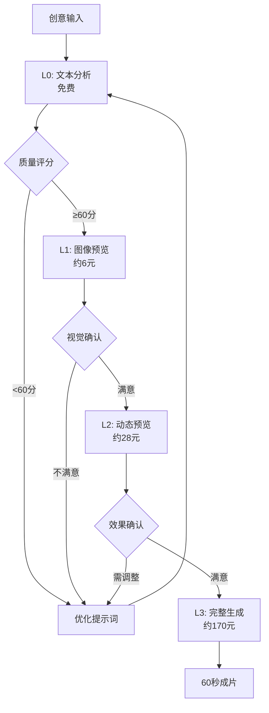
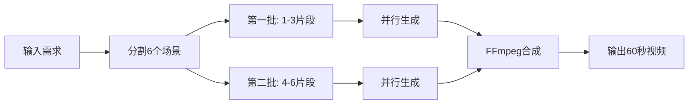

# MovieFlow 🎬

> AI 驱动的短视频生成工具 - 基于 Spec-Kit 架构的智能视频创作助手

[](https://www.npmjs.com/package/movieflow-cli)
[](https://opensource.org/licenses/MIT)

MovieFlow 是一个基于 [Spec-Kit](https://github.com/wordflowlab/spec-kit) 架构的 AI 视频生成工具，专门为抖音、微信视频号、快手等短视频平台设计。它采用**基础设施与业务分离**的设计理念：

- **CLI 命令** (`movieflow init`, `movieflow check`)：负责项目初始化和环境检查
- **Slash 命令** (`/specify`, `/validate` 等)：在 AI 助手中执行业务逻辑

这种架构让 AI 助手成为你的智能视频制作伙伴，而不仅仅是命令执行器。

## ✨ 特性

### 核心功能
- 🎯 **智能分段生成**：自动将60秒视频分成6个10秒片段，分批处理
- 🚀 **并行处理**：同时处理3个视频片段，提高生成效率
- 🎨 **多风格支持**：Q版动画、真人、卡通等多种视觉风格
- 📱 **平台适配**：自动适配抖音(9:16)、视频号(1:1)、快手等平台
- 🔄 **智能重试**：自动处理失败片段，确保视频完整性
- 🎵 **音视频合成**：支持背景音乐、转场效果等后期处理
- 📝 **专业脚本格式**：支持MV级别的分镜脚本，包含景别、运镜、转场等专业元素
- 📊 **多格式导出**：可导出为Markdown、HTML、JSON、CSV等格式

### 🆕 v0.3.0 新特性

- 🏗️ **Spec-Kit 架构**：基础设施与业务分离，CLI 极简化
- 🤖 **Slash 命令系统**：所有业务逻辑通过 AI 助手执行
- 🌐 **多平台支持**：自动生成 Claude/Cursor/Gemini/Windsurf 命令
- 🎯 **更自然交互**：用自然语言描述需求，AI 智能选择参数

### v0.2.7 特性

- 🎨 **多风格图像预览**：支持 wireframe/sketch/lineart/full 四种风格
- 💰 **成本优化**：线框图验证仅需3元，是完整渲染的50%
- 🚀 **快速迭代**：黑白线稿快速验证分镜和构图

### v0.2.6 特性

- 💰 **渐进式验证系统**：L0-L1-L2三级验证，调试成本降低80%
- 🔍 **智能提示词分析**：自动评分和优化建议（L0级，免费）
- 🖼️ **关键帧预览**：生成静态图像预览视觉效果（L1级，约3-6元）
- 🎬 **动态预览**：10秒测试视频验证动态效果（L2级，约28元）
- 🌐 **多API支持**：集成UniAPI和云雾API，支持FLUX、DALL-E等模型

### v0.2.2 特性


- 🤖 **多平台AI助手支持**：智能适配 Claude Code、Cursor、Windsurf、Gemini
- 💾 **断点续传**：支持中断后继续生成，避免浪费API tokens
- 📡 **实时进度追踪**：长时间任务心跳机制，防止AI助手超时
- 🎯 **智能平台检测**：自动识别运行环境，优化输出格式
- 📈 **会话管理**：完整的任务状态追踪和恢复机制

## 🚀 快速开始

### 安装

```bash
npm install -g movieflow-cli
```

### 获取即梦AI API密钥

MovieFlow 使用火山引擎的即梦AI来生成视频，需要先获取API密钥：

1. **注册火山引擎账号**
   - 访问 [火山引擎控制台](https://console.volcengine.com/)
   - 使用手机号注册账号

2. **开通即梦AI服务**
   - 在控制台搜索"即梦AI"或访问 [即梦AI产品页](https://www.volcengine.com/product/jimeng)
   - 点击"立即使用"开通服务
   - 注意：即梦AI是付费服务，每次生成视频会产生费用

3. **获取API密钥**
   - 进入 [密钥管理页面](https://console.volcengine.com/iam/keymanage/)
   - 点击"新建密钥"
   - 复制 Access Key ID 和 Secret Access Key
   - ⚠️ **重要**：Secret Key 只显示一次，请妥善保存

4. **配置环境变量**

   复制示例配置文件：
   ```bash
   cp .env.example .env
   ```

   编辑 `.env` 文件（不要提交到Git）：
   ```bash
   # 在项目根目录创建 .env 文件
   touch .env
   ```

   添加以下内容：
   ```env
   # 火山引擎即梦AI密钥（必需，用于L2预览和最终生成）
   VOLCANO_ACCESS_KEY=你的AccessKeyID
   VOLCANO_SECRET_KEY=你的SecretAccessKey

   # 渐进式验证API配置（L1级图像预览）
   UNIAPI_KEY=你的UniAPI密钥        # 推荐，支持FLUX等模型
   YUNWU_API_KEY=你的云雾API密钥    # 备选方案

   # 阿里云TTS配置（推荐，稳定性更高）
   ALIYUN_TTS_APP_KEY=你的AppKey
   ALIYUN_TTS_TOKEN=你的Token

   # 可选：Gemini API密钥（用于智能脚本生成）
   GEMINI_API_KEY=你的GeminiKey
   ```

5. **验证配置**
   ```bash
   # 检查环境配置
   movieflow check
   ```

### 初始化项目

```bash
# 创建新项目（会自动生成 Slash 命令）
movieflow init my-video-project

# 自动检测 AI 助手并生成对应格式的命令
movieflow init my-video-project --ai auto

# 为特定 AI 助手初始化（claude | cursor | gemini | windsurf）
movieflow init my-video-project --ai claude
```

初始化后会生成 Spec-Kit 兼容的项目结构：

```
my-video-project/
├── .specify/
│   ├── memory/          # AI 助手记忆
│   ├── specs/           # 项目规范
│   ├── projects/        # 项目数据
│   └── scripts/         # 生成的脚本
├── .claude/commands/    # Claude Code Slash 命令
├── .cursor/prompts/     # Cursor Slash 命令
├── .gemini/commands/    # Gemini Slash 命令
└── .windsurf/workflows/ # Windsurf Slash 命令
```

### 🎯 使用 AI 助手创作视频

MovieFlow 的所有业务逻辑都通过 AI 助手的 Slash 命令执行，支持 Claude Code、Cursor、Gemini 和 Windsurf。

#### 完整创作流程

**📘 [完整使用手册请查看 USER_GUIDE.md](./docs/USER_GUIDE.md)**

在你的 AI 助手中（如 Claude Code）使用以下 Slash 命令：

```
/specify      # 1️⃣ 创建视频项目规格
/plan         # 2️⃣ 制定技术实现计划
/tasks        # 3️⃣ 生成任务列表
/validate     # 4️⃣ L0+L1 渐进式验证（推荐）
/preview      # 5️⃣ L2 动态预览（可选）
/implement    # 6️⃣ 生成完整60秒视频
```

#### 渐进式验证流程（节省80%调试成本）

MovieFlow 采用渐进式验证系统，让你在生成最终视频前以极低成本验证效果：

**1. L0级验证 - 文本质量分析（免费）**

在 AI 助手中执行 `/validate`，会自动执行 L0 级分析：
- 分析提示词质量
- 评估场景完整性
- 提供优化建议

**2. L1级验证 - 图像预览（约3-6元，支持多种风格）**

`/validate` 命令支持 4 种风格，成本递增：

- **wireframe**：黑白线框图（约3元）- 快速验证分镜和构图，推荐首选
- **sketch**：铅笔素描（约4元）- 验证构图和光影
- **lineart**：精细线稿（约4元）- 验证线条细节
- **full**：完整渲染（约6元）- 验证最终视觉效果

在 AI 助手中使用：

```
/validate
然后告诉 AI：使用 wireframe 风格验证场景1-3
```

💡 **推荐工作流**：
1. 先用 `wireframe` 快速验证分镜（3元）
2. 满意后用 `full` 验证最终效果（6元）
3. 跳过中间风格，节省更多成本

**3. L2级验证 - 动态预览（约28元，可选）**

如果你对静态效果已经很满意，可以直接跳到最终生成。L2 主要用于验证动态效果：

```
/preview
然后告诉 AI：生成场景3的10秒预览，包含音频和字幕
```

**何时需要 L2？**
- ✅ 有复杂动作（跑步、战斗、舞蹈）
- ✅ 有镜头运动（推拉摇移）
- ✅ 需要验证转场效果
- ✅ 首次使用即梦AI

**何时可跳过 L2？**
- ✅ 场景主要是静态或微动画
- ✅ 对 L1 效果非常满意
- ✅ 预算紧张，愿意承担一定风险

**4. 最终生成 - 完整60秒视频（约170元）**

```
/implement
然后告诉 AI：使用唐僧模板生成完整视频
```

#### 成本对比

**传统方式**：
- 每次测试170元，3-5次调试需要 510-850元

**完整渐进式验证**：
- L0(0元) + L1-wireframe(3元) + L1-full(6元) + L2(28元) + 最终(170元) = 207元
- **节省成本：60-76%**

**快速验证路径**（推荐）：
- L0(0元) + L1-wireframe(3元) + L1-full(6元) + 最终(170元) = 179元
- 跳过L2，**节省成本：65-79%**

**预算紧张路径**：
- L0(0元) + L1-wireframe(3元) + 最终(170元) = 173元
- 仅线框图验证，**节省成本：66-80%**

### 🏗️ Spec-Kit 架构说明

MovieFlow 严格遵循 Spec-Kit 的设计理念：**基础设施与业务分离**

#### CLI 命令（基础设施）

仅提供两个命令，负责项目搭建和环境检查：

```bash
# 初始化项目结构和 Slash 命令
movieflow init <project-name> [--ai <type>]

# 检查系统环境和依赖
movieflow check
```

#### Slash 命令（业务逻辑）

所有视频创作逻辑都通过 AI 助手的 Slash 命令执行：

| Slash 命令 | 描述 | 对应原 CLI 命令 |
|-----------|------|----------------|
| `/specify` | 创建视频项目规格 | - |
| `/plan` | 制定技术实现计划 | - |
| `/tasks` | 生成任务列表 | - |
| `/validate` | L0+L1 渐进式验证 | `movieflow validate` |
| `/preview` | L2 动态预览 | `movieflow preview` |
| `/implement` | 生成完整60秒视频 | `movieflow generate` |

#### 为什么这样设计？

1. **更自然的交互**：在 AI 助手中用自然语言描述需求，而不是记忆复杂的 CLI 参数
2. **智能决策**：AI 可以根据上下文自动选择最佳参数（如风格、场景、质量等）
3. **断点续传**：AI 助手有记忆能力，自动处理中断和恢复
4. **跨平台统一**：一套 Slash 命令，适配所有 AI 助手（Claude、Cursor、Gemini、Windsurf）

#### 平台适配

MovieFlow 自动生成各 AI 平台的 Slash 命令格式：

- **Claude Code**: `.claude/commands/*.md` (Markdown with YAML frontmatter)
- **Cursor**: `.cursor/prompts/*.md` (Simple Markdown)
- **Gemini**: `.gemini/commands/*.toml` (TOML format)
- **Windsurf**: `.windsurf/workflows/*.md` (Markdown workflows)

## 🎭 示例：唐僧说媒视频

MovieFlow 内置了一个有趣的"唐僧说媒"视频模板，展示Q版唐僧的相亲自我介绍。

使用 AI 助手创建：

```
/implement
然后告诉 AI：使用唐僧说媒模板生成视频，添加转场效果
```

AI 助手会自动：
1. 读取模板脚本（6个场景，每个10秒）
2. 执行 L0 文本分析
3. 询问是否需要 L1/L2 验证
4. 调用火山引擎 API 生成视频
5. 使用 FFmpeg 合成最终60秒视频

如需编程方式调用（用于自动化工作流）：

```typescript
import { VideoGenerator } from 'movieflow-cli';

const generator = new VideoGenerator({
  accessKey: process.env.VOLCANO_ACCESS_KEY,
  secretKey: process.env.VOLCANO_SECRET_KEY,
  platform: 'douyin'
});

const videoPath = await generator.generateVideo({
  projectName: 'tang-monk-dating',
  useTemplate: 'tang-monk',
  addTransition: true
});
```

## 🛠 技术架构

### 核心组件

- **VideoSegmentManager**: 管理视频片段的生成流程
- **VolcanoEngineClient**: 火山引擎即梦AI接口封装
- **FFmpegService**: 视频合成和后期处理
- **VideoGenerator**: 协调各服务的主控制器
- **PreviewService**: 渐进式验证服务 🆕
- **PromptValidator**: 提示词质量分析器 🆕
- **UniAPIClient**: UniAPI图像生成客户端 🆕
- **YunwuAPIClient**: 云雾API图像生成客户端 🆕

### 渐进式验证流程 🆕



### 视频生成流程



## 📝 API 文档（内部使用）

> **注意**：以下 API 主要由 Slash 命令内部调用。普通用户建议直接使用 AI 助手的 Slash 命令，无需手动调用这些 API。

### VideoGenerator

主要的视频生成类，由 `/implement` 命令调用：

```typescript
const generator = new VideoGenerator({
  accessKey: string,      // 火山引擎 Access Key
  secretKey: string,      // 火山引擎 Secret Key
  platform?: 'douyin' | 'wechat' | 'kuaishou',
  aspectRatio?: '16:9' | '9:16' | '1:1',
  maxConcurrency?: number // 最大并发数，默认3
});
```

### generateVideo 方法

```typescript
await generator.generateVideo({
  projectName: string,     // 项目名称
  scenes?: Array<{         // 自定义场景（6个）
    prompt: string,
    audio?: string
  }>,
  useTemplate?: 'tang-monk', // 使用预设模板
  addTransition?: boolean,    // 添加转场效果
  addMusic?: string           // 背景音乐路径
});
```

### PreviewService

渐进式验证服务，由 `/validate` 和 `/preview` 命令调用：

```typescript
const previewService = new PreviewService(imageClient);

// L0 文本分析
const l0Result = await previewService.validateL0(prompts);

// L1 图像预览（支持 wireframe | sketch | lineart | full）
const l1Result = await previewService.validateL1(sceneConfigs, 'wireframe');

// L2 动态预览
const l2Result = await previewService.generateL2Preview(config);
```

## 🔧 环境要求

- Node.js >= 18.0.0
- FFmpeg（用于视频合成）
- 火山引擎账号（获取即梦AI访问权限）

### 安装 FFmpeg

```bash
# macOS
brew install ffmpeg

# Ubuntu/Debian
sudo apt-get install ffmpeg

# Windows
# 从 https://ffmpeg.org/download.html 下载安装
```

## ⚙️ 配置

### 环境变量配置方法

有三种方式配置API密钥：

#### 方法1：项目级配置（推荐）

在项目根目录创建 `.env` 文件：

```bash
# 创建配置文件
touch .env

# 编辑配置文件
nano .env  # 或使用你喜欢的编辑器
```

添加以下内容：
```env
# 火山引擎即梦AI密钥（必需）
VOLCANO_ACCESS_KEY=你的AccessKeyID
VOLCANO_SECRET_KEY=你的SecretAccessKey

# Gemini API密钥（可选，用于智能脚本生成）
GEMINI_API_KEY=你的GeminiKey
```

#### 方法2：全局环境变量

在你的shell配置文件中添加（如 `~/.bashrc` 或 `~/.zshrc`）：

```bash
export VOLCANO_ACCESS_KEY="你的AccessKeyID"
export VOLCANO_SECRET_KEY="你的SecretAccessKey"
export GEMINI_API_KEY="你的GeminiKey"  # 可选
```

然后重新加载配置：
```bash
source ~/.bashrc  # 或 source ~/.zshrc
```

#### 方法3：临时环境变量

在运行命令时临时设置：

```bash
VOLCANO_ACCESS_KEY=xxx VOLCANO_SECRET_KEY=yyy movieflow generate-video
```

### 验证配置

使用以下命令检查配置是否正确：

```bash
# 检查所有环境和依赖
movieflow check

# 测试API连接（会尝试调用API）
npm test  # 在项目目录中
```

### 项目配置

项目初始化后会生成 `.specify/config.json`：

```json
{
  "name": "my-video-project",
  "type": "video",
  "version": "0.1.0",
  "settings": {
    "defaultDuration": 10,
    "defaultFrames": 241,
    "defaultRatio": "9:16",
    "concurrency": 3
  }
}
```

## ❓ 常见问题

### 0. Spec-Kit 架构相关 🆕

**Q: 为什么要移除 CLI 的业务命令？**

A: MovieFlow v0.2.7 采用 Spec-Kit 架构，将基础设施与业务分离：

- **CLI 命令**：只负责项目初始化（`init`）和环境检查（`check`）
- **Slash 命令**：所有业务逻辑（生成、验证、预览等）都通过 AI 助手执行

这样做的好处：

- 🗣️ 更自然的交互：用自然语言描述需求，而非记忆复杂参数
- 🧠 智能决策：AI 根据上下文自动选择最佳参数
- 💾 自动恢复：AI 助手有记忆，自动处理断点续传
- 🌐 跨平台统一：一套命令，适配 Claude、Cursor、Gemini、Windsurf

**Q: 旧版本的 CLI 命令还能用吗？**

A: v0.3.0 移除了以下 CLI 命令：

- `movieflow validate` → 使用 `/validate`
- `movieflow preview` → 使用 `/preview`
- `movieflow generate` → 使用 `/implement`
- `movieflow sessions` → AI 助手自动处理

**Q: 我不想用 AI 助手，可以直接调用 API 吗？**

A: 可以！所有底层 API 仍然保留。参考"API 文档"部分，你可以在自己的代码中直接调用 `VideoGenerator`、`PreviewService` 等类。

### 1. 成本控制相关

**Q: 如何降低调试成本？**

A: 使用渐进式验证系统和风格选项：

- L0级（免费）：先验证提示词质量
- L1级-线框图（约3元）：快速验证分镜和构图
- L1级-完整渲染（约6元）：验证最终视觉效果
- L2级（约28元，可选）：生成10秒动态预览
- 满意后再生成完整视频（约170元）

在 AI 助手中执行 `/validate`，AI 会引导你选择合适的验证策略。

**Q: 不同风格有什么区别？**

A:

- `wireframe`：黑白线框图，最便宜（3元），快速验证分镜布局
- `sketch`：铅笔素描，带轻微阴影（4元），验证构图和光影
- `lineart`：精细线稿，漫画风格（4元），验证线条细节
- `full`：完整彩色渲染（6元），验证最终视觉效果

**Q: 应该选择哪种风格？**

A:

- **首次验证**：推荐 `wireframe`，成本最低，快速迭代
- **确认效果后**：使用 `full` 验证最终视觉
- **中间风格**：通常可以跳过 `sketch` 和 `lineart`

**Q: 需要配置哪些API？**

A:

- **必需**：火山引擎API（L2预览和最终生成）
- **推荐**：UniAPI或云雾API（L1图像预览）
- **可选**：Gemini API（智能脚本生成）

**Q: L2 验证是必需的吗？**

A: 不是必需的。如果满足以下条件可以跳过：

- 场景主要是静态画面或轻微动画
- 对 L1 的效果非常满意
- 预算紧张，愿意直接生成最终视频

### 2. 即梦AI相关

**Q: 即梦AI是免费的吗？**
A: 不是。即梦AI是火山引擎的付费服务，每次生成视频都会产生费用。使用渐进式验证可以大幅降低调试成本。

**Q: 提示"401 Unauthorized"错误**
A: 检查你的API密钥是否正确配置。使用 `movieflow check` 验证环境配置。

**Q: 支持哪些API版本？**

A:

- `v30`: 即梦AI 3.0 (720P)
- `v30_1080p`: 即梦AI 3.0 1080P版本
- `v30_pro`: 即梦AI 3.0 Pro版本 (需要专门开通权限)

### 2. 视频生成相关

**Q: 为什么视频分成6个片段？**
A: 这是为了避免API限流，同时提高生成效率。6个10秒片段可以并行处理，最后合成60秒完整视频。

**Q: 可以自定义视频时长吗？**
A: 可以。虽然默认是60秒（6×10秒），但你可以通过修改场景数量和每个场景的时长来调整。

**Q: FFmpeg提示未安装**

A: 请根据你的操作系统安装FFmpeg：

- macOS: `brew install ffmpeg`
- Ubuntu: `sudo apt-get install ffmpeg`
- Windows: 从官网下载安装包

### 3. 脚本格式相关

**Q: 专业脚本格式有什么用？**
A: 专业脚本格式提供了更详细的拍摄指导，包括镜头语言、运镜方式、转场效果等，让AI生成的视频更有导演思维。

**Q: 可以导入自己的脚本吗？**
A: 可以。你可以参考 `templates/professional-script-format.md` 的格式创建自己的脚本。

## 📚 文档

### 用户文档
- **[用户使用手册 (USER_GUIDE.md)](./docs/USER_GUIDE.md)** - 完整的使用指南，包含所有命令详解和实战案例
- [工作流程指南 (workflow.md)](./docs/workflow.md) - 详细的工作流程说明
- [渐进式验证指南 (progressive-validation-guide.md)](./docs/progressive-validation-guide.md) - 成本优化策略

### 技术文档
- [产品需求文档 (PRD.md)](./docs/PRD.md) - 产品设计和技术架构
- [平台适配器文档 (platform-adapters/)](./docs/platform-adapters/README.md) - 多平台支持说明
- [视频提示词标准化指南 (video-prompt-standardization-guide.md)](./docs/video-prompt-standardization-guide.md) - 提示词优化技巧

### 开发文档
- [本地开发指南 (local-development.md)](./docs/local-development.md) - 开发环境配置
- [数据模型 (data-model.md)](./docs/data-model.md) - 数据结构说明

## 🤝 贡献

欢迎提交 Pull Request 和 Issue！

### 开发

```bash
# 克隆仓库
git clone https://github.com/wordflowlab/movieflow.git
cd movieflow

# 安装依赖
npm install

# 开发模式
npm run dev

# 构建
npm run build

# 测试
npm test
```

## 📄 许可证

MIT License - 详见 [LICENSE](LICENSE) 文件

## 🙏 致谢

- [Spec Kit](https://github.com/wordflowlab/spec-kit) - 项目架构基础
- [火山引擎即梦AI](https://www.volcengine.com) - 视频生成能力
- [FFmpeg](https://ffmpeg.org) - 视频处理工具

## 📮 联系我们

- GitHub: [https://github.com/wordflowlab/movieflow](https://github.com/wordflowlab/movieflow)
- Issues: [https://github.com/wordflowlab/movieflow/issues](https://github.com/wordflowlab/movieflow/issues)

---

Made with ❤️ by MovieFlow Team
