# MovieFlow 🎬

> AI 驱动的短视频生成工具 - 基于即梦AI和Gemini的智能视频创作助手

[](https://www.npmjs.com/package/movieflow-cli)
[](https://opensource.org/licenses/MIT)

MovieFlow 是一个基于 Spec Kit 架构的 AI 视频生成工具，专门为抖音、微信视频号、快手等短视频平台设计。它能够自动将创意转化为60秒的高质量短视频。

## ✨ 特性

- 🎯 **智能分段生成**：自动将60秒视频分成6个10秒片段，分批处理
- 🚀 **并行处理**：同时处理3个视频片段，提高生成效率
- 🎨 **多风格支持**：Q版动画、真人、卡通等多种视觉风格
- 📱 **平台适配**：自动适配抖音(9:16)、视频号(1:1)、快手等平台
- 🔄 **智能重试**：自动处理失败片段，确保视频完整性
- 🎵 **音视频合成**：支持背景音乐、转场效果等后期处理

## 🚀 快速开始

### 安装

```bash
npm install -g movieflow-cli
```

### 初始化项目

```bash
# 创建新项目
movieflow init my-video-project

# 在当前目录初始化
movieflow init --here

# 为特定AI助手初始化
movieflow init my-video --ai claude
```

### 使用AI助手命令

在 Claude Code、Cursor 或其他 AI 助手中使用斜杠命令：

```
/video-script      # 创建视频脚本
/video-character   # 设计角色形象
/video-scene       # 生成场景画面
/video-voice       # 生成配音
/video-generate    # 生成完整视频
```

## 🎭 唐僧说媒示例

MovieFlow 内置了一个有趣的"唐僧说媒"视频模板，展示Q版唐僧的相亲自我介绍：

```typescript
import { VideoGenerator } from 'movieflow-cli';

const generator = new VideoGenerator({
  accessKey: 'YOUR_VOLCANO_ACCESS_KEY',
  secretKey: 'YOUR_VOLCANO_SECRET_KEY',
  platform: 'douyin'
});

// 使用预设模板生成视频
const videoPath = await generator.generateVideo({
  projectName: 'tang-monk-dating',
  useTemplate: 'tang-monk',
  addTransition: true
});

console.log(`视频已生成: ${videoPath}`);
```

## 🛠 技术架构

### 核心组件

- **VideoSegmentManager**: 管理视频片段的生成流程
- **VolcanoEngineClient**: 火山引擎即梦AI接口封装
- **FFmpegService**: 视频合成和后期处理
- **VideoGenerator**: 协调各服务的主控制器

### 视频生成流程

```mermaid
graph LR
    A[输入需求] --> B[分割6个场景]
    B --> C[第一批: 1-3片段]
    B --> D[第二批: 4-6片段]
    C --> E[并行生成]
    D --> F[并行生成]
    E --> G[FFmpeg合成]
    F --> G
    G --> H[输出60秒视频]
```



## 📝 API 文档

### VideoGenerator

主要的视频生成类。

```typescript
const generator = new VideoGenerator({
  accessKey: string,      // 火山引擎 Access Key
  secretKey: string,      // 火山引擎 Secret Key
  platform?: 'douyin' | 'wechat' | 'kuaishou',
  aspectRatio?: '16:9' | '9:16' | '1:1',
  maxConcurrency?: number // 最大并发数，默认3
});
```

### generateVideo 方法

```typescript
await generator.generateVideo({
  projectName: string,     // 项目名称
  scenes?: Array<{         // 自定义场景（6个）
    prompt: string,
    audio?: string
  }>,
  useTemplate?: 'tang-monk', // 使用预设模板
  addTransition?: boolean,    // 添加转场效果
  addMusic?: string           // 背景音乐路径
});
```

## 🔧 环境要求

- Node.js >= 18.0.0
- FFmpeg（用于视频合成）
- 火山引擎账号（获取即梦AI访问权限）

### 安装 FFmpeg

```bash
# macOS
brew install ffmpeg

# Ubuntu/Debian
sudo apt-get install ffmpeg

# Windows
# 从 https://ffmpeg.org/download.html 下载安装
```

## ⚙️ 配置

### 环境变量

创建 `.env` 文件：

```env
VOLCANO_ACCESS_KEY=your_access_key
VOLCANO_SECRET_KEY=your_secret_key
GEMINI_API_KEY=your_gemini_key  # 可选
```

### 项目配置

项目初始化后会生成 `.specify/config.json`：

```json
{
  "name": "my-video-project",
  "type": "video",
  "version": "0.1.0",
  "settings": {
    "defaultDuration": 10,
    "defaultFrames": 241,
    "defaultRatio": "9:16",
    "concurrency": 3
  }
}
```

## 🤝 贡献

欢迎提交 Pull Request 和 Issue！

### 开发

```bash
# 克隆仓库
git clone https://github.com/wordflowlab/movieflow.git
cd movieflow

# 安装依赖
npm install

# 开发模式
npm run dev

# 构建
npm run build

# 测试
npm test
```

## 📄 许可证

MIT License - 详见 [LICENSE](LICENSE) 文件

## 🙏 致谢

- [Spec Kit](https://github.com/wordflowlab/spec-kit) - 项目架构基础
- [火山引擎即梦AI](https://www.volcengine.com) - 视频生成能力
- [FFmpeg](https://ffmpeg.org) - 视频处理工具

## 📮 联系我们

- GitHub: [https://github.com/wordflowlab/movieflow](https://github.com/wordflowlab/movieflow)
- Issues: [https://github.com/wordflowlab/movieflow/issues](https://github.com/wordflowlab/movieflow/issues)

---

Made with ❤️ by MovieFlow Team