# MovieFlow 🎬

> AI 驱动的短视频生成工具 - 基于即梦AI和Gemini的智能视频创作助手

[](https://www.npmjs.com/package/movieflow-cli)
[](https://opensource.org/licenses/MIT)

MovieFlow 是一个基于 Spec Kit 架构的 AI 视频生成工具，专门为抖音、微信视频号、快手等短视频平台设计。它能够自动将创意转化为60秒的高质量短视频。

## ✨ 特性

- 🎯 **智能分段生成**：自动将60秒视频分成6个10秒片段，分批处理
- 🚀 **并行处理**：同时处理3个视频片段，提高生成效率
- 🎨 **多风格支持**：Q版动画、真人、卡通等多种视觉风格
- 📱 **平台适配**：自动适配抖音(9:16)、视频号(1:1)、快手等平台
- 🔄 **智能重试**：自动处理失败片段，确保视频完整性
- 🎵 **音视频合成**：支持背景音乐、转场效果等后期处理
- 📝 **专业脚本格式**：支持MV级别的分镜脚本，包含景别、运镜、转场等专业元素
- 📊 **多格式导出**：可导出为Markdown、HTML、JSON、CSV等格式

## 🚀 快速开始

### 安装

```bash
npm install -g movieflow-cli
```

### 获取即梦AI API密钥

MovieFlow 使用火山引擎的即梦AI来生成视频，需要先获取API密钥：

1. **注册火山引擎账号**
   - 访问 [火山引擎控制台](https://console.volcengine.com/)
   - 使用手机号注册账号

2. **开通即梦AI服务**
   - 在控制台搜索"即梦AI"或访问 [即梦AI产品页](https://www.volcengine.com/product/jimeng)
   - 点击"立即使用"开通服务
   - 注意：即梦AI是付费服务，每次生成视频会产生费用

3. **获取API密钥**
   - 进入 [密钥管理页面](https://console.volcengine.com/iam/keymanage/)
   - 点击"新建密钥"
   - 复制 Access Key ID 和 Secret Access Key
   - ⚠️ **重要**：Secret Key 只显示一次，请妥善保存

4. **配置环境变量**

   创建 `.env` 文件（不要提交到Git）：
   ```bash
   # 在项目根目录创建 .env 文件
   touch .env
   ```

   添加以下内容：
   ```env
   # 火山引擎即梦AI密钥
   VOLCANO_ACCESS_KEY=你的AccessKeyID
   VOLCANO_SECRET_KEY=你的SecretAccessKey

   # 可选：Gemini API密钥（用于智能脚本生成）
   GEMINI_API_KEY=你的GeminiKey
   ```

5. **验证配置**
   ```bash
   # 检查环境配置
   movieflow check
   ```

### 初始化项目

```bash
# 创建新项目
movieflow init my-video-project

# 在当前目录初始化
movieflow init --here

# 为特定AI助手初始化
movieflow init my-video --ai claude
```

### 使用AI助手命令

在 Claude Code、Cursor 或其他 AI 助手中使用斜杠命令：

```
/video-script      # 创建视频脚本
/video-character   # 设计角色形象
/video-scene       # 生成场景画面
/video-voice       # 生成配音
/video-generate    # 生成完整视频
```

### 使用专业脚本功能 (v0.2.1新增)

MovieFlow 现在支持专业的MV分镜脚本格式：

```bash
# 预览脚本格式
movieflow script-export --preview

# 导出为Markdown格式（适合文档查看）
movieflow script-export --format markdown --output ./scripts

# 导出为HTML格式（适合浏览器查看和打印）
movieflow script-export --format html --output ./scripts

# 导出为CSV格式（适合Excel处理）
movieflow script-export --format csv --output ./scripts

# 快速生成脚本
movieflow generate-script
```

专业脚本包含的信息：
- **镜头编号和时间码**：精确到秒的时间控制
- **景别**：远景、中景、特写等专业术语
- **运镜方式**：推拉摇移、固定镜头等
- **画面层次**：前景、中景、背景的空间关系
- **转场效果**：淡入淡出、硬切、溶解等
- **视觉效果**：色调、光线、氛围、特效描述

## 🎭 唐僧说媒示例

MovieFlow 内置了一个有趣的"唐僧说媒"视频模板，展示Q版唐僧的相亲自我介绍：

```typescript
import { VideoGenerator } from 'movieflow-cli';

const generator = new VideoGenerator({
  accessKey: 'YOUR_VOLCANO_ACCESS_KEY',
  secretKey: 'YOUR_VOLCANO_SECRET_KEY',
  platform: 'douyin'
});

// 使用预设模板生成视频
const videoPath = await generator.generateVideo({
  projectName: 'tang-monk-dating',
  useTemplate: 'tang-monk',
  addTransition: true
});

console.log(`视频已生成: ${videoPath}`);
```

## 🛠 技术架构

### 核心组件

- **VideoSegmentManager**: 管理视频片段的生成流程
- **VolcanoEngineClient**: 火山引擎即梦AI接口封装
- **FFmpegService**: 视频合成和后期处理
- **VideoGenerator**: 协调各服务的主控制器

### 视频生成流程

```mermaid
graph LR
    A[输入需求] --> B[分割6个场景]
    B --> C[第一批: 1-3片段]
    B --> D[第二批: 4-6片段]
    C --> E[并行生成]
    D --> F[并行生成]
    E --> G[FFmpeg合成]
    F --> G
    G --> H[输出60秒视频]
```



## 📝 API 文档

### VideoGenerator

主要的视频生成类。

```typescript
const generator = new VideoGenerator({
  accessKey: string,      // 火山引擎 Access Key
  secretKey: string,      // 火山引擎 Secret Key
  platform?: 'douyin' | 'wechat' | 'kuaishou',
  aspectRatio?: '16:9' | '9:16' | '1:1',
  maxConcurrency?: number // 最大并发数，默认3
});
```

### generateVideo 方法

```typescript
await generator.generateVideo({
  projectName: string,     // 项目名称
  scenes?: Array<{         // 自定义场景（6个）
    prompt: string,
    audio?: string
  }>,
  useTemplate?: 'tang-monk', // 使用预设模板
  addTransition?: boolean,    // 添加转场效果
  addMusic?: string           // 背景音乐路径
});
```

## 🔧 环境要求

- Node.js >= 18.0.0
- FFmpeg（用于视频合成）
- 火山引擎账号（获取即梦AI访问权限）

### 安装 FFmpeg

```bash
# macOS
brew install ffmpeg

# Ubuntu/Debian
sudo apt-get install ffmpeg

# Windows
# 从 https://ffmpeg.org/download.html 下载安装
```

## ⚙️ 配置

### 环境变量配置方法

有三种方式配置API密钥：

#### 方法1：项目级配置（推荐）

在项目根目录创建 `.env` 文件：

```bash
# 创建配置文件
touch .env

# 编辑配置文件
nano .env  # 或使用你喜欢的编辑器
```

添加以下内容：
```env
# 火山引擎即梦AI密钥（必需）
VOLCANO_ACCESS_KEY=你的AccessKeyID
VOLCANO_SECRET_KEY=你的SecretAccessKey

# Gemini API密钥（可选，用于智能脚本生成）
GEMINI_API_KEY=你的GeminiKey
```

#### 方法2：全局环境变量

在你的shell配置文件中添加（如 `~/.bashrc` 或 `~/.zshrc`）：

```bash
export VOLCANO_ACCESS_KEY="你的AccessKeyID"
export VOLCANO_SECRET_KEY="你的SecretAccessKey"
export GEMINI_API_KEY="你的GeminiKey"  # 可选
```

然后重新加载配置：
```bash
source ~/.bashrc  # 或 source ~/.zshrc
```

#### 方法3：临时环境变量

在运行命令时临时设置：

```bash
VOLCANO_ACCESS_KEY=xxx VOLCANO_SECRET_KEY=yyy movieflow generate-video
```

### 验证配置

使用以下命令检查配置是否正确：

```bash
# 检查所有环境和依赖
movieflow check

# 测试API连接（会尝试调用API）
npm test  # 在项目目录中
```

### 项目配置

项目初始化后会生成 `.specify/config.json`：

```json
{
  "name": "my-video-project",
  "type": "video",
  "version": "0.1.0",
  "settings": {
    "defaultDuration": 10,
    "defaultFrames": 241,
    "defaultRatio": "9:16",
    "concurrency": 3
  }
}
```

## ❓ 常见问题

### 1. 即梦AI相关

**Q: 即梦AI是免费的吗？**
A: 不是。即梦AI是火山引擎的付费服务，每次生成视频都会产生费用。建议先小规模测试，了解费用后再批量使用。

**Q: 提示"401 Unauthorized"错误**
A: 检查你的API密钥是否正确配置。使用 `movieflow check` 验证环境配置。

**Q: 支持哪些API版本？**
A:
- `v30`: 即梦AI 3.0 (720P)
- `v30_1080p`: 即梦AI 3.0 1080P版本
- `v30_pro`: 即梦AI 3.0 Pro版本 (需要专门开通权限)

### 2. 视频生成相关

**Q: 为什么视频分成6个片段？**
A: 这是为了避免API限流，同时提高生成效率。6个10秒片段可以并行处理，最后合成60秒完整视频。

**Q: 可以自定义视频时长吗？**
A: 可以。虽然默认是60秒（6×10秒），但你可以通过修改场景数量和每个场景的时长来调整。

**Q: FFmpeg提示未安装**
A: 请根据你的操作系统安装FFmpeg：
- macOS: `brew install ffmpeg`
- Ubuntu: `sudo apt-get install ffmpeg`
- Windows: 从官网下载安装包

### 3. 脚本格式相关

**Q: 专业脚本格式有什么用？**
A: 专业脚本格式提供了更详细的拍摄指导，包括镜头语言、运镜方式、转场效果等，让AI生成的视频更有导演思维。

**Q: 可以导入自己的脚本吗？**
A: 可以。你可以参考 `templates/professional-script-format.md` 的格式创建自己的脚本。

## 🤝 贡献

欢迎提交 Pull Request 和 Issue！

### 开发

```bash
# 克隆仓库
git clone https://github.com/wordflowlab/movieflow.git
cd movieflow

# 安装依赖
npm install

# 开发模式
npm run dev

# 构建
npm run build

# 测试
npm test
```

## 📄 许可证

MIT License - 详见 [LICENSE](LICENSE) 文件

## 🙏 致谢

- [Spec Kit](https://github.com/wordflowlab/spec-kit) - 项目架构基础
- [火山引擎即梦AI](https://www.volcengine.com) - 视频生成能力
- [FFmpeg](https://ffmpeg.org) - 视频处理工具

## 📮 联系我们

- GitHub: [https://github.com/wordflowlab/movieflow](https://github.com/wordflowlab/movieflow)
- Issues: [https://github.com/wordflowlab/movieflow/issues](https://github.com/wordflowlab/movieflow/issues)

---

Made with ❤️ by MovieFlow Team