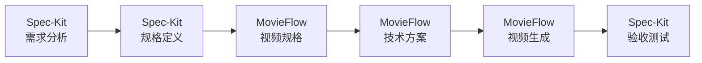

# MovieFlow API 文档

MovieFlow 参考 Spec-Kit 的方法论，提供规格驱动的视频生成 API。本文档详细介绍所有可用的 API 接口。

## 目录
- [认证](#认证)
- [CLI 命令](#cli-命令)
- [核心API](#核心api)
  - [视频生成API](#视频生成api)
  - [任务管理API](#任务管理api)
  - [素材管理API](#素材管理api)
- [火山引擎集成](#火山引擎集成)
- [Gemini集成](#gemini集成)
- [错误处理](#错误处理)
- [WebSocket实时通信](#websocket实时通信)
- [与Spec-Kit集成](#与spec-kit集成)

## 认证

### API密钥配置

所有API调用需要通过环境变量配置认证信息：

```env
# 火山引擎认证
VOLCANO_ACCESS_KEY=your_access_key
VOLCANO_SECRET_KEY=your_secret_key
VOLCANO_REGION=cn-north-1

# Google Gemini认证
GEMINI_API_KEY=your_api_key

# TTS服务认证（可选）
TTS_API_KEY=your_tts_key
TTS_API_SECRET=your_tts_secret
```

### 请求签名

火山引擎API使用AWS Signature V4签名算法：

```typescript
interface SignatureHeaders {
  'X-Date': string;
  'Authorization': string;
  'X-Security-Token'?: string;
  'Content-Type': 'application/json';
}
```

## 核心API

### 视频生成API

#### POST /api/v1/video/generate

生成完整的60秒短视频。

**请求体：**

```json
{
  "projectName": "tang-monk-dating",
  "template": "tang-monk",
  "scenes": [
    {
      "id": "scene1",
      "prompt": "Q版唐僧站在寺庙前",
      "duration": 10,
      "frames": 241,
      "audio": {
        "text": "贫僧刚从西天取经回来",
        "voice": "male_soft",
        "emotion": "humble"
      }
    }
  ],
  "config": {
    "platform": "douyin",
    "aspectRatio": "9:16",
    "resolution": "1080x1920",
    "fps": 24,
    "quality": "high"
  },
  "effects": {
    "transitions": true,
    "backgroundMusic": "chinese_traditional.mp3",
    "watermark": false
  }
}
```

**响应：**

```json
{
  "taskId": "task_20240920_001",
  "status": "processing",
  "estimatedTime": 300,
  "segments": [
    {
      "id": "scene1",
      "status": "queued",
      "progress": 0
    }
  ],
  "createdAt": "2024-09-20T10:00:00Z"
}
```

#### POST /api/v1/video/segment

生成单个10秒视频片段。

**请求体：**

```json
{
  "segmentId": "scene1",
  "prompt": "Q版唐僧站在寺庙前，卡通风格",
  "model": "jimeng_t2v_v30_1080p",
  "parameters": {
    "frames": 241,
    "seed": -1,
    "scale": 3.5,
    "ddimSteps": 25,
    "aspectRatio": "9:16"
  }
}
```

**响应：**

```json
{
  "taskId": "seg_20240920_001",
  "segmentId": "scene1",
  "status": "submitted",
  "volcanoTaskId": "cv_task_abc123",
  "estimatedTime": 60
}
```

### 任务管理API

#### GET /api/v1/task/{taskId}

查询任务状态。

**响应：**

```json
{
  "taskId": "task_20240920_001",
  "status": "processing",
  "progress": 45,
  "currentPhase": "generating_segments",
  "segments": [
    {
      "id": "scene1",
      "status": "completed",
      "videoUrl": "https://cdn.example.com/scene1.mp4",
      "duration": 10.02
    },
    {
      "id": "scene2",
      "status": "processing",
      "progress": 60
    }
  ],
  "logs": [
    {
      "timestamp": "2024-09-20T10:01:00Z",
      "level": "info",
      "message": "Scene 1 generation completed"
    }
  ]
}
```

#### POST /api/v1/task/{taskId}/retry

重试失败的片段。

**请求体：**

```json
{
  "segmentIds": ["scene3", "scene5"],
  "reason": "quality_check_failed"
}
```

#### DELETE /api/v1/task/{taskId}

取消正在执行的任务。

### 素材管理API

#### POST /api/v1/assets/upload

上传自定义素材。

**请求体（multipart/form-data）：**

```
file: binary
type: "image" | "audio" | "video"
metadata: {
  "name": "background_music.mp3",
  "tags": ["bgm", "chinese"]
}
```

#### GET /api/v1/assets

获取素材列表。

**查询参数：**
- `type`: 素材类型
- `tags`: 标签过滤
- `page`: 页码
- `limit`: 每页数量

## 火山引擎集成

### 文本生成视频 (T2V)

#### CVSync2AsyncSubmitTask

提交异步视频生成任务。

**端点：** `https://cv-plugin-cn-beijing.volces.com/req/CVSync2AsyncSubmitTask`

**请求体：**

```json
{
  "req_key": "cv_tpl",
  "prompt": "Q版唐僧站在寺庙前，温馨卡通风格",
  "model_version": "jimeng_t2v_v30_1080p",
  "seed": -1,
  "scale": 3.5,
  "ddim_steps": 25,
  "video_length": 241,
  "aspect_ratio": "9:16",
  "quality": "high"
}
```

**响应：**

```json
{
  "code": 0,
  "message": "success",
  "data": {
    "task_id": "cv_task_123456",
    "status": "submitted"
  }
}
```

### 图片生成视频 (I2V)

#### 首帧模式

```json
{
  "req_key": "cv_tpl_img2video",
  "prompt": "角色向前走动",
  "model_version": "jimeng_i2v_first_v30_1080",
  "binary_data_base64": ["base64_image_data"],
  "video_length": 241
}
```

#### 首尾帧模式

```json
{
  "req_key": "cv_tpl_img2video",
  "model_version": "jimeng_i2v_first_tail_v30_1080",
  "binary_data_base64": [
    "base64_first_frame",
    "base64_last_frame"
  ]
}
```

### 数字人生成

#### 快速口播模式

```json
{
  "req_key": "digital_human_quick_mode",
  "image_url": "https://example.com/avatar.jpg",
  "audio_url": "https://example.com/speech.mp3",
  "driven_mode": 1,
  "mouth_sync": true,
  "head_motion": true,
  "emotion_expression": "happy"
}
```

### 任务查询

#### CVSync2AsyncGetResult

**端点：** `https://cv-plugin-cn-beijing.volces.com/req/CVSync2AsyncGetResult`

**请求体：**

```json
{
  "task_id": "cv_task_123456"
}
```

**响应状态：**

```json
{
  "code": 0,
  "data": {
    "status": "SUCCESS",
    "result": {
      "video_url": "https://cdn.volces.com/output/video.mp4",
      "duration": 10.0,
      "frames": 241,
      "resolution": "1088x1920"
    }
  }
}
```

状态码说明：
- `QUEUING`: 排队中
- `PROCESSING`: 处理中
- `SUCCESS`: 成功
- `FAILED`: 失败

## Gemini集成

### 场景图片生成

#### POST /v1beta/models/gemini-2.5-flash-image:generateImage

**请求头：**
```
X-Goog-Api-Key: YOUR_API_KEY
Content-Type: application/json
```

**请求体：**

```json
{
  "prompt": {
    "text": "Create a cartoon-style Buddhist temple background with mountains"
  },
  "generationConfig": {
    "numberOfImages": 1,
    "aspectRatio": "9:16",
    "imageSize": "1080x1920",
    "style": "cartoon"
  },
  "safetySettings": [
    {
      "category": "HARM_CATEGORY_DANGEROUS_CONTENT",
      "threshold": "BLOCK_NONE"
    }
  ]
}
```

**响应：**

```json
{
  "images": [
    {
      "url": "https://storage.googleapis.com/gemini-images/xxx.png",
      "mimeType": "image/png"
    }
  ]
}
```

### 智能场景编辑

```json
{
  "image": "base64_encoded_image",
  "instruction": "Remove the person in the background",
  "mask": "base64_encoded_mask"
}
```

## 错误处理

### 错误响应格式

```json
{
  "error": {
    "code": "RATE_LIMIT_EXCEEDED",
    "message": "API rate limit exceeded",
    "details": {
      "limit": 100,
      "reset": "2024-09-20T11:00:00Z"
    },
    "requestId": "req_abc123",
    "timestamp": "2024-09-20T10:30:00Z"
  }
}
```

### 错误码列表

| 错误码 | HTTP状态码 | 说明 | 处理建议 |
|-------|-----------|------|---------|
| `INVALID_REQUEST` | 400 | 请求参数无效 | 检查请求格式 |
| `UNAUTHORIZED` | 401 | 认证失败 | 检查API密钥 |
| `FORBIDDEN` | 403 | 权限不足 | 检查账户权限 |
| `NOT_FOUND` | 404 | 资源不存在 | 检查资源ID |
| `RATE_LIMIT_EXCEEDED` | 429 | 超过频率限制 | 实施退避重试 |
| `INTERNAL_ERROR` | 500 | 服务器内部错误 | 联系技术支持 |
| `SERVICE_UNAVAILABLE` | 503 | 服务暂时不可用 | 稍后重试 |
| `TASK_FAILED` | 200 | 任务执行失败 | 查看错误详情 |
| `QUOTA_EXCEEDED` | 402 | 配额用尽 | 购买更多配额 |
| `CONTENT_VIOLATION` | 422 | 内容违规 | 修改提示词 |

### 重试策略

```typescript
interface RetryConfig {
  maxRetries: 3;
  backoffMultiplier: 2;
  initialDelay: 1000; // ms
  maxDelay: 30000; // ms
  retryableErrors: [
    'RATE_LIMIT_EXCEEDED',
    'SERVICE_UNAVAILABLE',
    'INTERNAL_ERROR'
  ];
}
```

## WebSocket实时通信

### 连接建立

```javascript
const ws = new WebSocket('wss://api.movieflow.com/v1/ws');

ws.onopen = () => {
  ws.send(JSON.stringify({
    type: 'auth',
    token: 'your_auth_token'
  }));
};
```

### 消息格式

#### 订阅任务

```json
{
  "type": "subscribe",
  "taskId": "task_20240920_001"
}
```

#### 进度更新

```json
{
  "type": "progress",
  "taskId": "task_20240920_001",
  "data": {
    "overall": 45,
    "segments": {
      "scene1": 100,
      "scene2": 60,
      "scene3": 0
    },
    "phase": "generating",
    "message": "正在生成场景2..."
  }
}
```

#### 状态变更

```json
{
  "type": "status_change",
  "taskId": "task_20240920_001",
  "oldStatus": "processing",
  "newStatus": "merging",
  "timestamp": "2024-09-20T10:15:00Z"
}
```

#### 错误通知

```json
{
  "type": "error",
  "taskId": "task_20240920_001",
  "error": {
    "segment": "scene3",
    "code": "GENERATION_FAILED",
    "message": "场景3生成失败：内容违规"
  }
}
```

## 性能优化建议

### 批量请求

支持批量提交多个片段：

```json
{
  "batch": true,
  "segments": [
    { "id": "scene1", "prompt": "..." },
    { "id": "scene2", "prompt": "..." },
    { "id": "scene3", "prompt": "..." }
  ]
}
```

### 缓存策略

- 场景图片缓存：15分钟
- 生成结果缓存：7天
- API响应缓存：根据Cache-Control头

### 并发控制

```typescript
const ConcurrencyLimits = {
  maxConcurrentTasks: 3,
  maxSegmentsPerBatch: 3,
  rateLimitPerMinute: 60,
  burstLimit: 10
};
```

## SDK示例

### Node.js/TypeScript

```typescript
import { MovieFlowClient } from 'movieflow-sdk';

const client = new MovieFlowClient({
  accessKey: process.env.VOLCANO_ACCESS_KEY,
  secretKey: process.env.VOLCANO_SECRET_KEY,
  geminiKey: process.env.GEMINI_API_KEY
});

// 生成视频
const task = await client.generateVideo({
  projectName: 'my-video',
  template: 'tang-monk',
  platform: 'douyin'
});

// 监听进度
task.onProgress((progress) => {
  console.log(`Progress: ${progress.overall}%`);
});

// 获取结果
const result = await task.wait();
console.log(`Video URL: ${result.videoUrl}`);
```

### Python

```python
from movieflow import MovieFlowClient

client = MovieFlowClient(
    access_key=os.environ['VOLCANO_ACCESS_KEY'],
    secret_key=os.environ['VOLCANO_SECRET_KEY']
)

# 异步生成
async def generate():
    task = await client.generate_video(
        project_name='my-video',
        scenes=scenes,
        config={'platform': 'douyin'}
    )

    # 轮询状态
    while task.status != 'completed':
        await asyncio.sleep(5)
        await task.refresh()

    return task.result

video_url = asyncio.run(generate())
```

## 测试环境

### 测试端点

```
https://api-test.movieflow.com/v1
```

### 测试凭证

```json
{
  "accessKey": "test_access_key",
  "secretKey": "test_secret_key",
  "limits": {
    "dailyQuota": 100,
    "maxConcurrency": 1
  }
}
```

### Mock数据

提供预生成的测试视频URL用于开发测试：

```json
{
  "mockVideos": {
    "scene1": "https://test-cdn.movieflow.com/mock/scene1.mp4",
    "scene2": "https://test-cdn.movieflow.com/mock/scene2.mp4"
  }
}
```

## CLI 命令

MovieFlow CLI 提供了一套完整的命令行工具，参考 Spec-Kit 的命令设计理念。

### /video-specify - 视频规格定义

```bash
movieflow video-specify <description> [options]
```

**参数：**
- `description`: 视频描述文本
- `--duration`: 视频时长（默认60秒）
- `--platform`: 目标平台（douyin/wechat/bilibili）
- `--style`: 视觉风格（cartoon/realistic/anime）
- `--ai`: AI 提供商选择

**示例：**
```bash
movieflow video-specify "创建一个展示产品功能的60秒演示视频"
```

### /video-plan - 技术方案规划

```bash
movieflow video-plan <spec-path> [options]
```

**参数：**
- `spec-path`: 规格文件路径
- `--generator`: 优先生成器（volcano/gemini）
- `--quality`: 质量级别（low/medium/high）
- `--optimize`: 优化目标（speed/quality/cost）

### /video-tasks - 任务分解

```bash
movieflow video-tasks <spec-path> [options]
```

**参数：**
- `spec-path`: 规格文件路径
- `--parallel`: 并行任务数
- `--priority`: 优先级排序

### /video-generate - 视频生成

```bash
movieflow video-generate <spec-path> [options]
```

**参数：**
- `spec-path`: 规格文件路径
- `--scene`: 特定场景编号
- `--all-scenes`: 生成所有场景
- `--preview`: 实时预览模式
- `--mock`: 模拟生成（无需API）

## Python API

### 基础用法

```python
from movieflow import MovieFlow

# 初始化客户端
mf = MovieFlow(
    volcano_key="...",
    gemini_key="..."
)

# 创建视频项目
project = mf.create_project(
    name="product-demo",
    description="产品功能演示视频"
)

# 定义规格
spec = mf.video_specify(
    project=project,
    duration=60,
    platform="douyin"
)

# 生成计划
plan = mf.video_plan(spec)

# 执行生成
video = mf.video_generate(plan)
```

### 高级功能

```python
# 批量生成
videos = mf.batch_generate(
    specs=["spec1", "spec2", "spec3"],
    parallel=True
)

# 模板应用
template = mf.load_template("product-intro")
video = mf.generate_from_template(
    template=template,
    variables={
        "product_name": "智能助手",
        "features": ["AI对话", "任务管理", "数据分析"]
    }
)

# 自定义生成器
from movieflow.generators import BaseGenerator

class MyGenerator(BaseGenerator):
    def generate(self, scene):
        # 自定义生成逻辑
        pass

mf.register_generator("custom", MyGenerator())
```

## 与 Spec-Kit 集成

MovieFlow 参考 Spec-Kit 的方法论，可以无缝集成到 Spec-Kit 工作流中。

### 在 Spec-Kit 项目中使用 MovieFlow

```bash
# 1. 在 Spec-Kit 项目中初始化
specify init my-project --ai claude

# 2. 创建视频规格
specify execute "创建产品介绍视频规格"

# 3. 使用 MovieFlow 生成视频
movieflow from-spec ../spec-kit/specs/001-video/spec.md
```

### 共享规格格式

MovieFlow 和 Spec-Kit 使用兼容的规格格式：

```markdown
# Spec-Kit 规格
## Requirements
- FR-001: 生成60秒视频
- FR-002: 包含6个场景
- NFR-001: 1080p分辨率

# MovieFlow 规格
## Video Specification
- Duration: 60s
- Scenes: 6
- Resolution: 1080p
```

### 联合工作流



### API 互操作

```python
# Spec-Kit 生成规格
from specify import SpecKit
sk = SpecKit()
spec = sk.specify("视频需求...")

# MovieFlow 读取规格
from movieflow import MovieFlow
mf = MovieFlow()
video_spec = mf.from_speckit(spec)

# 生成视频
video = mf.generate(video_spec)

# 返回给 Spec-Kit 验证
result = sk.validate(video, spec)
```

## 最佳实践

### 1. 错误处理

```python
try:
    video = mf.generate(spec)
except RateLimitError as e:
    # 实施退避重试
    time.sleep(e.retry_after)
    video = mf.generate(spec)
except ContentViolationError as e:
    # 修改内容后重试
    spec = mf.sanitize_spec(spec)
    video = mf.generate(spec)
```

### 2. 性能优化

```python
# 使用缓存
mf.enable_cache(ttl=3600)

# 批量处理
with mf.batch_context() as batch:
    for spec in specs:
        batch.add(spec)
    results = batch.execute()

# 异步生成
async def generate_async():
    tasks = [mf.generate_async(s) for s in specs]
    return await asyncio.gather(*tasks)
```

### 3. 监控和日志

```python
# 配置日志
import logging
logging.basicConfig(level=logging.INFO)

# 添加回调
def on_progress(progress):
    logger.info(f"Progress: {progress}%")

mf.generate(spec, on_progress=on_progress)

# 性能指标
metrics = mf.get_metrics()
print(f"Total time: {metrics.total_time}s")
print(f"API calls: {metrics.api_calls}")
```

---

**文档版本**: v1.0.0
**更新日期**: 2024-09-20
**API版本**: v1
**参考**: [Spec-Kit 文档](https://github.com/github/spec-kit)