# MovieFlow 短视频生成产品技术需求文档 (PRD)

## 1. 产品概述

### 1.1 产品名称
**MovieFlow** - AI驱动的短视频内容生成平台

### 1.2 产品定位
参考Spec-Kit方法论的AI短视频生成平台，采用规格驱动开发(Spec-Driven Development)的理念，通过结构化的工作流程（规格化→规划→任务分解→实施）来组织视频项目的创建和管理。专注于为内容创作者提供智能化的短视频制作能力，支持数字人口播、场景生成、智能配音等功能。

### 1.3 目标用户
- **内容创作者**：短视频博主、自媒体运营者
- **营销团队**：企业市场部、广告公司
- **教育机构**：在线教育、知识付费平台
- **个人用户**：有创意表达需求的普通用户

### 1.4 核心价值
- **降低创作门槛**：通过AI技术简化视频制作流程
- **提升创作效率**：自动化生成脚本、场景、配音
- **保证内容质量**：专业级数字人和场景渲染
- **多平台适配**：支持抖音、视频号、快手等主流平台

### 1.5 开发方法论

MovieFlow参考了Spec-Kit的Spec-Driven Development方法论，建立了适合视频生成领域的工作流程：

- **规格优先**：先定义视频需求和效果，再进行技术实现
- **分阶段执行**：遵循 specify → plan → tasks → implement 的渐进式流程
- **模板驱动**：使用标准化模板确保项目一致性
- **可追溯性**：每个技术决策都能追溯到具体需求

与Spec-Kit的关系：
- MovieFlow是独立的视频生成项目
- 借鉴Spec-Kit的工作流程理念
- 针对视频领域做了专门优化

### 1.6 MovieFlow vs Spec-Kit

| 方面 | Spec-Kit | MovieFlow |
|------|---------|-----------|
| 定位 | 通用软件开发方法论 | 视频生成专用工具 |
| 核心理念 | Spec-Driven Development | 借鉴SDD，应用于视频领域 |
| 工作流 | specify→plan→tasks→implement | video-specify→video-plan→video-tasks→video-generate |
| 输出物 | 软件代码 | 短视频文件 |
| 目标用户 | 软件开发者 | 视频创作者 |
| 项目组织 | specs/目录 | projects/目录 |

## 2. 功能需求

### 2.0 工作流命令（基于Spec-Kit方法论，增加渐进式验证）

MovieFlow提供三类命令：工作流命令、验证命令和执行命令。

#### 工作流命令
这些命令参考Spec-Kit的方法论，用于组织和管理视频项目：

- **`/video-specify`** - 创建视频项目规格
  - 定义视频需求和目标
  - 生成specs/[编号-项目名]/spec.md
  - 明确验收标准和场景设计

- **`/video-plan`** - 制定技术实施计划
  - 选择API服务（火山引擎、Gemini等）
  - 成本估算和性能规划
  - 生成specs/[编号-项目名]/plan.md

- **`/video-tasks`** - 生成任务列表
  - 分解为可执行的具体任务
  - 标记并行任务和依赖关系
  - 生成specs/[编号-项目名]/tasks.md

#### 验证命令 🆕
渐进式验证命令，用于降低试错成本：

- **`/video-validate`** - L0+L1级验证
  - L0: 分析提示词质量（免费）
  - L1: 生成关键帧图像预览（约6元）
  - 输出验证报告和改进建议
  - 生成specs/[编号-项目名]/validation.md

- **`/video-preview`** - L2级预览
  - 生成10秒测试视频（约28元）
  - 验证动态效果和参数
  - 生成specs/[编号-项目名]/preview/
  - 决策是否进行完整生成

#### 执行命令
这些是MovieFlow的核心功能命令：

### 2.1 视频脚本创作（/video-script）

#### 功能描述
智能生成结构化的短视频脚本，支持多种创意风格和叙事模式。

#### 核心能力
- **对话式脚本**：生成问答式、访谈式对话结构
- **场景划分**：自动将脚本划分为多个拍摄场景
- **时长控制**：根据平台要求控制脚本长度（15秒、30秒、60秒）
- **风格定制**：支持幽默、正经、煽情等多种风格

#### 技术实现
```yaml
输入参数:
  - topic: 视频主题
  - style: 风格类型
  - duration: 视频时长
  - platform: 目标平台

输出格式:
  - scenes: 场景列表
  - dialogues: 对话内容
  - subtitles: 字幕文案
  - timing: 时间轴
```

### 2.2 数字人设计（/video-character）

#### 功能描述
创建和管理数字人形象，支持卡通、写实等多种风格。

#### 核心能力
- **形象创建**：生成Q版、卡通、写实等风格的数字人
- **表情动作**：支持多种表情和肢体动作
- **服装道具**：可更换服装、配饰等元素
- **角色库**：预设角色模板（如唐僧、主持人、教师等）

#### 技术集成
- **即梦AI数字人OmniHuman**
  - API端点：通过火山引擎接入
  - 支持功能：口型同步、表情驱动、动作生成
  - 输出格式：MP4视频、透明背景序列帧

### 2.3 场景生成（/video-scene）

#### 功能描述
智能生成视频背景场景，保持视觉一致性。

#### 核心能力
- **场景创建**：根据描述生成背景图片
- **风格统一**：多场景保持视觉风格一致
- **智能编辑**：局部修改、物体添加/删除
- **场景库**：预设场景模板（室内、室外、虚拟等）

#### 技术集成
- **Google Gemini 2.5 Flash Image (nano-banana)**
  - API端点：Gemini API / Vertex AI
  - 核心功能：
    - 图片生成：文本到图像
    - 角色一致性：同一角色多场景
    - 智能编辑：自然语言指令编辑
  - 价格：$0.039/图片

### 2.4 配音生成（/video-voice）

#### 功能描述
为视频生成专业级配音和背景音乐。

#### 核心能力
- **语音合成**：多音色、多语言TTS
- **情感表达**：支持不同情绪的语音表现
- **音频同步**：与视频画面精准同步
- **背景音乐**：智能匹配BGM

#### 技术实现

##### TTS引擎集成
- **Edge-TTS**（首选，免费）
  - Microsoft Azure 语音服务
  - 支持多语言多音色
  - 中文语音：zh-CN-XiaoxiaoNeural（女）、zh-CN-YunxiNeural（男）
- **macOS Say**（本地备选）
  - 系统内置TTS
  - 中文语音：Tingting
- **商业TTS服务**（可扩展）
  - 讯飞、百度、阿里云
  - 支持SSML标记语言

##### 音频处理流程
- **分场景生成**：每个10秒场景生成独立音频
- **音频合并**：使用FFmpeg合并多个音频文件
- **背景音乐**：根据情绪基调自动选择
- **音量平衡**：自动调整语音和音乐音量
- **输出格式**：MP3（兼容性好）、WAV（高质量）

### 2.5 视频生成（/video-generate）

#### 功能描述
整合所有素材，生成最终的短视频。

#### 核心能力
- **素材合成**：整合视频片段、音频、字幕
- **字幕处理**：
  - 自动生成SRT/ASS格式字幕
  - 支持双语样式（问答不同颜色）
  - 时间轴精准同步
  - 烧录字幕到视频
- **音视频同步**：
  - 多轨道合成
  - 音画同步校准
  - 音量自动平衡
- **特效添加**：转场、滤镜、动画效果
- **格式输出**：适配不同平台的视频规格

#### 技术实现

##### 视频生成流程
- **即梦AI视频生成**
  - 视频生成3.0pro模型
  - 每个场景10秒（241帧）
  - 并发处理：最多3个任务

##### 完整合成流程
1. **并行处理阶段**
   - 视频片段生成（即梦AI）
   - 音频文件生成（TTS服务）
   - 字幕文件生成（ASS/SRT）

2. **FFmpeg合成阶段**
   ```bash
   # 合并视频片段
   ffmpeg -f concat -i list.txt -c copy video.mp4

   # 添加音频和字幕
   ffmpeg -i video.mp4 -i audio.mp3 -vf "ass=subtitle.ass" \
          -c:v libx264 -c:a aac -shortest output.mp4
   ```

3. **输出规格**
   - 分辨率：1080×1920（竖屏）、1920×1080（横屏）
   - 帧率：30fps
   - 编码：H.264视频 + AAC音频
   - 格式：MP4（通用性最好）

## 3. 系统架构

### 3.1 工作流架构

MovieFlow采用六阶段渐进式工作流（基于Spec-Kit方法论优化，增加验证环节以降低成本）：

#### Phase 1: Specify（规格化）
- **命令**：`/video-specify`
- **输入**：视频创意描述
- **输出**：specs/[编号]/spec.md
- **内容**：
  - 场景设计（画面、音频、字幕）
  - 验收标准
  - 功能需求
  - 音频配置（语音、情绪、背景音乐）
  - 字幕样式（字体、位置、颜色）

#### Phase 2: Plan（规划）
- **命令**：`/video-plan`
- **输入**：项目规格文档
- **输出**：specs/[编号]/plan.md
- **内容**：
  - 视频生成：API选择、参数配置
  - 音频方案：TTS引擎、语音选择
  - 字幕方案：格式选择、样式设计
  - 合成策略：并行处理、FFmpeg配置
  - 成本估算

#### Phase 3: Validate（验证）🆕
- **命令**：`/video-validate`
- **输入**：技术计划
- **处理**：
  - L0: 提示词质量分析（免费）
  - L1: 生成6张关键帧图像（UniAPI/云雾API，约6元）
- **输出**：specs/[编号]/validation.md
- **内容**：
  - 提示词评分和优化建议
  - 关键帧图像预览
  - 视觉效果确认
  - 成本预估报告
- **决策点**：视觉效果是否符合预期，是否继续

#### Phase 4: Tasks（任务分解）
- **命令**：`/video-tasks`
- **输入**：验证通过的计划
- **输出**：specs/[编号]/tasks.md
- **内容**：
  - 并行任务组：视频、音频、字幕生成
  - 串行任务组：合并、同步、输出
  - 任务依赖关系
  - 执行顺序优化

#### Phase 5: Preview（预览）🆕
- **命令**：`/video-preview`
- **输入**：任务列表
- **处理**：
  - L2: 生成最重要的10秒片段（约28元）
  - 音频预览生成
  - 初步合成测试
- **输出**：specs/[编号]/preview/
- **内容**：
  - 10秒预览视频
  - 效果评估报告
  - 动态效果确认
- **决策点**：动态效果是否满意，参数是否需要调整

#### Phase 6: Implement（实施）
- **命令**：`/video-generate [--skip-validation]`
- **输入**：预览确认的任务列表
- **执行**：
  - L3: 完整60秒视频生成（170元）
  - 并行生成6个视频片段
  - 并行生成音频文件
  - 生成字幕文件
  - FFmpeg合成最终视频
- **输出**：完整视频文件（含音频和字幕）
- **质量检查**：音视频同步、字幕时间轴、输出规格
- **选项**：`--skip-validation` 跳过验证直接生成（风险自担）

### 3.2 渐进式验证成本模型 🆕

#### 成本对比表

| 验证级别 | 阶段 | 单次成本 | 典型调试次数 | 累计成本 | 输出内容 | 决策点 |
|---------|------|----------|-------------|---------|----------|--------|
| L0 | Validate | 0元 | 2-3次 | 0元 | 文本分析报告 | 提示词是否优化 |
| L1 | Validate | ~6元 | 1-2次 | 6-12元 | 6张关键帧图像 | 视觉效果是否满意 |
| L2 | Preview | ~28元 | 1次 | 28元 | 10秒测试视频 | 动态效果是否符合要求 |
| L3 | Implement | 170元 | 1次 | 170元 | 60秒完整视频 | 最终交付 |

#### 成本路径对比

| 方案 | 路径 | 总成本 | 节省比例 |
|------|------|--------|---------|
| 传统直接生成 | L3×3次（调试） | 510元 | 0% |
| 渐进式验证 | L0×3 + L1×2 + L2×1 + L3×1 | ~210元 | 59% |
| 激进验证 | L0×5 + L1×3 + L2×2 + L3×1 | ~244元 | 52% |
| 跳过验证 | L3×1（幸运） | 170元 | 67% |

### 3.3 技术架构
```
┌─────────────────────────────────────────────┐
│            前端界面 (可选)                    │
├─────────────────────────────────────────────┤
│         AI助手集成层                          │
│   (Claude/Cursor/Windsurf/Gemini)           │
├─────────────────────────────────────────────┤
│         命令解析层                            │
│     (Slash Commands Parser)                  │
├─────────────────────────────────────────────┤
│         业务逻辑层                            │
│   ┌──────────┬──────────┬──────────┐       │
│   │ 脚本生成  │ 素材生成  │ 视频合成  │       │
│   └──────────┴──────────┴──────────┘       │
│   ┌──────────┬──────────┬──────────┐ 🆕    │
│   │ 验证服务  │ 预览服务  │ 成本控制  │       │
│   └──────────┴──────────┴──────────┘       │
├─────────────────────────────────────────────┤
│         API集成层                             │
│   ┌──────────┬──────────┬──────────┐       │
│   │ 即梦AI   │ Gemini   │  TTS服务  │       │
│   └──────────┴──────────┴──────────┘       │
│   ┌──────────┬──────────┐ 🆕               │
│   │ UniAPI   │ 云雾API  │                   │
│   └──────────┴──────────┘                   │
└─────────────────────────────────────────────┘
```

### 3.4 渐进式验证流程图 🆕

```mermaid
flowchart TD
    Start([开始]) --> Specify[规格化<br/>定义需求]
    Specify --> Plan[规划<br/>技术方案]
    Plan --> Validate{验证阶段}

    Validate --> L0[L0: 文本验证<br/>成本: 0元]
    L0 --> L0Check{质量OK?}
    L0Check -->|否| OptimizePrompt[优化提示词]
    OptimizePrompt --> L0
    L0Check -->|是| L1[L1: 图像预览<br/>成本: ~6元]

    L1 --> L1Check{视觉OK?}
    L1Check -->|否| AdjustScene[调整场景设计]
    AdjustScene --> Plan
    L1Check -->|是| Tasks[任务分解]

    Tasks --> Preview{预览阶段}
    Preview --> L2[L2: 单段测试<br/>成本: ~28元]
    L2 --> L2Check{动态OK?}
    L2Check -->|否| RefineParams[调整参数]
    RefineParams --> Tasks
    L2Check -->|是| Implement[实施阶段]

    Implement --> L3[L3: 完整生成<br/>成本: 170元]
    L3 --> End([完成])

    style L0 fill:#90EE90
    style L1 fill:#FFE4B5
    style L2 fill:#FFA07A
    style L3 fill:#FF6B6B
```



### 3.5 数据流设计

```mermaid
graph LR
    A[用户输入] --> B[脚本生成]
    B --> C[场景设计]
    B --> D[角色设定]
    C --> E[Gemini生成背景]
    D --> F[即梦生成数字人]
    B --> G[配音生成]
    E --> H[视频合成]
    F --> H
    G --> H
    H --> I[最终视频]
```



### 3.6 系统时序图

```mermaid
sequenceDiagram
    participant U as 用户
    participant AI as AI助手
    participant S as 脚本生成器
    participant G as Gemini API
    participant J as 即梦AI API
    participant V as 视频合成器

    U->>AI: /video-script 唐僧说媒
    AI->>S: 生成脚本请求
    S-->>AI: 返回脚本结构

    AI->>G: 请求生成场景图片
    G-->>AI: 返回5个场景图片

    AI->>J: 请求生成数字人
    J-->>AI: 返回数字人视频

    AI->>V: 合成最终视频
    V-->>AI: 返回MP4文件
    AI-->>U: 输出视频结果
```



### 3.7 功能流程图（60秒视频分段生成）

```mermaid
flowchart TD
    Start([开始]) --> Input[输入60秒视频需求]
    Input --> Script{生成脚本?}
    Script -->|是| CreateScript[创建6个10秒场景脚本]
    Script -->|否| UseTemplate[使用模板脚本]

    CreateScript --> SceneDesign[场景设计<br/>6个场景×10秒]
    UseTemplate --> SceneDesign

    SceneDesign --> SplitBatch[分批处理<br/>每批3个场景]

    SplitBatch --> Batch1[第一批: 1-3场景]
    SplitBatch --> Batch2[第二批: 4-6场景]

    Batch1 --> Gen1{并行生成<br/>最多3个任务}
    Gen1 --> T1[任务1<br/>frames=241]
    Gen1 --> T2[任务2<br/>frames=241]
    Gen1 --> T3[任务3<br/>frames=241]

    T1 --> Poll1[轮询状态]
    T2 --> Poll1
    T3 --> Poll1
    Poll1 --> Store1[存储片段1-3]

    Store1 --> Batch2
    Batch2 --> Gen2{并行生成<br/>最多3个任务}
    Gen2 --> T4[任务4<br/>frames=241]
    Gen2 --> T5[任务5<br/>frames=241]
    Gen2 --> T6[任务6<br/>frames=241]

    T4 --> Poll2[轮询状态]
    T5 --> Poll2
    T6 --> Poll2
    Poll2 --> Store2[存储片段4-6]

    Store2 --> FFmpeg[FFmpeg合成]
    FFmpeg --> AddTrans[添加转场效果]
    AddTrans --> UnifyAudio[统一音频轨道]
    UnifyAudio --> Resize[调整为1088×1920]

    Resize --> QualityCheck{质量检查}
    QualityCheck -->|通过| Export[导出60秒视频]
    QualityCheck -->|不通过| Regen[重新生成失败片段]
    Regen --> Gen1

    Export --> Platform{平台适配}
    Platform --> Douyin[抖音<br/>9:16竖屏]
    Platform --> WeChat[视频号<br/>1:1或9:16]
    Platform --> Kuaishou[快手<br/>竖屏优先]

    Douyin --> End([完成])
    WeChat --> End
    Kuaishou --> End
```



### 3.8 组件架构图

```mermaid
graph TB
    subgraph "前端层"
        UI[用户界面<br/>可选]
        CLI[命令行界面]
    end

    subgraph "AI集成层"
        Claude[Claude命令]
        Cursor[Cursor命令]
        Gemini[Gemini命令]
        Windsurf[Windsurf命令]
    end

    subgraph "业务逻辑层"
        ScriptGen[脚本生成模块]
        AssetGen[素材生成模块]
        VideoSyn[视频合成模块]
        QualityCtrl[质量控制模块]
        TaskMgr[任务管理模块]
    end

    subgraph "API服务层"
        subgraph "火山引擎API"
            JimengT2V[文本生成视频<br/>jimeng_t2v_v30_1080p]
            JimengI2V[图片生成视频<br/>jimeng_i2v_first_v30_1080]
            DigitalHuman[数字人快速模式<br/>口型同步]
            TaskAPI[异步任务API<br/>CVSync2Async]
        end
        GeminiAPI[Gemini 2.5 Flash<br/>场景图片生成]
        TTSAPI[TTS API<br/>语音合成]
        SafetyAPI[内容安全API<br/>审核检测]
    end

    subgraph "数据存储层"
        FileStore[(文件存储<br/>视频/图片)]
        ConfigStore[(配置存储<br/>参数/模板)]
        CacheStore[(缓存存储<br/>临时文件)]
        TaskQueue[(任务队列<br/>异步处理)]
    end

    UI --> ScriptGen
    CLI --> ScriptGen
    Claude --> ScriptGen
    Cursor --> ScriptGen
    Gemini --> ScriptGen
    Windsurf --> ScriptGen

    ScriptGen --> AssetGen
    AssetGen --> TaskMgr
    TaskMgr --> JimengT2V
    TaskMgr --> JimengI2V
    TaskMgr --> DigitalHuman
    TaskMgr --> TaskAPI
    AssetGen --> GeminiAPI
    AssetGen --> TTSAPI

    TaskMgr --> TaskQueue
    AssetGen --> VideoSyn
    VideoSyn --> QualityCtrl
    QualityCtrl --> SafetyAPI

    VideoSyn --> FileStore
    ScriptGen --> ConfigStore
    AssetGen --> CacheStore
```



### 3.9 API调用时序图

```mermaid
sequenceDiagram
    participant User as 用户
    participant CLI as MovieFlow CLI
    participant TM as TaskManager
    participant VE as 火山引擎API
    participant FFmpeg as FFmpeg
    participant Storage as 存储服务

    User->>CLI: /video-generate --project tang-monk
    CLI->>CLI: 解析6个10秒场景
    CLI->>CLI: 分成2批处理(每批3个)

    Note over CLI,VE: 第一批：场景1-3（并发处理）

    par 场景1 (0-10秒)
        CLI->>VE: 提交任务(prompt, frames=241)
        VE-->>CLI: task_id_1
    and 场景2 (10-20秒)
        CLI->>VE: 提交任务(prompt, frames=241)
        VE-->>CLI: task_id_2
    and 场景3 (20-30秒)
        CLI->>VE: 提交任务(prompt, frames=241)
        VE-->>CLI: task_id_3
    end

    loop 批次1轮询
        TM->>VE: GetResult(task_id_1,2,3)
        VE-->>TM: 状态: in_queue/generating
    end
    VE-->>TM: 全部完成，返回video_urls
    TM->>Storage: 下载视频片段1-3

    Note over CLI,VE: 第二批：场景4-6（并发处理）

    par 场景4 (30-40秒)
        CLI->>VE: 提交任务(prompt, frames=241)
        VE-->>CLI: task_id_4
    and 场景5 (40-50秒)
        CLI->>VE: 提交任务(prompt, frames=241)
        VE-->>CLI: task_id_5
    and 场景6 (50-60秒)
        CLI->>VE: 提交任务(prompt, frames=241)
        VE-->>CLI: task_id_6
    end

    loop 批次2轮询
        TM->>VE: GetResult(task_id_4,5,6)
        VE-->>TM: 状态: in_queue/generating
    end
    VE-->>TM: 全部完成，返回video_urls
    TM->>Storage: 下载视频片段4-6

    Note over CLI,FFmpeg: 视频合成阶段

    CLI->>FFmpeg: 加载6个10秒片段
    FFmpeg->>FFmpeg: 添加转场效果
    FFmpeg->>FFmpeg: 统一音频轨道
    FFmpeg->>FFmpeg: 调整为1088×1920
    FFmpeg-->>CLI: 输出最终60秒视频

    CLI->>User: 视频生成完成(output.mp4)
```



### 3.10 部署架构图

```mermaid
graph LR
    subgraph "开发环境"
        Dev[本地开发<br/>MovieFlow CLI]
        DevTest[测试环境<br/>API Mock]
    end

    subgraph "火山引擎"
        Jimeng[即梦AI服务<br/>cv-plugin-cn-beijing]
        VolcAuth[鉴权服务<br/>Access/Secret Key]
        VolcCDN[CDN加速]
    end

    subgraph "Google Cloud"
        GeminiSvc[Gemini服务]
        VertexAI[Vertex AI]
    end

    subgraph "其他服务"
        TTSCloud[TTS云服务]
        OSSCloud[对象存储]
    end

    subgraph "用户端"
        User1[Claude Code]
        User2[Cursor]
        User3[Windsurf]
    end

    Dev --> DevTest
    DevTest --> Jimeng
    DevTest --> GeminiSvc

    User1 --> Dev
    User2 --> Dev
    User3 --> Dev

    Jimeng --> VolcCDN
    GeminiSvc --> VertexAI

    VolcCDN --> OSSCloud
    TTSCloud --> OSSCloud
```



### 3.11 目录结构

MovieFlow采用清晰的项目组织结构（参考Spec-Kit的组织方式）：

```bash
movieflow/
├── .specify/               # Spec-Kit兼容（保持为空）
├── specs/                  # 视频项目规格
│   └── [编号-项目名]/      # 通过/video-specify生成
│       ├── spec.md         # 项目规格
│       ├── plan.md         # 技术计划
│       ├── tasks.md        # 任务列表
│       └── output/         # 生成结果
├── templates/              # 命令模板
│   └── commands/           # 命令定义
│       ├── video-specify.md # 工作流命令
│       ├── video-plan.md
│       ├── video-tasks.md
│       ├── video-script.md  # 执行命令
│       ├── video-character.md
│       ├── video-scene.md
│       ├── video-voice.md
│       └── video-generate.md
├── scripts/                # 执行脚本
│   ├── bash/              # Unix脚本
│   └── powershell/        # Windows脚本
├── memory/                 # 项目原则
│   └── constitution.md    # MovieFlow宪章
├── src/                    # 源代码
│   ├── cli.ts             # 命令行接口
│   ├── core/              # 核心功能
│   └── services/          # API服务
├── docs/                   # 文档
│   ├── PRD.md            # 产品需求文档
│   ├── API.md            # API文档
│   └── data-model.md     # 数据模型
└── output/                 # 临时输出
    └── [项目输出]
```

注意：
- `specs/`目录存放通过工作流命令创建的视频项目规格
- `templates/`包含所有命令模板
- 参考了Spec-Kit的目录组织方式，但针对视频项目做了优化
- 保持简洁，不创建额外的配置目录

### 3.12 数据流图

```mermaid
graph LR
    subgraph "输入数据"
        UserInput[用户输入<br/>主题/要求]
        Templates[模板库<br/>脚本/场景]
        Memory[AI记忆<br/>风格/历史]
    end

    subgraph "处理流程"
        ScriptProcess[脚本处理<br/>解析/规划]
        AssetGenerate[素材生成]
        subgraph "并行生成"
            T2V[文本→视频]
            I2V[图片→视频]
            Voice[文本→语音]
            Scene[提示词→场景]
        end
        VideoMerge[视频合成<br/>剪辑/特效]
    end

    subgraph "输出数据"
        VideoFile[视频文件<br/>MP4格式]
        Metadata[元数据<br/>字幕/标签]
        Preview[预览文件<br/>缩略图]
    end

    UserInput --> ScriptProcess
    Templates --> ScriptProcess
    Memory --> ScriptProcess

    ScriptProcess --> AssetGenerate
    AssetGenerate --> T2V
    AssetGenerate --> I2V
    AssetGenerate --> Voice
    AssetGenerate --> Scene

    T2V --> VideoMerge
    I2V --> VideoMerge
    Voice --> VideoMerge
    Scene --> VideoMerge

    VideoMerge --> VideoFile
    VideoMerge --> Metadata
    VideoMerge --> Preview
```



## 4. 唐僧说媒案例实现

### 4.1 案例概述
创建一个Q版唐僧形象的相亲自我介绍短视频，通过幽默的问答形式展现角色特点。

### 4.2 视频结构（60秒完整版）

#### 分段策略说明
基于即梦AI API限制（单次生成最长10秒），采用6×10秒分段方案：

```yaml
场景1-开场介绍（0-10秒）:
  画面: Q版唐僧站在寺庙背景前，庄严而可爱
  对话:
    问: "你是做什么工作的？"
    答: "贫僧刚从西天取经回来，正在找工作"
  字幕: 黄色醒目文字，带emoji表情
  帧数: 241帧（10秒）

场景2-工作经历（10-20秒）:
  画面: 唐僧展示经书，背景是西天取经路线图
  对话:
    问: "那你有什么工作经验？"
    答: "贫僧走了十四年，管理过三个问题员工"
  字幕: "项目经理实战经验"
  帧数: 241帧（10秒）

场景3-感情经历（20-30秒）:
  画面: 唐僧与女儿国国王的Q版形象
  对话:
    问: "谈过恋爱吗？"
    答: "女儿国国王曾经追求过贫僧，但贫僧志在事业"
  字幕: "专注事业型男士"
  帧数: 241帧（10秒）

场景4-个人优点（30-40秒）:
  画面: 唐僧念经，妖怪抱头的搞笑场景
  对话:
    问: "你有什么特长？"
    答: "贫僧念经功力深厚，能让妖怪头痛欲裂"
  字幕: "顶级声波疗愈师"
  帧数: 241帧（10秒）

场景5-解决问题（40-50秒）:
  画面: 唐僧与孙悟空、猪八戒、沙僧的Q版形象
  对话:
    问: "遇到困难怎么办？"
    答: "贫僧有专业团队，悟空能打，八戒能吃，沙僧能扛"
  字幕: "资源整合专家"
  帧数: 241帧（10秒）

场景6-物质条件（50-60秒）:
  画面: 白龙马变身豪车的搞笑转换
  对话:
    问: "有车有房吗？"
    答: "贫僧有一匹能变豪车的白龙马，大雷音寺还分配了禅房"
  字幕: "限量版座驾+单位分房"
  帧数: 241帧（10秒）
```

### 4.3 技术实现步骤

#### Step 1: 脚本生成
```bash
/video-script --topic "唐僧相亲自我介绍" --style "幽默" --duration 60
```

#### Step 2: 角色创建
```bash
/video-character --type "Q版唐僧" --style "卡通"
```

#### Step 3: 场景生成
```bash
/video-scene --scenes "寺庙,花园,经堂,山路,马厩" --style "中国风卡通"
```

#### Step 4: 配音生成
```bash
/video-voice --character "唐僧" --emotion "谦逊幽默"
```

#### Step 5: 视频合成
```bash
/video-generate --project "tang-monk-dating" --platform "douyin"
```

## 5. API集成方案

### 5.1 渐进式预览服务集成 🆕

#### UniAPI 集成（图像预览）

```python
import requests
from typing import List, Dict

class UniAPIClient:
    """UniAPI 图像生成客户端（用于L1级预览）"""

    def __init__(self, api_key: str):
        self.api_key = api_key
        self.base_url = "https://api.uniapi.io/v1"
        self.headers = {
            "Authorization": f"Bearer {self.api_key}",
            "Content-Type": "application/json"
        }

    def generate_keyframes(self, scenes: List[Dict]) -> List[str]:
        """生成关键帧图像（FLUX模型）"""
        image_urls = []

        for scene in scenes:
            payload = {
                "model": "flux-kontext-pro",
                "prompt": scene["prompt"],
                "aspect_ratio": "9:16",  # 抖音竖屏
                "n": 1
            }

            response = requests.post(
                f"{self.base_url}/images/generations",
                headers=self.headers,
                json=payload
            )

            if response.status_code == 200:
                data = response.json()
                image_urls.append(data["data"][0]["url"])
            else:
                raise Exception(f"UniAPI错误: {response.text}")

        return image_urls
```

#### 云雾API 集成（备选方案）

```python
class YunwuAPIClient:
    """云雾API 图像生成客户端（备选方案）"""

    def __init__(self, api_key: str):
        self.api_key = api_key
        self.base_url = "https://yunwu.ai/v1"
        self.headers = {
            "Authorization": f"Bearer {self.api_key}",
            "Content-Type": "application/json"
        }

    def generate_keyframes(self, scenes: List[Dict]) -> List[str]:
        """生成关键帧图像（FLUX系列）"""
        # 类似UniAPI的实现，但使用云雾API端点
        pass
```

#### 渐进式验证服务

```python
class ProgressiveValidationService:
    """渐进式验证服务协调器"""

    def __init__(self):
        self.uniapi = UniAPIClient(os.getenv("UNIAPI_KEY"))
        self.yunwu = YunwuAPIClient(os.getenv("YUNWU_API_KEY"))
        self.validator = PromptValidator()

    def validate_l0(self, prompts: List[str]) -> Dict:
        """L0级验证：文本质量分析（免费）"""
        results = []
        for prompt in prompts:
            score = self.validator.analyze(prompt)
            suggestions = self.validator.get_suggestions(prompt)
            results.append({
                "prompt": prompt,
                "score": score,
                "suggestions": suggestions
            })
        return {
            "level": "L0",
            "cost": 0,
            "results": results
        }

    def validate_l1(self, scenes: List[Dict], provider="uniapi") -> Dict:
        """L1级验证：图像预览（约6元）"""
        try:
            if provider == "uniapi":
                image_urls = self.uniapi.generate_keyframes(scenes)
            else:
                image_urls = self.yunwu.generate_keyframes(scenes)

            return {
                "level": "L1",
                "cost": len(scenes) * 1,  # 约1元/张
                "images": image_urls,
                "provider": provider
            }
        except Exception as e:
            # 降级处理
            if provider == "uniapi":
                return self.validate_l1(scenes, "yunwu")
            raise e

    def preview_l2(self, scene: Dict) -> Dict:
        """L2级预览：单段视频测试（约28元）"""
        # 调用即梦AI生成10秒视频
        api = JimengAPI(access_key="...", secret_key="...")
        task = api.submit_text_to_video(
            prompt=scene["prompt"],
            frames=241  # 10秒
        )

        # 等待任务完成
        result = self.wait_for_task(task["task_id"])

        return {
            "level": "L2",
            "cost": 28,
            "video_url": result["video_url"],
            "duration": 10
        }
```

### 5.2 即梦AI集成

#### 认证方式
```python
import requests
import json
from datetime import datetime

class JimengAPI:
    def __init__(self, access_key, secret_key):
        self.base_url = "https://cv-plugin-cn-beijing.volces.com/req"
        self.access_key = access_key
        self.secret_key = secret_key
        self.region = "cn-north-1"
        self.service = "cv"

    def _prepare_headers(self):
        """准备火山引擎API请求头"""
        return {
            "Content-Type": "application/json",
            "Accept": "application/json",
            "Region": self.region,
            "Service": self.service
        }

    def submit_text_to_video(self, prompt, model="jimeng_t2v_v30_1080p"):
        """提交文本生成视频任务"""
        req_key = "cv_tpl" if model == "jimeng_t2v_v30_1080p" else "cv_tpl"

        request_body = {
            "req_key": req_key,
            "prompt": prompt,
            "model_version": model,
            "seed": -1,
            "scale": 3.5,
            "ddim_steps": 25,
            "video_length": 80  # 5秒视频，16fps
        }

        response = requests.post(
            f"{self.base_url}/CVSync2AsyncSubmitTask",
            headers=self._prepare_headers(),
            json=request_body
        )
        return response.json()

    def submit_image_to_video(self, prompt, image_binary, model="jimeng_i2v_first_v30_1080"):
        """提交图片生成视频任务（首帧）"""
        req_key = {
            "jimeng_i2v_first_v30_1080": "cv_tpl_img2video",
            "jimeng_i2v_first_tail_v30_1080": "cv_tpl_img2video",
            "jimeng_ti2v_v30_pro": "cv_tpl"
        }.get(model, "cv_tpl_img2video")

        request_body = {
            "req_key": req_key,
            "prompt": prompt,
            "model_version": model,
            "binary_data_base64": [image_binary],  # base64编码的图片
            "seed": -1,
            "scale": 3.5,
            "ddim_steps": 25,
            "video_length": 80
        }

        # 如果是首尾帧模型，需要两张图片
        if model == "jimeng_i2v_first_tail_v30_1080":
            request_body["binary_data_base64"].append(image_binary)  # 添加尾帧

        response = requests.post(
            f"{self.base_url}/CVSync2AsyncSubmitTask",
            headers=self._prepare_headers(),
            json=request_body
        )
        return response.json()

    def get_task_result(self, task_id):
        """查询任务结果"""
        request_body = {
            "task_id": task_id
        }

        response = requests.post(
            f"{self.base_url}/CVSync2AsyncGetResult",
            headers=self._prepare_headers(),
            json=request_body
        )
        return response.json()

    def generate_digital_human_quick(self, image_url, audio_url):
        """数字人快速模式生成（用于唐僧角色）"""
        request_body = {
            "req_key": "digital_human_quick_mode",
            "image_url": image_url,
            "audio_url": audio_url,
            "driven_mode": 1,  # 1: 静态图片驱动
            "mouth_sync": True,  # 开启嘴型同步
            "head_motion": True  # 开启头部运动
        }

        response = requests.post(
            f"{self.base_url}/CVSync2AsyncSubmitTask",
            headers=self._prepare_headers(),
            json=request_body
        )
        return response.json()
```

#### API使用示例
```python
# 使用示例：生成唐僧说媒视频
async def create_tang_monk_video():
    api = JimengAPI(access_key="your_key", secret_key="your_secret")

    # 1. 提交文本生成视频任务
    prompt = "Q版唐僧站在寺庙前，对镜头说话，卡通风格，温馨画面"
    task = api.submit_text_to_video(prompt)
    task_id = task["data"]["task_id"]

    # 2. 轮询任务状态
    import time
    while True:
        result = api.get_task_result(task_id)
        if result["data"]["status"] == "SUCCESS":
            video_url = result["data"]["result"]["video_url"]
            break
        elif result["data"]["status"] == "FAILED":
            raise Exception(f"Task failed: {result['data']['message']}")
        time.sleep(5)

    # 3. 数字人口播生成
    digital_task = api.generate_digital_human_quick(
        image_url="https://example.com/tangmonk.jpg",
        audio_url="https://example.com/tangmonk_audio.mp3"
    )

    return video_url
```

### 5.3 Google Gemini集成

#### 场景生成示例
```python
import google.generativeai as genai

class GeminiScene:
    def __init__(self, api_key):
        genai.configure(api_key=api_key)
        self.model = genai.GenerativeModel('gemini-2.5-flash-image')

    def generate_scene(self, prompt):
        """生成场景图片"""
        response = self.model.generate_images(
            prompt=prompt,
            number_of_images=1,
            safety_settings="none"
        )
        return response.images[0]

    def edit_scene(self, image, instruction):
        """编辑场景图片"""
        response = self.model.edit_image(
            image=image,
            instruction=instruction
        )
        return response.edited_image
```

### 5.4 数字人视频生成完整流程

#### 唐僧角色数字人实现
```python
import base64
import requests
import os
from typing import Dict, Any

class DigitalHumanGenerator:
    """数字人视频生成器 - 专门用于唐僧说媒场景"""

    def __init__(self, access_key: str, secret_key: str):
        self.api = JimengAPI(access_key, secret_key)
        self.gemini_api_key = os.getenv("GEMINI_API_KEY")

    def prepare_tang_monk_image(self) -> str:
        """准备Q版唐僧形象图片"""
        # 使用Gemini生成Q版唐僧形象
        prompt = """
        Generate a Q-version cartoon monk character:
        - Cute cartoon style with big eyes
        - Wearing traditional orange Buddhist robes
        - Bald head with prayer beads
        - Friendly smile, facing camera
        - Clean white background
        - Portrait shot, shoulders up
        """
        # 这里调用Gemini API生成图片
        image_url = self.generate_with_gemini(prompt)
        return image_url

    def generate_scene_videos(self) -> Dict[str, str]:
        """生成6个10秒视频片段（总计60秒）"""
        scenes = [
            {
                "id": "scene1",
                "prompt": "Q版唐僧站在古色古香的寺庙前，背景青山绿水，阳光温暖，卡通风格",
                "frames": 241,  # 10秒
                "audio": "你是做什么工作的？贫僧刚从西天取经回来，正在找工作"
            },
            {
                "id": "scene2",
                "prompt": "Q版唐僧展示经书，背景是西天取经路线图，冒险地图风格",
                "frames": 241,  # 10秒
                "audio": "那你有什么工作经验？贫僧走了十四年，管理过三个问题员工"
            },
            {
                "id": "scene3",
                "prompt": "Q版唐僧与女儿国国王的可爱形象，花园背景，粉色浪漫氛围",
                "frames": 241,  # 10秒
                "audio": "谈过恋爱吗？女儿国国王曾经追求过贫僧，但贫僧志在事业"
            },
            {
                "id": "scene4",
                "prompt": "Q版唐僧念经，妖怪抱头痛苦的搞笑场景，金光闪闪效果",
                "frames": 241,  # 10秒
                "audio": "你有什么特长？贫僧念经功力深厚，能让妖怪头痛欲裂"
            },
            {
                "id": "scene5",
                "prompt": "Q版师徒四人站在一起，孙悟空挥棒、猪八戒吃东西、沙僧扛担",
                "frames": 241,  # 10秒
                "audio": "遇到困难怎么办？贫僧有专业团队，悟空能打，八戒能吃，沙僧能扛"
            },
            {
                "id": "scene6",
                "prompt": "白龙马变身豪华跑车的魔法转换场景，闪光特效，搞笑风格",
                "frames": 241,  # 10秒
                "audio": "有车有房吗？贫僧有一匹能变豪车的白龙马，大雷音寺还分配了禅房"
            }
        ]

        # 并发控制：同时处理3个任务，避免API限流
        video_urls = {}
        task_manager = TaskManager(self.api)

        # 分批处理，每批3个
        for batch_start in range(0, len(scenes), 3):
            batch = scenes[batch_start:batch_start + 3]
            batch_tasks = []

            for scene in batch:
                # 提交视频生成任务
                task = self.api.submit_text_to_video(
                    prompt=scene["prompt"],
                    frames=scene["frames"],
                    aspect_ratio="9:16"  # 抖音竖屏格式
                )
                batch_tasks.append({
                    "task_id": task["data"]["task_id"],
                    "scene_id": scene["id"],
                    "audio": scene["audio"]
                })

            # 等待批次完成
            for task in batch_tasks:
                result = task_manager.wait_for_task(task["task_id"])
                video_urls[task["scene_id"]] = result["video_url"]

        return video_urls

    def merge_videos(self, video_urls: Dict[str, str]) -> str:
        """合并所有场景视频为最终成品"""
        # 调用视频合并API或使用FFmpeg
        final_video_url = self.combine_videos_with_transitions(video_urls)
        return final_video_url
```

#### 任务状态管理
```python
class TaskManager:
    """异步任务状态管理器"""

    def __init__(self, api: JimengAPI):
        self.api = api
        self.tasks = {}

    def wait_for_task(self, task_id: str, timeout: int = 300) -> Dict[str, Any]:
        """等待任务完成并返回结果"""
        import time
        start_time = time.time()

        while time.time() - start_time < timeout:
            result = self.api.get_task_result(task_id)
            status = result["data"]["status"]

            if status == "SUCCESS":
                return result["data"]["result"]
            elif status == "FAILED":
                raise Exception(f"Task {task_id} failed: {result['data']['message']}")
            elif status in ["QUEUING", "PROCESSING"]:
                time.sleep(5)
            else:
                raise Exception(f"Unknown status: {status}")

        raise TimeoutError(f"Task {task_id} timeout after {timeout} seconds")

    def batch_submit_tasks(self, tasks: list) -> list:
        """批量提交任务并行处理"""
        task_ids = []
        for task in tasks:
            response = self.api.submit_text_to_video(**task)
            task_ids.append(response["data"]["task_id"])

        # 并行等待所有任务完成
        results = []
        for task_id in task_ids:
            result = self.wait_for_task(task_id)
            results.append(result)

        return results
```

## 6. 平台适配规范

### 6.1 抖音
- **视频规格**：9:16竖屏，分辨率1080x1920
- **时长限制**：15秒、30秒、60秒
- **文件大小**：不超过500MB
- **格式要求**：MP4（H.264编码）

### 6.2 微信视频号
- **视频规格**：1:1或9:16，最高1080P
- **时长限制**：1分钟（普通）、30分钟（认证）
- **文件大小**：不超过1GB
- **特殊要求**：支持封面图设置

### 6.3 快手
- **视频规格**：9:16竖屏优先，支持16:9横屏
- **时长限制**：57秒（普通）、5分钟（优质创作者）
- **文件大小**：不超过500MB
- **特色功能**：支持直播切片

### 6.4 错误处理与重试机制

#### 异常处理策略
```python
import time
from typing import Optional, Callable
from functools import wraps

class APIErrorHandler:
    """API错误处理和重试机制"""

    @staticmethod
    def retry_with_backoff(max_retries: int = 3, backoff_factor: float = 2.0):
        """装饰器：带指数退避的重试机制"""
        def decorator(func: Callable):
            @wraps(func)
            def wrapper(*args, **kwargs):
                last_exception = None
                for attempt in range(max_retries):
                    try:
                        return func(*args, **kwargs)
                    except Exception as e:
                        last_exception = e
                        if attempt < max_retries - 1:
                            wait_time = backoff_factor ** attempt
                            print(f"重试 {attempt + 1}/{max_retries}，等待 {wait_time} 秒...")
                            time.sleep(wait_time)
                        else:
                            raise last_exception
                return None
            return wrapper
        return decorator

    @staticmethod
    def handle_api_errors(response: dict) -> Optional[dict]:
        """处理API响应中的错误"""
        if not response:
            raise ValueError("空响应")

        if response.get("code") != 0:
            error_msg = response.get("message", "未知错误")
            error_code = response.get("code", -1)

            # 根据错误码进行特殊处理
            if error_code == 429:  # 限流
                raise RateLimitError(f"API限流: {error_msg}")
            elif error_code == 401:  # 认证失败
                raise AuthenticationError(f"认证失败: {error_msg}")
            elif error_code == 500:  # 服务器错误
                raise ServerError(f"服务器错误: {error_msg}")
            else:
                raise APIError(f"API错误 [{error_code}]: {error_msg}")

        return response.get("data")

class RateLimitError(Exception):
    """API限流异常"""
    pass

class AuthenticationError(Exception):
    """认证失败异常"""
    pass

class ServerError(Exception):
    """服务器错误异常"""
    pass

class APIError(Exception):
    """通用API异常"""
    pass
```

## 7. 测试计划

### 7.1 功能测试
- [ ] 脚本生成准确性测试
- [ ] 数字人口型同步测试
- [ ] 场景一致性测试
- [ ] 音视频同步测试
- [ ] 多平台导出测试

### 7.2 性能测试
- [ ] API响应时间测试
- [ ] 视频生成速度测试
- [ ] 并发处理能力测试
- [ ] 资源占用测试

### 7.3 用户体验测试
- [ ] 命令易用性测试
- [ ] 错误提示友好性测试
- [ ] 生成质量满意度测试

## 8. 部署计划

### 8.1 第一阶段：MVP版本
- 实现基础的视频生成功能
- 支持单一角色和简单场景
- 完成唐僧说媒案例

### 8.2 第二阶段：功能完善
- 增加更多角色模板
- 支持复杂场景编辑
- 优化生成速度和质量

### 8.3 第三阶段：生态建设
- 开放API接口
- 建立创作者社区
- 提供更多行业模板

## 9. 风险与对策

### 9.1 技术风险
- **API限流**：实现请求队列和重试机制
- **生成质量**：建立质量评估和人工审核流程
- **成本控制**：实现用量监控和预算管理

### 9.2 合规风险
- **内容审核**：接入内容安全检测API
- **版权保护**：添加水印和版权声明
- **隐私保护**：遵守数据保护法规

## 10. 成功指标

### 10.1 技术指标
- 视频生成成功率 > 95%
- 平均生成时间 < 3分钟
- API可用性 > 99.9%

### 10.2 业务指标
- 月活跃用户数
- 视频生成数量
- 用户满意度评分

### 10.3 质量指标
- 口型同步准确率 > 90%
- 场景一致性评分 > 4.0/5.0
- 用户二次使用率 > 60%

---

**文档版本**: v1.0
**更新日期**: 2024-09-20
**作者**: MovieFlow Team
**基于**: Spec-Kit架构