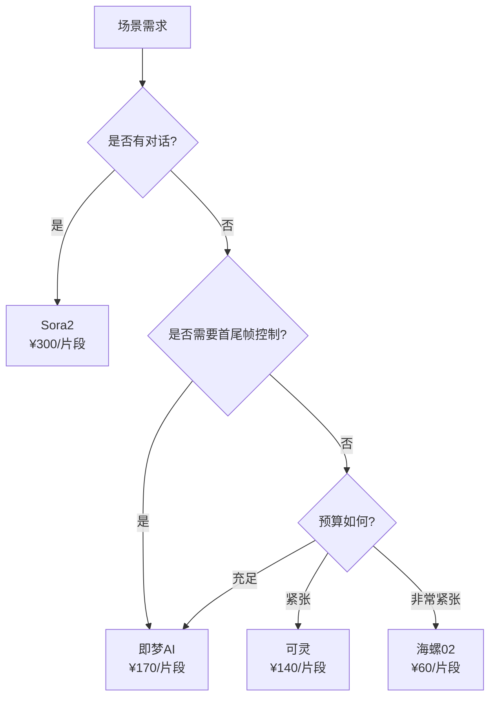

# MovieFlow 用户使用手册

> 📘 面向创作者的完整使用指南 - 从零开始创建专业AI短视频

## 📖 快速导航

- [🚀 5分钟上手](#-5分钟上手)
- [📋 核心命令参考](#-核心命令参考)
- [🎬 完整创作流程](#-完整创作流程)
- [💰 成本优化建议](#-成本优化建议)
- [🔧 故障排除](#-故障排除)
- [❓ 常见问题](#-常见问题)

---

## 🚀 5分钟上手

### 前置准备

1. **安装 MovieFlow**
   ```bash
   npm install -g movieflow-cli
   ```

2. **配置API密钥**
   ```bash
   # 创建 .env 文件
   cp .env.example .env

   # 编辑 .env，添加火山引擎密钥
   VOLCANO_ACCESS_KEY=你的AccessKeyID
   VOLCANO_SECRET_KEY=你的SecretAccessKey
   ```

3. **初始化项目**
   ```bash
   movieflow init
   ```

### 创建你的第一个视频

在 AI 助手（Claude Code/Cursor）中执行：

```
1️⃣ /specify 创建一个30秒的产品介绍视频，展示智能手表的核心功能

2️⃣ /validate [项目名]

3️⃣ /implement [项目名]
```

✅ **就这么简单！** 30分钟后你会得到一个完整的视频。

---

## 📋 核心命令参考

MovieFlow 提供6个核心命令，按照工作流程依次使用：

### 1️⃣ `/specify` - 创建项目规格

**用途**：将你的创意想法转化为结构化的视频规格

**何时使用**：每个新项目的第一步

**使用方法**：
```
/specify [用自然语言描述你的视频创意]
```

**示例**：
```
/specify 创建一个60秒的健康管理APP介绍视频，目标用户是30-40岁
的职场人士，风格轻松专业，展示数据追踪和AI建议功能

/specify 制作唐僧相亲的搞笑短视频，Q版卡通风格，通过问答形式
展现唐僧的工作经历和个人优势

/specify 美食探店视频，介绍川菜馆的招牌菜，突出麻辣鲜香，
30秒抖音竖屏格式
```

**输出说明**：
- 自动分解为6个10秒场景
- 包含画面、音频、字幕设计
- 标记所有待确认项 `[NEEDS CLARIFICATION]`
- 生成文件：`specs/[编号-项目名]/spec.md`

**常见问题**：
- ❓ **描述越详细越好吗？** 是的，但重点说明：目标受众、风格、核心信息
- ❓ **可以修改生成的规格吗？** 可以，直接编辑 `spec.md` 文件
- ❓ **必须是60秒吗？** 推荐60秒（6×10秒），也可以30秒（3×10秒）

---

### 2️⃣ `/plan` - 制定技术方案

**用途**：将规格转化为具体的技术实现方案

**何时使用**：规格确认后，生成前

**使用方法**：
```
/plan [项目名]
```

**示例**：
```
/plan health-app-intro
```

**输出说明**：
- 选择视频生成平台（即梦AI/Sora2/可灵等）
- 估算成本和时间
- 制定API调用策略
- 生成文件：`specs/[项目名]/plan.md`

**平台选择建议**：

| 场景需求 | 推荐平台 | 单片段成本 | 特点 |
|---------|---------|-----------|------|
| 对话/口播 | Sora2 | ¥300 | 唯一支持唇形同步 |
| 连续镜头 | 即梦AI | ¥170 | 支持首尾帧控制 |
| 预算紧张 | 可灵 | ¥140 | 性价比高 |
| 快速原型 | 海螺02 | ¥60 | 最高6秒/片段 |

**常见问题**：
- ❓ **如何降低成本？** 使用混合平台策略（对话用Sora2，其他用即梦AI）
- ❓ **plan会自动选择最佳平台吗？** 是的，基于场景需求自动推荐
- ❓ **可以手动指定平台吗？** 可以，编辑 `plan.md` 修改平台配置

---

### 3️⃣ `/tasks` - 生成任务列表

**用途**：将技术方案分解为可执行的任务

**何时使用**：plan 确认后，生成前（可选步骤）

**使用方法**：
```
/tasks [项目名]
```

**示例**：
```
/tasks health-app-intro
```

**输出说明**：
- 分解为具体任务（场景生成、音频处理、视频合成等）
- 标记任务优先级和依赖关系
- 生成文件：`specs/[项目名]/tasks.md`

**任务组织方式**：
```markdown
## 场景生成 [P1-重要]
- [ ] 生成场景1：开场钩子
- [ ] 生成场景2：背景介绍
...

## 音频制作 [P1-重要]
- [ ] 生成配音
- [ ] 添加背景音乐

## 后期合成 [P2-常规]
- [ ] 场景拼接
- [ ] 音视频同步
```

**常见问题**：
- ❓ **必须执行tasks吗？** 不必须，可以直接跳到 implement
- ❓ **tasks有什么用？** 帮助理解生成流程，适合复杂项目

---

### 4️⃣ `/validate` - 渐进式验证（推荐）

**用途**：低成本验证视频效果，避免直接生成的高成本试错

**何时使用**：plan 后、implement 前（强烈推荐）

**使用方法**：
```
/validate [项目名] [选项]
```

**示例**：
```bash
# 完整验证（L0文本分析 + L1图像预览）
/validate health-app-intro

# 仅文本验证（免费）
/validate health-app-intro --skip-l1

# 只预览部分场景
/validate health-app-intro --scenes "1,3,6"
```

**验证级别**：

| 级别 | 成本 | 时间 | 输出 | 适用场景 |
|-----|------|------|------|---------|
| **L0** | 免费 | 即时 | 提示词质量分析 | 所有项目必做 |
| **L1** | ¥6 | 30秒 | 6张关键帧图像 | 强烈推荐 |

**L0 验证输出**：
```
📊 提示词质量分析:
  场景1: 85/100 分
    ✅ 包含场景描述
    ✅ 包含人物描述
    ⚠️ 建议添加视觉风格描述

  平均分数: 88.5/100
  总体建议: 质量良好，可以继续
```

**L1 图像预览输出**：
```
🖼️ 关键帧预览已生成：
  output/preview/l1-preview-1.jpg - 场景1
  output/preview/l1-preview-2.jpg - 场景2
  ...

  💰 预览成本：6元
```

**成本对比**：
- ❌ **直接生成**：¥170 → 不满意 → 再¥170 → 总计¥340+
- ✅ **渐进验证**：¥0(L0) + ¥6(L1) + ¥170(生成) = ¥176

**常见问题**：
- ❓ **L1图像够准确吗？** 80-90%准确度，足以判断风格和构图
- ❓ **每次修改都要重新验证吗？** 是的，但L0免费可无限验证
- ❓ **L1失败了怎么办？** 根据建议修改规格，重新L0→L1

---

### 5️⃣ `/preview` - 动态预览（可选）

**用途**：生成10秒测试视频，验证动态效果

**何时使用**：L1验证通过，但仍不确定动态效果时

**使用方法**：
```
/preview [项目名] [选项]
```

**示例**：
```bash
# 预览第1个场景
/preview health-app-intro --scene 1

# 包含音频和字幕的完整预览
/preview health-app-intro --scene 3 --with-audio --with-subtitle

# 高质量预览
/preview health-app-intro --quality high
```

**预览策略建议**：

选择最关键的场景预览：
- **开场场景**：验证整体风格和吸引力
- **高潮场景**：测试复杂效果和动画
- **对话场景**：检查口型同步（如使用Sora2）
- **动作场景**：验证运动流畅度

**成本说明**：
- 单次L2预览：约¥28（10秒视频）
- 建议预览次数：1-2次
- 相比完整生成（¥170）节省：84%

**输出示例**：
```
✅ 预览生成完成！
  视频文件：output/preview/l2-preview-scene1.mp4
  文件大小：8.5 MB
  分辨率：1080×1920

  💰 预览成本：28元

  📊 效果评估：
    ✅ 画面流畅度：良好
    ✅ 音画同步：正常
    ⚠️ 建议：可以增强背景细节
```

**常见问题**：
- ❓ **必须preview吗？** 不必须，L1验证通过可直接implement
- ❓ **预览效果=最终效果吗？** 接近但不完全等同，约90%相似
- ❓ **预览失败怎么办？** 返回修改plan或spec，重新验证

---

### 6️⃣ `/implement` - 执行生成

**用途**：生成完整的60秒视频

**何时使用**：验证通过，准备生成最终视频

**使用方法**：
```
/implement [项目名] [选项]
```

**示例**：
```bash
# 基础生成
/implement health-app-intro

# 指定平台
/implement health-app-intro --platform sora2

# 跳过验证（不推荐）
/implement health-app-intro --skip-validation

# 断点续传
/implement health-app-intro --resume
```

**生成流程**：
```
1. 并行生成6个10秒片段
   ├─ 批次1：场景1-3（并发3个）
   └─ 批次2：场景4-6（并发3个）

2. 视频合成
   ├─ 场景拼接
   ├─ 添加转场效果
   └─ 统一分辨率

3. 音频处理
   ├─ 生成配音（TTS）
   ├─ 添加背景音乐
   └─ 音视频同步

4. 输出成品
   └─ output/final.mp4
```

**成功输出**：
```
✅ 视频生成完成!

📝 基本信息:
  项目名称: health-app-intro
  总时长: 60秒
  片段数量: 6个

🎬 生成片段:
  场景1: ./output/scene-01.mp4 (¥170, 12分钟)
  场景2: ./output/scene-02.mp4 (¥170, 11分钟)
  ...

💰 成本统计:
  平台: 即梦AI v3.0 Pro
  总成本: ¥1020

⏱️ 时间统计:
  总时长: 73分钟

📦 输出文件:
  合成视频: ./output/final.mp4
  音频文件: ./output/voice.mp3
  字幕文件: ./output/subtitle.ass
```

**常见问题**：
- ❓ **生成失败怎么办？** 使用 `--resume` 断点续传
- ❓ **能否只生成部分场景？** 可以，使用 `--scenes 1,3,5`
- ❓ **如何切换平台？** 编辑 plan.md 或使用 `--platform` 参数

---

## 🎬 完整创作流程

### 场景1：产品介绍视频

**需求**：为健康管理APP制作30秒介绍视频，目标用户是职场白领

#### Step 1: 创建规格
```
/specify 创建一个30秒的健康管理APP介绍视频，目标用户是25-35岁
职场白领，展示核心功能：健康数据追踪、AI健康建议、个性化方案，
风格简洁专业，抖音竖屏格式
```

**AI会生成**：
- 3个10秒场景（开场钩子、功能展示、行动号召）
- 每个场景的画面、音频、字幕设计
- 标记待确认项（如APP名称、品牌色等）

#### Step 2: 优化规格
编辑 `specs/001-health-app-intro/spec.md`：
- 补充APP名称："健康+"
- 确认品牌色：科技蓝 #0066CC
- 调整场景描述

#### Step 3: 制定方案
```
/plan health-app-intro
```

**AI会选择**：
- 平台：即梦AI（无对话场景，性价比高）
- 预估成本：3片段 × ¥170 = ¥510
- 预估时间：约20分钟

#### Step 4: 验证效果
```
/validate health-app-intro
```

**检查L1图像预览**：
- 场景1：都市职场场景 ✅
- 场景2：APP界面展示 ⚠️ 调整界面布局
- 场景3：用户满意表情 ✅

修改场景2描述后重新验证。

#### Step 5: 生成视频
```
/implement health-app-intro
```

20分钟后得到完整视频！

**总成本**：
- L0验证：¥0
- L1验证：¥3（3场景 × ¥1）
- 生成：¥510
- **总计：¥513**（vs 直接生成后返工 ¥1020+）

---

### 场景2：品牌故事视频

**需求**：咖啡品牌故事，从种植到杯中的旅程，60秒

#### Step 1: 创建规格
```
/specify 咖啡品牌故事视频，讲述从云南咖啡园种植到消费者手中的
完整旅程，展现匠心工艺，60秒，温馨治愈风格，横屏16:9
```

**生成6个场景**：
1. 云南咖啡园日出
2. 农人采摘咖啡果
3. 精心烘焙过程
4. 咖啡师手工冲泡
5. 消费者品味时刻
6. 品牌LOGO和Slogan

#### Step 2: 验证与调整
```
/validate coffee-story
```

L1预览发现：
- 场景3烘焙设备不够专业 → 修改提示词
- 场景5消费场景太普通 → 增加环境细节

#### Step 3: 关键场景预览
```
/preview coffee-story --scene 5 --with-audio
```

验证消费场景的氛围和音乐是否匹配。

#### Step 4: 生成
```
/implement coffee-story
```

**混合平台策略**：
- 场景1-5：即梦AI（¥170/片段）
- 场景6：可灵（品牌展示，¥140/片段）
- **总计：¥990**（vs 全用即梦 ¥1020，节省¥30）

---

### 场景3：教程类视频

**需求**：短视频运营教程，教新手如何提高播放量

#### Step 1: 规格设计
```
/specify 短视频运营教程，5个关键技巧提升播放量，面向新手博主，
60秒，信息量大，配字幕，横屏格式便于笔记
```

**6个场景设计**：
1. 开场：痛点展示（低播放量困扰）
2. 技巧1：选题策略
3. 技巧2：开头3秒设计
4. 技巧3：节奏控制
5. 技巧4：互动引导
6. 总结：行动号召

#### Step 2: 平台选择
因为是教程类，无需复杂动画：
- 选择海螺02（成本低，6秒/片段足够）
- 10个6秒片段
- 成本：10 × ¥60 = ¥600

#### Step 3: 字幕优化
重点配置字幕：
- 关键词高亮（黄色）
- 数字和百分比放大
- 技巧编号醒目

#### Step 4: 生成
```
/implement tutorial-tips
```

**特色**：
- 信息密度高
- 字幕清晰
- 成本控制好

---

## 💰 成本优化建议

### 渐进式验证路径

**传统方式**（总成本¥1020+）：
```
直接生成 → 不满意 → 修改 → 重新生成 → 还不满意 → 再生成
¥170     ¥170       ¥170        ¥170          ¥170
```

**MovieFlow方式**（总成本¥176-204）：
```
L0验证 → L1预览 → 满意 → 生成
¥0      ¥6      ✅    ¥170

L0验证 → L1预览 → 不满意 → 修改L0 → L1验证 → 生成
¥0      ¥6      ❌       ¥0       ¥6      ¥170
```

**节省**：59-80%

---

### 平台选择策略

#### 按场景需求选择



#### 混合平台策略

**示例**：60秒视频，前2个场景对话，后4个场景展示

| 方案 | 策略 | 成本 |
|-----|------|------|
| 方案A | 全用Sora2 | ¥1800 |
| 方案B | 对话用Sora2，展示用即梦AI | ¥1280（节省29%）|
| 方案C | 全用即梦AI（去掉唇同步）| ¥1020（节省43%）|

**推荐**：方案B（兼顾质量和成本）

---

### 批量优化

**场景**：需要制作10个类似视频（如产品系列）

#### 1. 创建模板
```
/specify 产品介绍视频模板，展示核心功能和优势...
```

保存为模板：
```bash
movieflow save-template specs/001-product-intro --name "产品介绍模板"
```

#### 2. 批量应用
```
# 基于模板创建新项目
movieflow create-from-template "产品介绍模板" product-A
movieflow create-from-template "产品介绍模板" product-B
...
```

#### 3. 成本节省
- 规格复用：节省规划时间
- 验证复用：模板验证过，新项目只需微调
- 批量生成：10个视频总成本 ¥1700（vs 逐个测试 ¥3400+）

---

## 🔧 故障排除

### API错误

#### 错误1: "认证失败"
```
❌ Error: Authentication failed
```

**原因**：API密钥配置错误

**解决**：
```bash
# 检查 .env 文件
cat .env

# 确保格式正确（无引号、无空格）
VOLCANO_ACCESS_KEY=AKLTxxx
VOLCANO_SECRET_KEY=xxx
```

---

#### 错误2: "API限流"
```
❌ Error: Rate limit exceeded
```

**原因**：短时间内请求过多

**解决**：
- 等待1-2分钟后重试
- 减少并发数（默认3，可改为2）
- 检查是否有其他程序在调用API

---

#### 错误3: "余额不足"
```
❌ Error: Insufficient balance
```

**原因**：火山引擎账户余额不足

**解决**：
- 登录火山引擎控制台充值
- 生成前使用 `/estimate` 预估成本

---

### 生成失败

#### 问题1: 某个场景生成失败
```
⚠️ 场景3生成失败: Timeout
```

**解决**：
```bash
# 使用断点续传
/implement [项目名] --resume

# 或只重新生成失败场景
/implement [项目名] --scenes 3
```

---

#### 问题2: 提示词被拒绝
```
❌ Content policy violation
```

**原因**：提示词包含敏感内容

**解决**：
- 检查spec.md中的场景描述
- 移除可能敏感的词汇（暴力、色情、政治等）
- 重新 `/validate` 验证

---

#### 问题3: 视频质量不符预期
```
✅ 生成完成，但画面模糊/人物变形
```

**解决**：
1. **检查L1预览**：是否在预览时已发现问题？
2. **优化提示词**：
   - 增加细节描述
   - 明确视觉风格
   - 添加参考示例
3. **切换平台**：不同平台擅长不同风格
4. **调整参数**：在plan.md中调整quality设置

---

### 音视频问题

#### 问题1: 音画不同步
```
视频和音频时间轴对不上
```

**解决**：
```bash
# 检查音频长度
ffprobe output/voice.mp3

# 重新生成音频
/implement [项目名] --regenerate-audio

# 或手动调整偏移
ffmpeg -i video.mp4 -itsoffset 0.3 -i audio.mp3 -c copy output.mp4
```

---

#### 问题2: 字幕不显示
```
生成的视频没有字幕
```

**检查**：
- 是否在spec.md中定义了字幕内容？
- 字幕文件是否生成（output/subtitle.ass）？

**解决**：
```bash
# 手动烧录字幕
ffmpeg -i output/final.mp4 -vf "ass=output/subtitle.ass" output/final-with-sub.mp4
```

---

## ❓ 常见问题

### 关于命令使用

#### Q1: 命令的执行顺序必须严格遵守吗？

**A**: 推荐顺序：`specify → plan → validate → tasks → preview → implement`

但可以跳过某些步骤：
- ✅ 可跳过：tasks（小项目）、preview（预算紧张时）
- ⚠️ 不推荐跳过：validate（会增加返工成本）
- ❌ 不可跳过：specify、plan、implement

---

#### Q2: 每次修改都要重新执行所有命令吗？

**A**: 不需要。

- **修改规格**：specify → validate → implement
- **修改平台选择**：编辑plan.md → validate → implement
- **只修改某个场景**：编辑spec.md → implement --scenes [场景编号]

---

#### Q3: 可以同时运行多个项目吗？

**A**: 可以，每个项目独立管理：
```
specs/
├── 001-project-a/
├── 002-project-b/
└── 003-project-c/
```

但注意：
- API并发限制（同时最多3个任务）
- 成本累加
- 生成时间叠加

---

### 关于成本控制

#### Q4: 最低成本生成一个视频需要多少钱？

**A**:
- **最低成本路径**：L0验证（¥0）→ 使用海螺02生成（¥60/片段）
- 30秒视频：3片段 × ¥60 = **¥180**
- 60秒视频：6片段 × ¥60 = **¥360**

但注意：
- 海螺02最多6秒/片段，需要更多片段
- 质量相对较低

---

#### Q5: 如何预估项目总成本？

**A**:
```
/estimate [项目名]
```

会输出详细成本预估：
```
💰 成本预估报告

场景成本: ¥1020 (6片段 × ¥170)
验证成本: ¥18 (L0+L1)
音频成本: ¥20 (TTS)
字幕成本: ¥10

总计: ¥1068
```

---

#### Q6: 生成失败会扣费吗？

**A**:
- ✅ **L0验证失败**：不扣费
- ✅ **L1验证失败**：扣费（¥3-6），但成本极低
- ⚠️ **生成失败**：
  - 任务提交成功但超时：可能扣费
  - 任务提交失败：不扣费
  - 使用断点续传避免重复扣费

---

### 关于平台选择

#### Q7: 如何选择合适的平台？

**A**: 按决策树选择：

```
是否需要对话/口播?
├─ 是 → Sora2（唯一支持唇同步）
└─ 否 ↓

是否需要连续镜头（首尾帧控制）?
├─ 是 → 即梦AI 或 可灵
└─ 否 ↓

预算情况?
├─ 充足 → 即梦AI（质量稳定）
├─ 适中 → 可灵（性价比）
└─ 紧张 → 海螺02（最便宜）
```

或使用AI推荐：
```
/plan [项目名]
```
AI会根据场景需求自动选择最佳平台。

---

#### Q8: 不同平台的质量差异大吗？

**A**: 质量对比：

| 平台 | 画面质量 | 动作流畅度 | 风格一致性 | 特殊能力 |
|-----|---------|-----------|-----------|---------|
| Sora2 | ⭐⭐⭐⭐⭐ | ⭐⭐⭐⭐⭐ | ⭐⭐⭐⭐⭐ | 唇同步、物理模拟 |
| 即梦AI | ⭐⭐⭐⭐ | ⭐⭐⭐⭐ | ⭐⭐⭐⭐ | 首尾帧控制 |
| 可灵 | ⭐⭐⭐⭐ | ⭐⭐⭐ | ⭐⭐⭐⭐ | 首尾帧控制 |
| 海螺02 | ⭐⭐⭐ | ⭐⭐⭐ | ⭐⭐⭐ | 成本低、速度快 |

---

#### Q9: 可以在一个项目中使用多个平台吗？

**A**: 可以（混合平台策略）：

编辑 `plan.md`：
```yaml
场景配置:
  场景1-2:
    平台: sora2
    原因: 需要对话和唇同步
  场景3-6:
    平台: jimeng
    原因: 静态场景，性价比高
```

MovieFlow会自动处理不同平台的调用和合成。

---

### 关于质量优化

#### Q10: 如何提高生成质量？

**A**:

1. **优化提示词**：
   - ✅ 详细描述（环境、人物、动作、情绪）
   - ✅ 明确视觉风格（电影级、卡通、写实）
   - ✅ 使用专业术语（景别、运镜、光线）
   - ❌ 避免模糊词汇（"好看"、"有趣"）

2. **使用渐进验证**：
   - L0发现提示词问题
   - L1确认视觉效果
   - L2验证动态表现

3. **选择合适平台**：
   - 对话场景 → Sora2
   - 动作场景 → 即梦AI
   - 风格化场景 → 根据风格选择

4. **调整质量参数**：
   ```yaml
   # 在 plan.md 中
   quality_settings:
     resolution: 1080p
     framerate: 30fps
     bitrate: high
   ```

---

#### Q11: 生成的人物总是变形怎么办？

**A**:

1. **使用角色一致性功能**（如果平台支持）：
   ```
   在spec.md中定义角色：

   角色设计:
     主角: 25岁女性，黑色长发，白色衬衫，友善微笑
     参考图: [上传参考图URL]
   ```

2. **详细描述角色特征**：
   ```
   ❌ "一个女性"
   ✅ "25岁东亚女性，齐肩黑发，白色衬衫，微笑表情，
       中景镜头，面向镜头"
   ```

3. **避免复杂动作**：
   ```
   ❌ "女性跳舞并旋转"
   ✅ "女性站立，微微点头"
   ```

4. **使用多张关键帧**（如果平台支持首尾帧控制）

---

#### Q12: 场景切换不自然怎么办？

**A**:

1. **使用首尾帧控制**（即梦AI/可灵）：
   ```yaml
   场景2:
     首帧: 承接场景1的结束画面
     尾帧: 为场景3做准备
   ```

2. **添加转场效果**：
   ```yaml
   转场设计:
     场景1→场景2: 淡入淡出
     场景2→场景3: 推镜
     场景3→场景4: 切换
   ```

3. **保持视觉连续性**：
   - 色调统一
   - 风格一致
   - 镜头逻辑合理

---

### 关于技术细节

#### Q13: 生成的视频分辨率是多少？

**A**: 默认分辨率：

| 平台 | 抖音(9:16) | 视频号(1:1) | B站(16:9) |
|-----|-----------|------------|----------|
| Sora2 | 1080×1920 | 1080×1080 | 1920×1080 |
| 即梦AI | 1080×1920 | 1080×1080 | 1920×1080 |
| 可灵 | 1080×1920 | 1080×1080 | 1920×1080 |

可在plan.md中自定义。

---

#### Q14: 支持哪些视频格式？

**A**:
- **输出格式**：MP4（H.264编码）
- **音频格式**：AAC 48kHz
- **字幕格式**：ASS、SRT

可使用FFmpeg转换为其他格式。

---

#### Q15: 可以导出多平台版本吗？

**A**: 可以：

```bash
# 生成时指定多平台
/implement [项目名] --platforms douyin,wechat,bilibili

# 会生成3个版本：
output/
├── final-douyin.mp4    (9:16)
├── final-wechat.mp4    (1:1)
└── final-bilibili.mp4  (16:9)
```

---

## 📚 相关文档

### 深入学习
- 📘 [workflow.md](./workflow.md) - 详细工作流程指南
- 📘 [progressive-validation-guide.md](./progressive-validation-guide.md) - 渐进式验证深入解析
- 📘 [video-prompt-standardization-guide.md](./video-prompt-standardization-guide.md) - 提示词优化技巧

### 技术参考
- 🔧 [platform-adapters/README.md](./platform-adapters/README.md) - 平台适配器文档
- 🔧 [platform-comparison.md](./platform-adapters/platform-comparison.md) - 平台对比表
- 🔧 [data-model.md](./data-model.md) - 数据模型说明

### 开发相关
- 💻 [local-development.md](./local-development.md) - 本地开发指南
- 💻 [PRD.md](./PRD.md) - 产品需求文档

---

## 🎯 快速参考卡片

### 命令速查表

| 命令 | 用途 | 输入 | 输出 | 成本 |
|-----|------|------|------|------|
| `/specify` | 创建规格 | 创意描述 | spec.md | 免费 |
| `/plan` | 技术方案 | 项目名 | plan.md | 免费 |
| `/tasks` | 任务分解 | 项目名 | tasks.md | 免费 |
| `/validate` | 渐进验证 | 项目名 | 分析+图像 | ¥0-6 |
| `/preview` | 动态预览 | 项目名+场景 | 10秒视频 | ¥28 |
| `/implement` | 生成视频 | 项目名 | 完整视频 | ¥360-1800 |

### 成本快速估算

| 场景 | 平台 | 30秒 | 60秒 |
|-----|------|------|------|
| 对话/口播 | Sora2 | ¥900 | ¥1800 |
| 连续镜头 | 即梦AI | ¥510 | ¥1020 |
| 一般场景 | 可灵 | ¥420 | ¥840 |
| 预算紧张 | 海螺02 | ¥300 | ¥600 |

加上验证成本（推荐）：+¥6-34

### 最佳实践清单

**每个项目必做**：
- ✅ 详细描述规格（越具体越好）
- ✅ L0文本验证（免费，必做）
- ✅ L1图像预览（¥6，强烈推荐）
- ✅ 预估成本（使用 /estimate）

**推荐做**：
- ⭐ 使用模板（提高效率）
- ⭐ 混合平台（降低成本）
- ⭐ L2关键场景预览（重要项目）

**可选做**：
- 💡 tasks分解（复杂项目）
- 💡 全场景preview（高要求项目）

---

## 🆘 获取帮助

### 遇到问题？

1. **查看本指南的故障排除章节**
2. **查看详细文档**：[workflow.md](./workflow.md)
3. **检查GitHub Issues**：[movieflow/issues](https://github.com/wordflowlab/movieflow/issues)
4. **提交新Issue**：详细描述问题和错误信息

### 反馈建议

欢迎提供改进建议：
- GitHub Issues
- Pull Requests
- 文档更新请求

---

**祝你创作愉快！** 🎬✨
