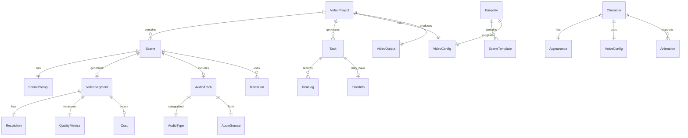
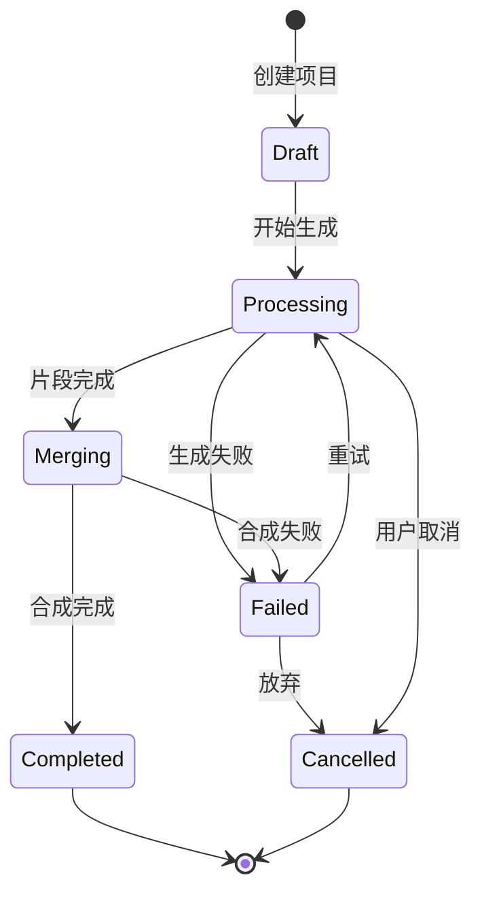
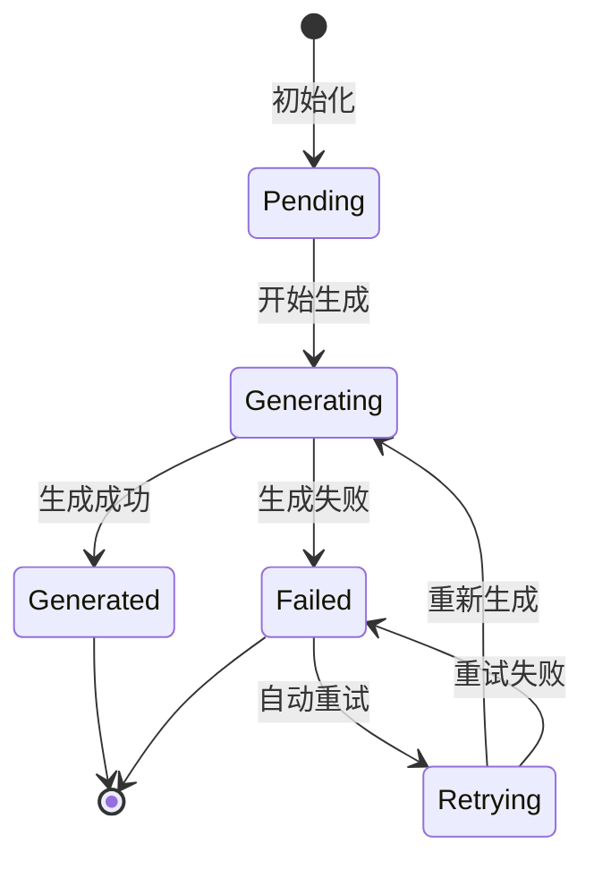

# MovieFlow 数据模型

## 核心实体

### VideoProject（视频项目）

视频项目是最顶层的实体，包含一个完整的视频创作项目。

```typescript
interface VideoProject {
  id: string;                    // 项目唯一标识
  name: string;                   // 项目名称
  description?: string;           // 项目描述
  template?: string;              // 使用的模板ID
  status: ProjectStatus;          // 项目状态
  platform: VideoPlatform;        // 目标平台
  config: VideoConfig;            // 视频配置
  scenes: Scene[];                // 场景列表（6个）
  assets: AssetReference[];       // 资产引用
  output?: VideoOutput;           // 输出结果
  metadata: ProjectMetadata;      // 元数据
  createdAt: Date;               // 创建时间
  updatedAt: Date;               // 更新时间
  completedAt?: Date;            // 完成时间
}

enum ProjectStatus {
  DRAFT = 'draft',
  PROCESSING = 'processing',
  MERGING = 'merging',
  COMPLETED = 'completed',
  FAILED = 'failed',
  CANCELLED = 'cancelled'
}

enum VideoPlatform {
  DOUYIN = 'douyin',           // 抖音
  WECHAT = 'wechat',           // 视频号
  KUAISHOU = 'kuaishou',       // 快手
  CUSTOM = 'custom'            // 自定义
}
```

### Scene（场景）

每个视频包含6个场景，每个场景10秒。

```typescript
interface Scene {
  id: string;                    // 场景ID (scene1-scene6)
  sequence: number;               // 序号 (1-6)
  name: string;                   // 场景名称
  description: string;            // 场景描述
  prompt: ScenePrompt;            // 生成提示词
  duration: number;               // 时长（秒）
  frames: number;                 // 帧数
  segment?: VideoSegment;         // 视频片段
  audio?: AudioTrack;             // 音频轨道
  transitions: Transition[];      // 转场效果
  status: SceneStatus;            // 场景状态
  retryCount: number;            // 重试次数
  error?: ErrorInfo;             // 错误信息
}

interface ScenePrompt {
  visual: string;                 // 视觉描述
  style: string;                  // 风格描述
  mood: string;                   // 氛围描述
  camera?: CameraMovement;        // 镜头运动
  characters?: CharacterDesc[];   // 角色描述
  objects?: ObjectDesc[];         // 物体描述
  background?: string;            // 背景描述
}

enum SceneStatus {
  PENDING = 'pending',
  GENERATING = 'generating',
  GENERATED = 'generated',
  FAILED = 'failed',
  RETRYING = 'retrying'
}
```

### VideoSegment（视频片段）

生成的视频片段数据。

```typescript
interface VideoSegment {
  id: string;                    // 片段ID
  sceneId: string;               // 关联的场景ID
  taskId: string;                // 生成任务ID
  volcanoTaskId?: string;        // 火山引擎任务ID
  model: AIModel;                // 使用的模型
  url?: string;                  // 视频URL
  localPath?: string;            // 本地路径
  duration: number;              // 实际时长
  frames: number;                // 实际帧数
  resolution: Resolution;        // 分辨率
  fps: number;                   // 帧率
  size: number;                  // 文件大小（字节）
  quality: QualityMetrics;       // 质量指标
  generatedAt: Date;             // 生成时间
  cost?: Cost;                   // 生成成本
}

interface Resolution {
  width: number;
  height: number;
  aspectRatio: string;           // "9:16", "16:9", "1:1"
}

interface QualityMetrics {
  clarity: number;               // 清晰度 (0-100)
  stability: number;             // 稳定性 (0-100)
  consistency: number;           // 一致性 (0-100)
  overall: number;              // 综合评分 (0-100)
}
```

### Character（角色）

数字人角色定义。

```typescript
interface Character {
  id: string;                    // 角色ID
  name: string;                  // 角色名称
  type: CharacterType;           // 角色类型
  style: CharacterStyle;         // 视觉风格
  appearance: Appearance;        // 外观描述
  personality: Personality;      // 性格特征
  voice: VoiceConfig;           // 语音配置
  animations: Animation[];       // 动画库
  presets: CharacterPreset[];    // 预设配置
}

enum CharacterType {
  DIGITAL_HUMAN = 'digital_human',  // 数字人
  CARTOON = 'cartoon',              // 卡通
  REALISTIC = 'realistic',          // 写实
  QVERSION = 'q_version'           // Q版
}

interface Appearance {
  gender?: string;
  age?: string;
  clothing: string;
  hairstyle?: string;
  accessories?: string[];
  features: string[];             // 特征描述
}

interface VoiceConfig {
  provider: string;               // TTS提供商
  voiceId: string;               // 音色ID
  language: string;              // 语言
  speed: number;                 // 语速
  pitch: number;                 // 音调
  emotion?: string;              // 情感
}
```

### AudioTrack（音频轨道）

音频数据模型。

```typescript
interface AudioTrack {
  id: string;                    // 音频ID
  type: AudioType;               // 音频类型
  source: AudioSource;           // 音频来源
  url?: string;                  // 音频URL
  text?: string;                 // 文本内容（TTS）
  duration: number;              // 时长
  format: string;                // 格式 (mp3, wav)
  sampleRate: number;            // 采样率
  bitrate: number;               // 比特率
  volume: number;                // 音量 (0-100)
  fadeIn?: number;               // 淡入时长
  fadeOut?: number;              // 淡出时长
}

enum AudioType {
  VOICE = 'voice',               // 人声
  BGM = 'bgm',                   // 背景音乐
  SFX = 'sfx',                   // 音效
  NARRATION = 'narration'        // 旁白
}

enum AudioSource {
  TTS = 'tts',                   // 语音合成
  UPLOADED = 'uploaded',         // 用户上传
  LIBRARY = 'library',           // 素材库
  GENERATED = 'generated'        // AI生成
}
```

### Task（任务）

异步任务管理。

```typescript
interface Task {
  id: string;                    // 任务ID
  type: TaskType;                // 任务类型
  projectId: string;             // 项目ID
  targetId?: string;             // 目标ID（场景/片段）
  status: TaskStatus;            // 任务状态
  progress: number;              // 进度 (0-100)
  priority: number;              // 优先级
  attempts: number;              // 尝试次数
  maxAttempts: number;           // 最大尝试次数
  input: any;                    // 输入参数
  output?: any;                  // 输出结果
  error?: ErrorInfo;             // 错误信息
  logs: TaskLog[];               // 执行日志
  createdAt: Date;               // 创建时间
  startedAt?: Date;              // 开始时间
  completedAt?: Date;            // 完成时间
  estimatedTime?: number;        // 预计时长（秒）
}

enum TaskType {
  VIDEO_GENERATION = 'video_generation',
  IMAGE_GENERATION = 'image_generation',
  AUDIO_SYNTHESIS = 'audio_synthesis',
  VIDEO_MERGE = 'video_merge',
  QUALITY_CHECK = 'quality_check'
}

enum TaskStatus {
  PENDING = 'pending',
  QUEUED = 'queued',
  PROCESSING = 'processing',
  COMPLETED = 'completed',
  FAILED = 'failed',
  CANCELLED = 'cancelled',
  RETRYING = 'retrying'
}

interface TaskLog {
  timestamp: Date;
  level: 'debug' | 'info' | 'warn' | 'error';
  message: string;
  data?: any;
}
```

### Template（模板）

预定义的视频模板。

```typescript
interface Template {
  id: string;                    // 模板ID
  name: string;                  // 模板名称
  category: string;              // 类别
  description: string;           // 描述
  thumbnail: string;             // 缩略图
  scenes: SceneTemplate[];       // 场景模板
  defaultConfig: VideoConfig;    // 默认配置
  tags: string[];                // 标签
  popularity: number;            // 使用次数
  rating: number;                // 评分
  author: string;                // 作者
  createdAt: Date;               // 创建时间
  updatedAt: Date;               // 更新时间
}

interface SceneTemplate {
  sequence: number;
  name: string;
  promptTemplate: string;        // 提示词模板
  duration: number;
  suggestedMusic?: string;
  transitions?: string[];
  variables?: TemplateVariable[];
}

interface TemplateVariable {
  name: string;
  type: 'text' | 'select' | 'number' | 'color';
  default?: any;
  options?: any[];
  required: boolean;
}
```

### VideoConfig（视频配置）

视频生成配置。

```typescript
interface VideoConfig {
  resolution: Resolution;        // 分辨率
  fps: number;                   // 帧率
  quality: 'low' | 'medium' | 'high' | 'ultra';
  codec: string;                 // 编码格式
  bitrate?: number;              // 比特率
  keyframeInterval?: number;     // 关键帧间隔
  colorSpace?: string;           // 色彩空间
  hdr?: boolean;                 // HDR支持
  effects: VideoEffects;         // 特效配置
}

interface VideoEffects {
  transitions: boolean;          // 启用转场
  transitionDuration: number;    // 转场时长
  transitionType?: string;       // 转场类型
  filters?: string[];            // 滤镜列表
  watermark?: WatermarkConfig;   // 水印配置
  subtitles?: SubtitleConfig;    // 字幕配置
}

interface WatermarkConfig {
  enabled: boolean;
  text?: string;
  image?: string;
  position: 'top-left' | 'top-right' | 'bottom-left' | 'bottom-right';
  opacity: number;
  size: number;
}
```

### Cost（成本）

API调用成本记录。

```typescript
interface Cost {
  provider: string;              // 服务提供商
  service: string;               // 服务类型
  amount: number;                // 金额
  currency: string;              // 货币
  units?: number;                // 单位数量
  unitPrice?: number;            // 单价
  timestamp: Date;               // 时间戳
  details?: any;                 // 详细信息
}
```

### ErrorInfo（错误信息）

错误详情。

```typescript
interface ErrorInfo {
  code: string;                  // 错误码
  message: string;               // 错误消息
  details?: any;                 // 详细信息
  stack?: string;                // 调用栈
  timestamp: Date;               // 发生时间
  retriable: boolean;            // 是否可重试
  suggestedAction?: string;      // 建议操作
}
```

## 关系图



## 状态机

### 项目状态流转



### 场景状态流转



## 数据约束

### 业务规则

1. **项目约束**
   - 每个项目必须包含正好6个场景
   - 项目名称唯一，长度2-50字符
   - 同时处理的项目数不超过3个

2. **场景约束**
   - 每个场景时长10秒（±0.5秒容差）
   - 场景序号1-6，不可重复
   - 提示词长度10-500字符
   - 最大重试次数3次

3. **视频约束**
   - 支持的分辨率：1080×1920, 1920×1080, 1080×1080
   - 帧率范围：24-30 fps
   - 文件大小限制：单片段<100MB，总视频<500MB

4. **任务约束**
   - 任务超时时间：片段5分钟，合成10分钟
   - 并发任务数：最多3个
   - 任务队列长度：最多100个

5. **成本约束**
   - 每日免费额度：10个视频
   - 付费用户额度：根据套餐
   - 成本记录保留：90天

### 数据验证

```typescript
// 项目名称验证
const validateProjectName = (name: string): boolean => {
  return name.length >= 2 &&
         name.length <= 50 &&
         /^[\u4e00-\u9fa5a-zA-Z0-9\-_]+$/.test(name);
};

// 场景提示词验证
const validatePrompt = (prompt: string): boolean => {
  return prompt.length >= 10 &&
         prompt.length <= 500 &&
         !containsSensitiveWords(prompt);
};

// 时长验证
const validateDuration = (duration: number, expected: number): boolean => {
  const tolerance = 0.5;
  return Math.abs(duration - expected) <= tolerance;
};

// 分辨率验证
const validateResolution = (width: number, height: number): boolean => {
  const validResolutions = [
    [1080, 1920], // 9:16
    [1920, 1080], // 16:9
    [1080, 1080]  // 1:1
  ];
  return validResolutions.some(([w, h]) => w === width && h === height);
};
```

## 索引设计

### 主要索引

```sql
-- 项目索引
CREATE INDEX idx_project_status ON video_projects(status);
CREATE INDEX idx_project_created ON video_projects(created_at DESC);
CREATE UNIQUE INDEX idx_project_name ON video_projects(name);

-- 场景索引
CREATE INDEX idx_scene_project ON scenes(project_id);
CREATE INDEX idx_scene_status ON scenes(status);
CREATE INDEX idx_scene_sequence ON scenes(project_id, sequence);

-- 任务索引
CREATE INDEX idx_task_status ON tasks(status, priority DESC);
CREATE INDEX idx_task_project ON tasks(project_id);
CREATE INDEX idx_task_created ON tasks(created_at);

-- 片段索引
CREATE INDEX idx_segment_scene ON video_segments(scene_id);
CREATE INDEX idx_segment_task ON video_segments(task_id);
```

## 数据生命周期

### 保留策略

| 数据类型 | 保留期限 | 清理策略 |
|---------|---------|---------|
| 项目元数据 | 永久 | 不清理 |
| 视频文件 | 30天 | 自动归档 |
| 临时文件 | 24小时 | 自动删除 |
| 任务日志 | 7天 | 压缩归档 |
| 错误日志 | 30天 | 导出备份 |
| 成本记录 | 90天 | 月度汇总 |

### 数据迁移

```typescript
interface DataMigration {
  version: string;
  description: string;
  up: () => Promise<void>;
  down: () => Promise<void>;
  timestamp: Date;
}

// 示例迁移
const migration_001: DataMigration = {
  version: '1.0.1',
  description: '添加场景标签字段',
  up: async () => {
    // ALTER TABLE scenes ADD COLUMN tags JSON;
  },
  down: async () => {
    // ALTER TABLE scenes DROP COLUMN tags;
  }
};
```

---

**文档版本**: v1.0.0
**更新日期**: 2024-09-20
**数据库版本**: 1.0.0