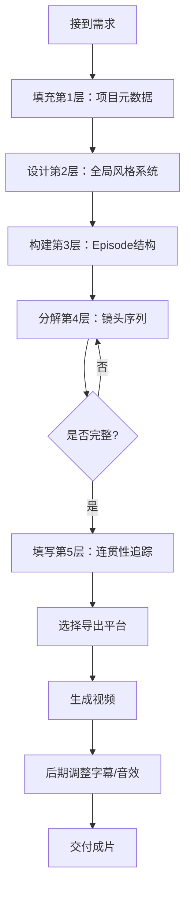

# 模板一：分层式结构 (Layered Structure Template)

## 概述

**适用场景**：
- ✅ 需要与MovieFlow Episode Spec无缝集成
- ✅ 需要跨多个镜头/场景的连贯性管理
- ✅ 需要扩展到60-120秒长视频
- ✅ 需要精确控制对话、字幕、音效的时间点
- ✅ 适合团队协作的结构化工作流

**核心优势**：
- 📋 5层清晰分离：元数据 → 全局风格 → 场景设定 → 镜头序列 → 连贯性
- 🔄 完美解决原始提示词的4大不足（对话、字幕、时长、连贯性）
- 🎯 AI平台无关：可导出为Sora2/Runway/即梦任意格式
- 🧩 模块化：每一层可独立调整

---

## 五层结构详解

### 第1层：项目元数据 (Project Metadata)

```yaml
PROJECT_ID: commercial_dudou_wangjiaweilstyle_v2
PLATFORM: Sora2  # 或 Runway Gen-4, 即梦Agent模式
TARGET_DURATION: 90s  # ⭐ 扩展到90秒
ASPECT_RATIO: 9:16  # 竖屏短视频
RESOLUTION: 1080x1920
FRAME_RATE: 24fps
BRAND: 传统服饰品牌「锦绣华裳」
CAMPAIGN: 2025新春系列
DELIVERABLE: 抖音/视频号付费推广素材
```

**为什么重要**：
- 确定技术约束（平台能力、时长上限）
- 品牌调性指导后续所有创意决策

---

### 第2层：全局设计系统 (Global Design System)

#### 2.1 视觉风格 (Visual Style)

```yaml
PRIMARY_STYLE: 王家卫电影美学
  - 怀旧色调：暖黄、深绿、褪色红
  - 0.8秒快速剪辑节奏
  - 手持摄影的晃动感
  - 霓虹灯招牌的柔和漫反射

COLOR_GRADING:
  Shadows: 深绿色调 (Teal shadows)
  Midtones: 暖黄偏移 +15
  Highlights: 柔和溢出 (Bloom +0.3)
  Saturation: 整体 -20% (褪色感)
  Film Grain: 35mm胶片颗粒感

LIGHTING_SYSTEM:
  - Key Light: 霓虹灯 (色温 3200K, Magenta偏移)
  - Fill Light: 环境反射 (Bounce from neon signs)
  - Rim Light: 背景橙色霓虹轮廓光
  - Atmosphere: 薄雾 (Haze density 0.15)
```

#### 2.2 音频设计系统 (Audio Design System)

```yaml
MUSIC:
  Track: 复古爵士乐 + 现代电子节拍融合
  BPM: 95
  Key: D minor (忧郁而复古)
  Volume: -18dB (为对话和SFX留空间)
  Timing:
    - 0:00-0:05 前奏渐入
    - 0:05-1:15 主旋律循环
    - 1:15-1:30 尾奏淡出

VOICEOVER:
  Talent: 女声，30-35岁，磁性低沉
  Tone: 诗意独白，慵懒而神秘
  Language: 普通话带港式口音
  Processing: 轻混响 (Reverb 15%, Decay 1.2s)

SFX_PALETTE:
  - 环境音：香港街头远处车声、人声嘈杂
  - 特写音：丝绸摩擦、玉佩碰撞、高跟鞋点地
  - 转场音：时钟滴答、霓虹灯电流声
```

---

### 第3层：Episode/场景结构 (Episode Structure)

#### Episode 01: 完整90秒叙事 (Complete 90s Narrative)

**主题**：《旧时光里的新年愿》

**叙事弧线**：
1. **起始 (0-20s)**: 主角在旧街巷徘徊，怀念旧情
2. **冲突 (20-50s)**: 回忆片段闪回，对比今昔
3. **高潮 (50-75s)**: 决定放下过去，迎接新年
4. **结局 (75-90s)**: 换上新肚兜，烟花绽放，露出微笑

**角色设定**：
```yaml
CHARACTER_01:
  Name: 林婉秋
  Age: 28岁
  Appearance:
    - 身高165cm，纤细身材
    - 长发盘起，露出天鹅颈
    - 肚兜：墨绿色丝绸，金线刺绣梅花
    - 配饰：玉镯、耳坠、绣花鞋
  Personality: 内敛、感性、带着旧时代的优雅
  Emotional Arc: 忧郁 → 犹豫 → 释怀 → 希望
  Continuity Notes:
    - 耳坠始终为翡翠雕花款（所有镜头统一）
    - 发髻松紧度随情绪变化（忧郁时松散，释怀后整齐）
```

**地点设定**：
```yaml
LOCATION: 90年代香港旧街区（重庆大厦风格）
  Time: 除夕夜晚 20:00-22:00
  Weather: 薄雾，微冷
  Props:
    - 霓虹灯招牌（粤语广告牌、麻将馆、茶餐厅）
    - 竹竿晾衣、老式电话亭
    - 红色灯笼（新年装饰）
    - 鞭炮纸屑散落地面
```

---

### 第4层：镜头序列 (Shot Sequence)

#### Shot 01-A: 开场氛围营造
```yaml
TIMECODE: 0:00 - 0:05 (5秒)
SHOT_SIZE: EWS (Extreme Wide Shot)
CAMERA:
  Movement: 缓慢Crane向下 (从楼顶俯瞰街道)
  Lens: 24mm广角
  Speed: 极慢 (Slow motion 0.5x)

VISUAL:
  > 90年代香港旧街区鸟瞰图。霓虹灯招牌在薄雾中闪烁，
  > 粤语广告牌、茶餐厅、麻将馆的红绿蓝光交织。
  > 街道湿漉，反射着彩色光斑。远处传来除夕夜的喧闹。

DIALOGUE: [无]

SUBTITLE:
  Text: "除夕夜，旧街区"
  Position: 中下位置
  Style: 宋体，48px，白色带黑色描边
  Animation: 淡入 0.3s，停留 2.5s，淡出 0.3s
  Timing: 0:01 - 0:04

AUDIO:
  Music: 前奏渐入（爵士钢琴和弦 + 氛围Pad）
  SFX:
    - 远处鞭炮声 (0:02, -22dB)
    - 街道嘈杂人声 (0:00持续, -28dB)
  Ambience: 城市夜晚低频嗡鸣

CONTINUITY:
  - 建立时间：除夕夜 20:00
  - 建立地点：香港旧街区
  - 天气：薄雾，微冷
```

---

#### Shot 01-B: 引入主角
```yaml
TIMECODE: 0:05 - 0:12 (7秒)
SHOT_SIZE: MS (Medium Shot)
CAMERA:
  Movement: Dolly跟拍 (侧面平移跟随人物)
  Lens: 35mm标准镜头
  Height: 胸部高度
  Speed: 正常速度

VISUAL:
  > 林婉秋侧面行走在街道上。她穿着墨绿色丝绸肚兜，
  > 外罩薄纱长衫，露出香肩。霓虹灯光从侧面照亮她的轮廓，
  > 头发盘起，玉镯在手腕轻轻摇晃。表情忧郁，眼神望向远方。
  > 背景霓虹招牌失焦成光斑（浅景深f/1.4）。

DIALOGUE:
  - Speaker: 林婉秋（旁白）
    Text: "这条街，我已经走了十年。"
    Timing: 0:06 - 0:10
    Tone: 低沉、诗意、带着怀念
    Lip_Sync: false  # 内心独白，口型不动
    Audio_Processing: 轻混响 + 低通滤波（模拟回忆感）

SUBTITLE:
  Text: "这条街，我已经走了十年。"
  Position: 中下
  Style: 楷体，44px，淡黄色 (#F4E8C1)
  Animation: 逐字显示（每字0.15s间隔）
  Timing: 0:06 - 0:11

AUDIO:
  Music: 主旋律进入（小提琴 + 钢琴）
  SFX:
    - 丝绸衣物摩擦声 (0:05, -18dB)
    - 高跟鞋点地声 (每0.8s一次, -16dB)
    - 玉镯碰撞声 (0:07, 0:09, -20dB)
  Ambience: 继续街道环境音

CONTINUITY:
  Character_State:
    林婉秋:
      Emotion: 忧郁、怀念
      Location: 街道中段，向前行走
      Costume: 墨绿色肚兜 + 薄纱长衫
      Props: 玉镯（左手腕），翡翠耳坠（确认可见）
```

---

#### Shot 02-A: 回忆闪回（快速剪辑组）
```yaml
TIMECODE: 0:12 - 0:20 (8秒，分为4个2秒快切镜头)

# === 子镜头 02-A1 ===
SUB_SHOT: 02-A1
DURATION: 0:12 - 0:14 (2秒)
SHOT_SIZE: ECU (Extreme Close-Up)
CAMERA: 手持晃动

VISUAL:
  > 林婉秋眼睛的特写。瞳孔中倒映着霓虹灯光。
  > 缓慢眨眼，睫毛上沾着薄雾水珠。

DIALOGUE: [无]

SUBTITLE: [无]

AUDIO:
  Music: 暂停（留白制造张力）
  SFX:
    - 时钟滴答声突然放大 (0:12, -10dB, 回音效果)
    - 心跳声 (0:13, 低频 60Hz, -15dB)

---

# === 子镜头 02-A2 ===
SUB_SHOT: 02-A2
DURATION: 0:14 - 0:16 (2秒)
SHOT_SIZE: CU (Close-Up)
CAMERA: 固定特写

VISUAL:
  > 五年前的除夕夜（褪色处理，更暖黄）。
  > 林婉秋年轻时的面容，笑容灿烂，
  > 一双手为她戴上玉镯（男性手，不露脸）。

DIALOGUE: [无]

SUBTITLE:
  Text: "五年前"
  Position: 左上角（小字）
  Style: 仿宋，32px，半透明 (#FFFFFF, 60% opacity)
  Timing: 0:14 - 0:16

AUDIO:
  Music: 短暂的怀旧旋律片段（八音盒音色）
  SFX: 玉镯滑入手腕的声音 (0:15, -14dB)

---

# === 子镜头 02-A3 ===
SUB_SHOT: 02-A3
DURATION: 0:16 - 0:18 (2秒)
SHOT_SIZE: MS (Medium Shot)
CAMERA: 轻微Zoom in (从f/2.8到f/1.8，增强情绪)

VISUAL:
  > 同一条街，五年前。林婉秋和模糊的男性身影并肩走，
  > 两人手牵手。画面如梦似幻，边缘虚化加重。

DIALOGUE: [无]

SUBTITLE: [无]

AUDIO:
  SFX:
    - 女性轻笑声（林婉秋年轻时）(0:16, -18dB)
    - 远处鞭炮声（回忆中）(0:17, -24dB)

---

# === 子镜头 02-A4 ===
SUB_SHOT: 02-A4
DURATION: 0:18 - 0:20 (2秒)
SHOT_SIZE: CU (Close-Up)
CAMERA: 急速Zoom out (视觉冲击)

VISUAL:
  > 猛然切回现在。林婉秋眼神恢复冷静，
  > 深呼吸，背景霓虹灯重新聚焦变清晰。

DIALOGUE: [无]

SUBTITLE: [无]

AUDIO:
  Music: 主旋律重新进入（鼓点加入，节奏加快）
  SFX:
    - 尖锐的电流声（转场音效）(0:18, -12dB)
    - 呼气声 (0:19, -16dB)

CONTINUITY:
  Character_State:
    林婉秋:
      Emotion: 忧郁 → 回忆触动 → 强制冷静
      Continuity_Check: 玉镯位置不变，耳坠始终可见
```

---

#### Shot 03-A: 情绪转折（驻足凝视）
```yaml
TIMECODE: 0:20 - 0:30 (10秒)
SHOT_SIZE: FS (Full Shot)
CAMERA:
  Movement: 固定机位 (Locked-off shot)
  Lens: 50mm人像镜头
  Composition: 三分法，人物偏左

VISUAL:
  > 林婉秋停在一家旧茶餐厅门口。霓虹灯「新春快乐」招牌
  > 在她身后闪烁。她转身面向镜头，手扶玉镯，眼神迷离。
  > 薄雾在画面前景飘过，增加层次感。

DIALOGUE:
  - Speaker: 林婉秋（旁白）
    Text: "旧的不去，新的不来。也许，是时候放下了。"
    Timing: 0:22 - 0:28
    Tone: 犹豫但逐渐坚定
    Lip_Sync: false
    Audio_Processing: 混响减少（情绪变清晰）

SUBTITLE:
  Text: "旧的不去，新的不来。"
  Position: 中下
  Style: 楷体，44px，白色
  Animation: 淡入
  Timing: 0:22 - 0:25

  Text: "也许，是时候放下了。"
  Position: 中下
  Style: 楷体，44px，白色
  Animation: 淡入
  Timing: 0:25 - 0:29

AUDIO:
  Music: 旋律转为希望调性（大调和弦进入）
  SFX:
    - 霓虹灯电流闪烁声 (0:20, 0:26, -18dB)
    - 远处烟花爆炸声（预示新年）(0:28, -20dB)
  Ambience: 人声嘈杂逐渐增大（象征重返人间）

CONTINUITY:
  Character_State:
    林婉秋:
      Emotion: 犹豫 → 决心萌芽
      Action: 驻足 → 手扶玉镯（象征性动作）
      Environment: 茶餐厅门口，「新春快乐」霓虹灯背景
```

---

#### Shot 04-A: 决定行动（动态转场）
```yaml
TIMECODE: 0:30 - 0:40 (10秒)
SHOT_SIZE: Tracking Shot (跟拍，从MS到CU)
CAMERA:
  Movement: Dolly in + Pan跟随
  Lens: 35mm → 85mm (变焦营造心理逼近感)
  Speed: 逐渐加速 (1.0x → 1.2x)

VISUAL:
  > 林婉秋转身快步走向一家服装店。店铺橱窗展示着
  > 新款红色刺绣肚兜。她推开门，门铃叮当响。
  > 镜头跟随她进入店内，灯光从冷色调变为暖黄色室内光。

DIALOGUE:
  - Speaker: 林婉秋（现场同期）
    Text: "老板，这件红色的，我试试。"
    Timing: 0:36 - 0:39
    Tone: 轻松、带着新生的希望
    Lip_Sync: true  # ⭐ 嘴型同步
    Audio_Processing: 室内混响 (Reverb 5%, Decay 0.4s)

SUBTITLE:
  Text: "老板，这件红色的，我试试。"
  Position: 中下
  Style: 黑体，40px，白色
  Animation: 逐字显示
  Timing: 0:36 - 0:39

AUDIO:
  Music: 节奏加快（鼓点 + 贝斯进入）
  SFX:
    - 高跟鞋加速点地 (0:30-0:35, 每0.5s, -14dB)
    - 门铃声 (0:34, -10dB, 清脆)
    - 店内环境音切换（室内空调低频）(0:35开始)
  Dialogue: 见上方

CONTINUITY:
  Character_State:
    林婉秋:
      Emotion: 决心 → 期待
      Location: 街道 → 服装店内
      Action: 快步走 → 推门 → 进入
  Visual_Continuity:
    - 色温变化：冷蓝户外 → 暖黄室内
    - 玉镯在运动中保持可见
```

---

#### Shot 05-A: 试穿蒙太奇（快速剪辑）
```yaml
TIMECODE: 0:40 - 0:55 (15秒，分为5个3秒镜头)

# === 子镜头 05-A1 ===
SUB_SHOT: 05-A1
DURATION: 0:40 - 0:43 (3秒)
SHOT_SIZE: CU (Close-Up)

VISUAL:
  > 试衣间镜子前，林婉秋解开旧肚兜的系带。
  > 绸缎滑落，露出白皙肩膀。手指微颤。

AUDIO:
  SFX: 丝绸滑落声 (0:41, -16dB)

---

# === 子镜头 05-A2 ===
SUB_SHOT: 05-A2
DURATION: 0:43 - 0:46 (3秒)
SHOT_SIZE: ECU

VISUAL:
  > 红色新肚兜的刺绣特写（凤凰图案，金线闪烁）。
  > 手指轻抚刺绣纹理。

DIALOGUE:
  - Speaker: 林婉秋（自言自语）
    Text: "红色...多久没穿过了。"
    Timing: 0:44 - 0:46
    Tone: 轻声，带着感慨
    Lip_Sync: false (画外音)

SUBTITLE:
  Text: "红色...多久没穿过了。"
  Timing: 0:44 - 0:46

AUDIO:
  SFX: 手指摩擦刺绣布料 (0:44, -18dB, ASMR质感)

---

# === 子镜头 05-A3 ===
SUB_SHOT: 05-A3
DURATION: 0:46 - 0:49 (3秒)
SHOT_SIZE: MS

VISUAL:
  > 镜子中的林婉秋穿上红色肚兜，系好系带。
  > 镜头通过镜子反射拍摄，营造自我对视感。

AUDIO:
  SFX: 系带打结声 (0:47, -15dB)

---

# === 子镜头 05-A4 ===
SUB_SHOT: 05-A4
DURATION: 0:49 - 0:52 (3秒)
SHOT_SIZE: FS (Full Shot)

VISUAL:
  > 林婉秋转身面对镜头，红色肚兜在暖光下熠熠生辉。
  > 她整理发髻，表情从犹豫变为自信。

DIALOGUE: [无]

AUDIO:
  Music: 旋律进入高潮段落（弦乐组齐奏）

---

# === 子镜头 05-A5 ===
SUB_SHOT: 05-A5
DURATION: 0:52 - 0:55 (3秒)
SHOT_SIZE: CU (面部特写)

VISUAL:
  > 林婉秋嘴角扬起微笑，眼中重新有了光彩。
  > 镜头缓慢Zoom in到眼睛，霓虹光芒在瞳孔中跳动。

DIALOGUE: [无]

SUBTITLE: [无]

AUDIO:
  Music: 达到情绪峰值
  SFX: 心跳声消失（象征放下过去）

CONTINUITY:
  Character_State:
    林婉秋:
      Emotion: 犹豫 → 接纳 → 自信
      Costume: 墨绿色肚兜 → 红色刺绣肚兜
      Visual_Change: 色彩从冷色变暖色，象征心理转变
```

---

#### Shot 06-A: 走出店门（新生时刻）
```yaml
TIMECODE: 0:55 - 1:05 (10秒)
SHOT_SIZE: WS (Wide Shot)
CAMERA:
  Movement: Crane up (从低角度向上升起)
  Lens: 28mm广角
  Speed: 慢速 (0.8x)

VISUAL:
  > 林婉秋推开店门走出，穿着红色肚兜和新披肩。
  > 街道上人群熙攘，红灯笼、烟花、彩纸飞舞。
  > 她深呼吸，抬头望天，镜头升起露出夜空中的烟花。

DIALOGUE:
  - Speaker: 林婉秋（旁白）
    Text: "新年快乐，婉秋。"
    Timing: 1:00 - 1:03
    Tone: 轻松、释然、带着微笑
    Lip_Sync: false

SUBTITLE:
  Text: "新年快乐，婉秋。"
  Position: 中下
  Style: 楷体，46px，金黄色 (#FFD700)
  Animation: 发光效果 (Glow)
  Timing: 1:00 - 1:04

AUDIO:
  Music: 高潮段落（所有乐器齐奏 + 合唱）
  SFX:
    - 门铃声（走出）(0:55, -12dB)
    - 烟花爆炸声（近景）(0:58, 1:01, -8dB)
    - 人群欢呼声 (0:56持续, -14dB)
    - 鞭炮连响 (1:00持续, -10dB)
  Ambience: 除夕夜高潮氛围（所有声音混合）

CONTINUITY:
  Character_State:
    林婉秋:
      Emotion: 释然 → 喜悦 → 希望
      Costume: 红色刺绣肚兜（完成转变）
      Environment: 店内 → 繁华街道
  Visual_Transition: 室内暖光 → 户外烟花彩光
```

---

#### Shot 07-A: 烟花绽放（视觉高潮）
```yaml
TIMECODE: 1:05 - 1:20 (15秒)
SHOT_SIZE: EWS (Extreme Wide Shot)
CAMERA:
  Movement: 无人机上升俯瞰
  Lens: 18mm超广角
  Speed: 慢动作 (0.6x)

VISUAL:
  > 夜空中大型烟花绽放，红色、金色、绿色交织。
  > 俯瞰整条街道，林婉秋在人群中抬头仰望（小小的身影）。
  > 霓虹灯、灯笼、烟花构成绚烂画面。薄雾在光中流动。

DIALOGUE: [无]

SUBTITLE:
  Text: "锦绣华裳 2025新春系列"
  Position: 中上
  Style: 衬线体，56px，金色带光晕
  Animation: 缓慢淡入 + 闪烁效果
  Timing: 1:10 - 1:18

  Text: "传承东方之美"
  Position: 中央偏下
  Style: 宋体，42px，白色
  Timing: 1:14 - 1:18

AUDIO:
  Music: 进入尾奏（保留主旋律，其他乐器淡出）
  SFX:
    - 大型烟花爆炸（低频震撼）(1:06, 1:10, 1:14, -6dB)
    - 细碎烟花声（高频）(持续, -12dB)
    - 人群同时欢呼 (1:10, -10dB)
  Ambience: 城市夜晚 + 庆典氛围

CONTINUITY:
  - 视觉母题回归：霓虹灯、薄雾、暖黄色调
  - 完成情绪弧线：忧郁 → 释怀 → 希望
```

---

#### Shot 08-A: 品牌收尾（Logo + CTA）
```yaml
TIMECODE: 1:20 - 1:30 (10秒)
SHOT_SIZE: Title Card (标版)
CAMERA: 静态图版

VISUAL:
  > 纯色背景（深红色渐变）。品牌Logo「锦绣华裳」居中，
  > 下方出现二维码和文字信息。背景有烟花余晖动画。

SUBTITLE:
  Text: "锦绣华裳"
  Position: 正中
  Style: 书法体，72px，金色
  Timing: 1:20 - 1:30

  Text: "新春限定系列 | 现已上线"
  Position: 中下
  Style: 黑体，36px，白色
  Timing: 1:22 - 1:30

  Text: "扫码进入小程序商城"
  Position: 底部
  Style: 黑体，28px，淡黄色
  Timing: 1:24 - 1:30

AUDIO:
  Music: 尾奏淡出（最后和弦延音）
  SFX: 轻柔钟声（象征新年）(1:25, -14dB)
  Voiceover:
    Text: "锦绣华裳，传承东方之美。"
    Timing: 1:21 - 1:25
    Talent: 女声，温柔磁性
    Processing: 清晰无混响（品牌标准音）

CONTINUITY:
  - 色彩呼应：深红色呼应新肚兜颜色
  - 完成商业闭环：从情感故事到购买引导
```

---

### 第5层：连贯性追踪 (Continuity Tracker)

```json
{
  "episode_id": "commercial_dudou_wangjiaweilstyle_v2",
  "duration": "90s",
  "character_tracker": {
    "林婉秋": {
      "costume": {
        "initial": "墨绿色丝绸肚兜 + 薄纱长衫",
        "change_point": "0:52 (Shot 05-A5)",
        "final": "红色刺绣肚兜 + 新披肩",
        "props": ["玉镯（左手腕）", "翡翠耳坠", "绣花鞋"]
      },
      "emotional_arc": [
        {"time": "0:00-0:20", "state": "忧郁、怀念"},
        {"time": "0:20-0:40", "state": "犹豫、决心萌芽"},
        {"time": "0:40-0:55", "state": "接纳自我、转变"},
        {"time": "0:55-1:30", "state": "释然、喜悦、希望"}
      ],
      "visual_consistency": {
        "hair": "盘发（发髻松紧度随情绪变化）",
        "jewelry": "玉镯和耳坠始终可见（除ECU镜头外）",
        "makeup": "淡妆，口红从豆沙色渐变到正红色（象征心理变化）"
      }
    }
  },
  "scene_tracker": {
    "location": "90年代香港旧街区（重庆大厦风格）",
    "time_progression": "除夕夜 20:00 → 22:00 (跨2小时)",
    "weather": "薄雾贯穿始终（视觉统一元素）",
    "lighting": "霓虹灯为主光源（所有镜头保持一致）",
    "props_registry": [
      {"item": "霓虹招牌「新春快乐」", "shots": ["Shot 03-A"]},
      {"item": "红灯笼", "shots": ["Shot 01-A", "Shot 06-A", "Shot 07-A"]},
      {"item": "服装店橱窗", "shots": ["Shot 04-A"]},
      {"item": "烟花", "shots": ["Shot 06-A", "Shot 07-A"]}
    ]
  },
  "visual_continuity": {
    "color_grading": "王家卫暖黄 + 深绿阴影（所有镜头统一LUT）",
    "film_grain": "35mm胶片颗粒感（全片应用）",
    "aspect_ratio": "9:16竖屏（所有镜头）",
    "frame_rate": "24fps（慢动作镜头除外）",
    "visual_motifs": [
      "霓虹灯反射在湿漉街道",
      "薄雾飘过前景",
      "浅景深光斑背景",
      "玉镯作为情感符号反复出现"
    ]
  },
  "audio_continuity": {
    "music": {
      "track": "复古爵士 + 现代电子",
      "key": "D minor",
      "structure": "前奏5s → 主旋律75s → 尾奏10s"
    },
    "voiceover": {
      "talent": "女声，磁性低沉",
      "lines": 4,
      "total_duration": "约20秒"
    },
    "sfx_palette": [
      "丝绸摩擦",
      "玉镯碰撞",
      "高跟鞋点地",
      "霓虹电流声",
      "时钟滴答",
      "烟花爆炸",
      "人群欢呼"
    ]
  },
  "platform_export": {
    "sora2_ready": true,
    "runway_gen4_ready": true,
    "jimeng_agent_ready": true,
    "notes": "所有对话已标注Lip_Sync，字幕已包含时间码和样式"
  }
}
```

---

## 如何使用此模板

### Step 1: 复制结构
```bash
cp template-1-layered-structure.md my-project.md
```

### Step 2: 填充项目元数据（第1层）
- 确定目标平台（Sora2/Runway/即梦）
- 设定时长（建议60-120秒解决"太短"问题）
- 明确品牌和交付物

### Step 3: 定义全局设计（第2层）
- 参考电影风格或品牌VI设计视觉系统
- 提前规划音乐和SFX资源
- 建立色彩、光照、氛围的统一标准

### Step 4: 构建叙事结构（第3层）
- 使用三幕式或Save the Cat结构
- 为角色设计完整的情绪弧线
- 建立地点和时间的连贯性

### Step 5: 分解镜头序列（第4层）⭐ 核心
- 每个镜头包含：
  - ✅ 时间码（解决时长问题）
  - ✅ 对话文本 + Lip_Sync标记（解决对话问题）
  - ✅ 字幕样式 + 时间码（解决字幕问题）
  - ✅ 音频分层设计（Music + SFX + Dialogue）
  - ✅ Continuity检查点（解决连贯性问题）

### Step 6: 填写连贯性追踪（第5层）
- 记录角色服装和道具变化
- 跟踪情绪弧线时间节点
- 列出所有视觉母题和音效素材

### Step 7: 导出到目标平台

#### 导出为Sora2格式
```python
# 伪代码示例
def export_to_sora2(layered_template):
    prompt = f"""
    {PROJECT_METADATA}

    {GLOBAL_VISUAL_STYLE}

    SHOT SEQUENCE:
    {for shot in shots:
        f"[{shot.timecode}] {shot.shot_size}, {shot.camera_movement}.
        {shot.visual_description}.
        {if shot.dialogue: f'{shot.dialogue.text} (said by {shot.speaker} at {shot.timing}, lip-synced)'}
        {if shot.sfx: f'Sound: {shot.sfx}'}"}

    CONTINUITY: {character_state_summary}
    """
    return prompt
```

#### 导出为Runway Gen-4格式
```python
def export_to_runway(layered_template):
    # 简化描述，专注运动
    simplified_prompt = extract_key_motion(shots)
    camera_values = convert_to_camera_controls(shots)
    return {
        "prompt": simplified_prompt,
        "camera": camera_values
    }
```

#### 导出为即梦Agent格式
```python
def export_to_jimeng(layered_template):
    # 详细中文描述 + 首尾帧检查
    detailed_cn = translate_to_detailed_chinese(shots)
    first_last_frames = extract_keyframes(shots[0], shots[-1])
    return {
        "description": detailed_cn,
        "first_frame": first_last_frames[0],
        "last_frame": first_last_frames[1]
    }
```

---

## 对比：解决原始提示词的4大不足

| 问题 | 原始提示词 | 分层式模板解决方案 |
|------|------------|-------------------|
| **❌ 缺少对话** | 无对话文本 | ✅ 每个镜头标注对话文本、时间点、Lip_Sync、语气处理 |
| **❌ 缺少字幕** | 无字幕规范 | ✅ 包含字幕文本、位置、样式、动画、时间码 |
| **❌ 时长太短** | 10-15秒 | ✅ 扩展到90秒，分为8个主镜头 + 多个子镜头 |
| **❌ 连贯性差** | 无跨镜头管理 | ✅ 第5层连贯性追踪器：角色状态、道具、情绪弧线、视觉母题 |

---

## 实际案例对比

### 原始肚兜广告提示词（10秒）
```
一段10秒的电影级肚兜广告短片，采用王家卫式的怀旧电影美学。
镜头以0.8秒的快速剪辑节奏切换...（省略）
```

**问题分析**：
- ❌ 单一镜头描述，无分层
- ❌ 无对话和字幕
- ❌ 10秒太短，无法讲完整故事
- ❌ 无跨镜头连贯性管理

### 使用分层式模板后（90秒）
- ✅ 5层结构清晰分离关注点
- ✅ 4段对话（20秒）+ 完整字幕（全程）
- ✅ 90秒完整三幕式叙事
- ✅ JSON连贯性追踪器确保一致性

---

## 高级技巧

### 1. 动态时长调整
```yaml
# 需要缩短到60秒？
- 删除回忆闪回组（Shot 02-A）
- 合并试穿蒙太奇（Shot 05-A减少到3个子镜头）
- 缩短品牌收尾（Shot 08-A减到5秒）

# 需要扩展到120秒？
- 增加第二个角色（闺蜜）对话
- 添加平行叙事线（其他顾客的故事）
- 扩展回忆段落（更多过往片段）
```

### 2. 多平台同时导出
```bash
# MovieFlow未来可能的命令
movieflow export episode-01 --format sora2,runway,jimeng --output dist/
```

### 3. A/B测试不同版本
```yaml
# 版本A：情感向（当前版本）
focus: 角色情绪弧线，诗意旁白

# 版本B：产品向
focus: 肚兜特写镜头增多，突出刺绣工艺，减少回忆段落
```

---

## 常见问题

**Q: 90秒会不会太长？**
A: 可以生成90秒完整版，然后裁剪为：
- 15秒版（抖音信息流）
- 30秒版（视频号推广）
- 60秒版（品牌形象片）
- 90秒版（官网展示）

**Q: 对话的Lip_Sync如何控制？**
A:
- Sora2：使用 `"Character says 'text' at 0:15, lip-synced"` 语法
- Runway：需要后期对嘴型（Gen-4尚不支持）
- 即梦Agent模式：AI自动匹配口型

**Q: 字幕样式如何实现？**
A:
- 在生成后使用剪辑软件添加（推荐剪映/PR）
- 或在prompt中描述"屏幕底部显示白色字幕"（AI会尝试生成）

**Q: 如何与MovieFlow集成？**
A: 参考主指南中的MovieFlow Integration章节，扩展Episode Spec JSON Schema。

---

## 完整工作流程图



---

## 授权与使用

此模板遵循 MIT License，可自由用于商业和个人项目。

建议保留以下归属信息：
```
Based on MovieFlow Layered Structure Template
https://github.com/wordflowlab/movieflow
```

---

## 相关资源

- **主指南**: `/docs/video-prompt-standardization-guide.md`
- **其他模板**:
  - `template-2-film-script-style.md`
  - `template-3-ai-optimized.md`
  - `template-4-commercial-format.md`
- **平台指南**:
  - `platform-specific-guides/sora2-guide.md`
  - `platform-specific-guides/runway-guide.md`
  - `platform-specific-guides/jimeng-guide.md`

---

**版本**: v1.0
**更新日期**: 2025-01-XX
**作者**: MovieFlow Team
