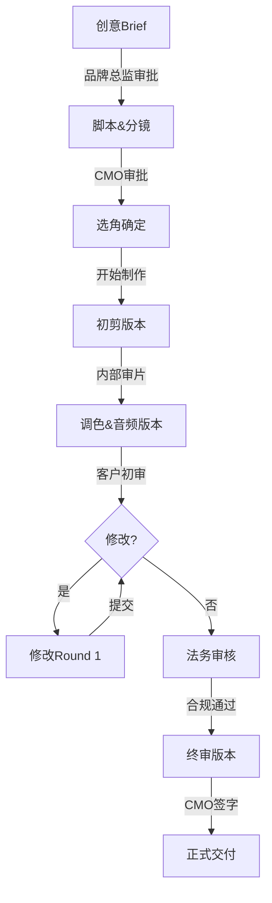

# 模板四：专业广告脚本格式 (Professional Commercial Format)

## 概述

**适用场景**：
- ✅ 需要客户审批的商业广告项目
- ✅ 代理公司与制作公司协作
- ✅ 需要清晰的预算和时间线管理
- ✅ 强调品牌规范和合规性
- ✅ 多方stakeholder沟通（品牌、创意、制作、法务）

**核心优势**：
- 📊 表格化Storyboard，一目了然
- 💼 包含商业信息（预算、档期、审批流程）
- 🎨 详细的品牌指南和合规要求
- 👥 明确的人员分工和责任
- 📝 适合打印和演示（PDF友好）

---

## 广告脚本模板结构

```
1. PROJECT OVERVIEW (项目概览)
2. CLIENT INFORMATION (客户信息)
3. CREATIVE BRIEF (创意简报)
4. STORYBOARD (分镜表)
5. TECHNICAL SPECIFICATIONS (技术规格)
6. TALENT & CASTING (演员/模特选角)
7. PRODUCTION SCHEDULE (制作排期)
8. POST-PRODUCTION REQUIREMENTS (后期需求)
9. LEGAL & COMPLIANCE (法务与合规)
10. BUDGET OVERVIEW (预算概览)
11. APPROVAL WORKFLOW (审批流程)
```

---

## 完整示例：时尚品牌季度广告

---

### 1. PROJECT OVERVIEW

| 项目 | 详情 |
|------|------|
| **项目名称** | 锦绣华裳 2025新春系列广告 |
| **项目代号** | JXH-2025-CNY-01 |
| **项目类型** | 品牌形象广告 (Brand TVC) |
| **交付物** | 90秒完整版 + 30秒精简版 + 15秒信息流版 |
| **投放平台** | 抖音、视频号、小红书、品牌官网 |
| **目标受众** | 25-40岁女性，中高收入，注重文化品味 |
| **核心信息** | 传统服饰现代化，东方美学复兴 |
| **项目负责人** | 张文（创意总监）、李明（制作经理） |

---

### 2. CLIENT INFORMATION

**客户名称**: 锦绣华裳服饰有限公司
**品牌**: 锦绣华裳 (JinXiu HuaShang)
**行业**: 传统服饰 / 文化创意
**品牌定位**: 高端传统服饰现代化品牌

**品牌核心价值**:
- 传承东方美学
- 现代生活方式融合
- 匠心手工艺
- 文化自信

**此次Campaign目标**:
1. 提升品牌知名度 30%（Q1 2025）
2. 新春系列销售额 ¥5M
3. 社交媒体互动量 +50%
4. 建立"新中式"品类领导地位

**关键审批人**:
- CMO: 王美华（最终审批）
- 品牌总监: 陈雅琪（创意审批）
- 法务: 刘正（合规审批）

---

### 3. CREATIVE BRIEF

#### 3.1 创意概念

**Campaign主题**: "旧时光里的新年愿"

**核心创意**:
通过一位现代女性在除夕夜重回旧街区的故事，展现传统与现代的融合。肚兜作为核心产品，象征着内在的文化自信与美的传承。

**情感基调**:
- 怀旧但不沉重（王家卫美学）
- 温暖而有希望
- 诗意而真实

**创意亮点**:
1. 王家卫式视觉风格（差异化竞品）
2. 情感叙事 + 产品展示自然结合
3. 跨代际沟通（母亲的传承）

#### 3.2 品牌信息传达

**Primary Message**: "美，从内到外"
**Secondary Message**: "传承东方之美"
**Call-to-Action**: "扫码进入小程序商城 - 新春限定系列"

**产品露出要求**:
- 肚兜特写镜头: 不少于3次，每次≥2秒
- Logo出现: 开头水印 + 结尾主标版，清晰可见
- 产品卖点: 手工刺绣、传统工艺（通过画面和对话体现）

---

### 4. STORYBOARD (分镜表)

#### 90秒完整版分镜

| 镜号 | 时间码 | 景别/运镜 | 画面描述 | 对话/旁白 | 字幕 | 音乐/音效 | 时长 |
|------|--------|----------|----------|-----------|------|-----------|------|
| **01** | 0:00-0:05 | EWS / Crane Down | 90年代香港旧街区鸟瞰。霓虹灯在薄雾中闪烁，湿漉街道反射彩光。 | [无] | "除夕夜，旧街区" | 音乐：爵士前奏<br>SFX：远处鞭炮、人声 | 5s |
| **02** | 0:05-0:12 | MS / Dolly跟拍 | 林婉秋侧面行走。墨绿色肚兜+薄纱长衫，玉镯摇晃。霓虹灯侧光，表情忧郁。 | 旁白："这条街，我已经走了十年。" | 同旁白 | 主旋律进入<br>SFX：脚步、玉镯碰撞 | 7s |
| **03** | 0:12-0:20 | ECU快切组 (4个2s镜头) | 3A:眼睛特写<br>3B:五年前回忆（戴玉镯）<br>3C:街道回忆（牵手）<br>3D:切回现在 | [无] | "五年前"(3B镜头) | 音乐暂停(留白)<br>SFX：时钟滴答、心跳<br>音乐重入 | 8s |
| **04** | 0:20-0:30 | FS / 固定机位 | 林婉秋停在茶餐厅门口，「新春快乐」霓虹灯背景。转身面向镜头，手扶玉镯。 | 旁白："旧的不去，新的不来。也许，是时候放下了。" | 同旁白(分两段) | 旋律转为希望调<br>SFX：霓虹灯闪烁、远处烟花 | 10s |
| **05** | 0:30-0:40 | Tracking / Dolly in | 林婉秋快步走向服装店，推门进入。镜头跟随，色温从冷蓝转暖黄。 | 现场同期："老板，这件红色的，我试试。" | 同对话 | 节奏加快<br>SFX：高跟鞋加速、门铃 | 10s |
| **06** | 0:40-0:55 | ECU快切组 (5个3s镜头) | 6A:解开旧肚兜<br>6B:红色肚兜刺绣特写<br>6C:镜子系肚兜<br>6D:转身展示<br>6E:微笑特写 | 自言自语："红色...多久没穿过了。" | 同对话(6B) | 高潮段落<br>SFX：丝绸、系带、心跳消失 | 15s |
| **07** | 0:55-1:05 | WS / Crane up | 林婉秋走出店门，红色肚兜+新披肩。街道繁华，烟花、灯笼。镜头升起露出夜空烟花。 | 旁白："新年快乐，婉秋。" | 同旁白 | 情绪饱满<br>SFX：门铃、烟花爆炸、人群欢呼 | 10s |
| **08** | 1:05-1:20 | EWS / 无人机俯瞰 | 夜空大型烟花绽放。俯瞰街道，林婉秋在人群中仰望（小身影）。霓虹、灯笼、烟花绚烂。 | [无] | "锦绣华裳 2025新春系列"<br>"传承东方之美" | 尾奏<br>SFX：大型烟花爆炸 | 15s |
| **09** | 1:20-1:30 | Title Card | 深红色渐变背景。品牌Logo「锦绣华裳」居中，二维码和文字信息。 | 品牌音："锦绣华裳，传承东方之美。" | "新春限定系列 \| 现已上线"<br>"扫码进入小程序商城" | 尾奏淡出<br>SFX：轻柔钟声 | 10s |

**分镜总计**: 9个主镜头，总时长 90秒

---

#### 30秒精简版分镜（信息流版本）

| 镜号 | 来源 | 时间码 | 画面 | 时长 |
|------|------|--------|------|------|
| 1 | 镜02 | 0:00-0:05 | 林婉秋侧面行走 + 旁白 | 5s |
| 2 | 镜04 | 0:05-0:12 | 驻足凝视 + 决心旁白 | 7s |
| 3 | 镜06浓缩 | 0:12-0:20 | 试穿蒙太奇（3个镜头） | 8s |
| 4 | 镜07+08 | 0:20-0:28 | 走出 + 烟花（快节奏剪辑） | 8s |
| 5 | 镜09 | 0:28-0:30 | 品牌标版 | 2s |

---

### 5. TECHNICAL SPECIFICATIONS

#### 5.1 拍摄规格

| 项目 | 规格 |
|------|------|
| **拍摄方式** | AI生成 (Sora2 / 即梦AI) |
| **画幅** | 9:16竖屏 (1080x1920) |
| **帧率** | 24fps (电影感) |
| **色彩空间** | Rec.709 (标准播放) |
| **文件格式** | ProRes 422 HQ (后期) / H.264 (交付) |

#### 5.2 视觉风格指南

**色彩方案**:
- 主色: 暖黄 (#F4D03F), 深绿 (#1E5631), 褪色红 (#C44536)
- 色彩饱和度: 整体 -20% (复古感)
- 色温: 偏暖 (3200K霓虹灯主导)

**LUT/调色参考**:
- 王家卫《花样年华》《2046》
- 自定义LUT: "JXH_WKW_Nostalgic_v1.cube"

**胶片颗粒**:
- 35mm胶片颗粒叠加 (Opacity 15%)
- Grain size: Medium

**光照风格**:
- 霓虹灯实用光源 (Practical lights)
- 侧光为主，Rim light勾勒轮廓
- 薄雾营造氛围 (Haze density 0.15)

#### 5.3 镜头语言

| 镜头类型 | 使用场景 | 焦段 | 光圈 |
|---------|---------|------|------|
| EWS (全景) | 环境建立 | 18-24mm | f/4-f/5.6 |
| WS (远景) | 人物与环境关系 | 28-35mm | f/2.8-f/4 |
| MS (中景) | 人物动作 | 35-50mm | f/2.0-f/2.8 |
| CU (特写) | 情绪表现 | 50-85mm | f/1.4-f/2.0 |
| ECU (大特写) | 细节展示 | 85-100mm | f/1.4-f/1.8 |

**运镜原则**:
- 缓慢推拉 (营造情绪张力)
- 0.8秒快速剪辑 (王家卫节奏)
- 手持轻微晃动 (真实感)
- Crane上升 (情绪高潮)

---

### 6. TALENT & CASTING (演员选角)

#### 6.1 主角：林婉秋

| 项目 | 要求 |
|------|------|
| **年龄** | 26-30岁 |
| **身高** | 163-168cm |
| **气质** | 内敛、优雅、带着旧时代的韵味 |
| **外形** | 长发、天鹅颈、清秀面容（非网红脸） |
| **演技要求** | 能表现细腻情绪变化（忧郁→犹豫→释然） |
| **特殊技能** | 无需（主要靠镜头语言和表情） |
| **服装要求** | 适合传统服饰，身材比例协调 |

**备选演员**:
1. 候选A: 李若彤 (KOL, 280万粉丝, 古风形象)
2. 候选B: 专业演员 (表演系，气质符合)
3. 候选C: AI生成虚拟形象（一致性最佳）

**最终决策**: 客户审批后确定

#### 6.2 配角：小蝶（仅30秒版删除）

| 项目 | 要求 |
|------|------|
| **年龄** | 20-24岁 |
| **气质** | 活泼、清新 |
| **戏份** | 镜03对话场景（90秒版） |

---

### 7. PRODUCTION SCHEDULE (制作排期)

| 阶段 | 任务 | 负责人 | 开始日期 | 结束日期 | 状态 |
|------|------|--------|---------|---------|------|
| **前期** | | | | | |
| 1.1 | 创意Brief审批 | 张文 | 2025-01-10 | 2025-01-12 | ✅ 完成 |
| 1.2 | 脚本&分镜审批 | 陈雅琪 | 2025-01-13 | 2025-01-15 | ⏳ 进行中 |
| 1.3 | 选角确定 | 李明 | 2025-01-16 | 2025-01-18 | ⏸️ 待开始 |
| **制作** | | | | | |
| 2.1 | AI生成测试 | 技术团队 | 2025-01-19 | 2025-01-22 | ⏸️ 待开始 |
| 2.2 | 正式生成（9个镜头） | 技术团队 | 2025-01-23 | 2025-01-26 | ⏸️ 待开始 |
| 2.3 | 初剪审片 | 剪辑师 | 2025-01-27 | 2025-01-28 | ⏸️ 待开始 |
| **后期** | | | | | |
| 3.1 | 调色（LUT应用） | 调色师 | 2025-01-29 | 2025-01-30 | ⏸️ 待开始 |
| 3.2 | 音频设计（对话/音效） | 音频师 | 2025-01-29 | 2025-01-31 | ⏸️ 待开始 |
| 3.3 | 字幕&品牌元素 | 包装师 | 2025-02-01 | 2025-02-02 | ⏸️ 待开始 |
| 3.4 | 客户审片（Round 1） | 王美华 | 2025-02-03 | 2025-02-04 | ⏸️ 待开始 |
| 3.5 | 修改&终审 | 全体 | 2025-02-05 | 2025-02-06 | ⏸️ 待开始 |
| **交付** | | | | | |
| 4.1 | 输出所有版本 | 技术团队 | 2025-02-07 | 2025-02-07 | ⏸️ 待开始 |
| 4.2 | 平台上传测试 | 投放团队 | 2025-02-08 | 2025-02-08 | ⏸️ 待开始 |
| 4.3 | 正式发布 | 市场部 | 2025-02-10 | 2025-02-10 | ⏸️ 待开始 |

**关键里程碑**:
- ✅ 2025-01-15: 脚本Lock（不再大改）
- 📅 2025-01-26: 素材生成完毕
- 📅 2025-02-04: 客户初审
- 📅 2025-02-10: 正式发布（除夕前）

---

### 8. POST-PRODUCTION REQUIREMENTS (后期需求)

#### 8.1 剪辑要求

**剪辑节奏**:
- 主体：0.8秒快速剪辑（镜03, 06）
- 情绪：3-10秒长镜头（镜02, 04, 07）
- 转场：直切为主，镜03-04淡入淡出

**版本交付**:
| 版本 | 时长 | 用途 | 特殊要求 |
|------|------|------|---------|
| 完整版 | 90s | 官网、线下门店 | 包含完整故事 |
| 精简版 | 30s | 抖音、视频号 | 突出产品和CTA |
| 信息流版 | 15s | 付费投放 | 前3秒抓眼球 |

#### 8.2 调色要求

**LUT应用**:
- 使用自定义LUT: `JXH_WKW_Nostalgic_v1.cube`
- 所有镜头统一色调

**特殊调色**:
- 镜03B (回忆): 更暖黄 +10, 饱和度 -30
- 镜06 (试穿): 从冷色过渡到暖色 (情绪转变)
- 镜08 (烟花): 保留高饱和度彩色 (对比)

**胶片颗粒**:
- FilmConvert插件: 35mm Kodak Vision3 250D
- Grain Amount: 30%

#### 8.3 音频后期

**对话处理**:
- 去噪、均衡、压缩
- 室内场景: 加5-8% Reverb (空间感)
- 旁白: 低通滤波 (电影感)

**音乐授权**:
- 曲目: "Nostalgic Jazz Fusion" (AudioJungle)
- 授权类型: Broadcast License (全媒体)
- 费用: $299 (已含预算)

**音效库**:
- 鞭炮、街道、霓虹灯: 自有Foley库
- 烟花: Boom Library - Fireworks Collection
- 丝绸、玉镯: ASMR录音 (定制)

**最终混音规格**:
- 立体声 (Stereo)
- -14 LUFS (抖音/视频号标准)
- True Peak: -1.0dB (防削波)

#### 8.4 字幕&图形

**字幕规范**:
| 元素 | 字体 | 大小 | 颜色 | 位置 | 描边 |
|------|------|------|------|------|------|
| 对话字幕 | 黑体 | 42px | 白色 | 中下 (15%上) | 黑色3px |
| 旁白字幕 | 楷体 | 44px | 淡黄 #F4E8C1 | 中下 | 黑色2px |
| 品牌标语 | 宋体 | 52px | 金色 #FFD700 | 中央 | 光晕效果 |

**品牌元素**:
- Logo水印: 右下角, 10% opacity, 全程
- 结尾标版: Logo + 文字 + 二维码
- 二维码测试: 确保可扫描

**动效**:
- 字幕: 淡入/逐字显示 (Premiere Pro动态字幕)
- Logo: 描金展开效果 (After Effects)
- 二维码: 轻微脉冲 (吸引注意)

---

### 9. LEGAL & COMPLIANCE (法务与合规)

#### 9.1 内容合规

**广告法审查**:
- ✅ 无绝对化用语（"最"、"第一"）
- ✅ 无虚假宣传（产品描述真实）
- ✅ 无低俗内容
- ⚠️ 待确认: 是否需标注"广告"字样（各平台规定不同）

**文化合规**:
- ✅ 传统文化正面呈现
- ✅ 无宗教、政治敏感内容
- ✅ 尊重历史（宋代元素考据准确）

**平台规范**:
| 平台 | 特殊要求 | 状态 |
|------|---------|------|
| 抖音 | 需标注"广告"、不得超过60s (信息流) | ✅ 符合 |
| 视频号 | 需标注"推广"、品牌蓝V认证 | ✅ 符合 |
| 小红书 | 需#广告话题、不得诱导点赞 | ⏳ 待审核 |

#### 9.2 权利清理

**演员肖像权**:
- 签署肖像使用授权书 (全媒体, 5年)
- 费用: ¥50,000 (已含预算)

**音乐版权**:
- 音乐授权: AudioJungle Broadcast License
- 有效期: 永久 (此项目)

**素材版权**:
- AI生成内容: 确认平台ToS (Sora2/即梦)
- 字体版权: 方正字库商业授权

**品牌元素**:
- Logo、VI: 客户提供，拥有完整权利
- 二维码: 指向客户小程序 (合规)

---

### 10. BUDGET OVERVIEW (预算概览)

| 项目 | 明细 | 费用 (¥) | 备注 |
|------|------|---------|------|
| **前期** | | | |
| 创意策划 | 脚本、分镜、创意设计 | 30,000 | 已完成 |
| 选角费 | 演员/KOL肖像使用 | 50,000 | 待支付 |
| **制作** | | | |
| AI生成 | Sora2/即梦AI生成费用 | 20,000 | 预估9镜头 |
| **后期** | | | |
| 剪辑 | 3版本剪辑 | 15,000 | |
| 调色 | 专业调色师 | 12,000 | |
| 音频设计 | 对话/音效/混音 | 18,000 | |
| 包装动效 | 字幕/Logo动画 | 10,000 | |
| **版权** | | | |
| 音乐授权 | AudioJungle | 2,000 | Broadcast |
| 字体授权 | 方正商业授权 | 5,000 | 年度 |
| **其他** | | | |
| 审片差旅 | 客户/团队沟通 | 3,000 | |
| 应急预算 | 修改/意外支出 | 10,000 | 10% |
| **总计** | | **175,000** | |

**付款节点**:
1. 签约时: 30% (¥52,500)
2. 素材生成完成: 40% (¥70,000)
3. 终审通过交付: 30% (¥52,500)

---

### 11. APPROVAL WORKFLOW (审批流程)

#### 11.1 审批节点



#### 11.2 当前审批状态

| 阶段 | 审批人 | 状态 | 日期 | 反馈 |
|------|--------|------|------|------|
| 创意Brief | 陈雅琪 | ✅ 通过 | 2025-01-12 | "王家卫风格很好，继续" |
| 脚本初稿 | 陈雅琪 | ✅ 通过 | 2025-01-14 | "对话需再精简" |
| 脚本终稿 | 王美华 | ⏳ 审批中 | 2025-01-15 | 待反馈 |
| 选角方案 | 王美华 | ⏸️ 待提交 | - | - |

#### 11.3 修改反馈记录

**Round 1 (2025-01-14)**:
- 反馈人: 陈雅琪
- 问题: 对话略显冗长，影响节奏
- 修改: 精简镜03对话，从4句减为3句
- 状态: ✅ 已修改

**Round 2 (预期 2025-02-04)**:
- 反馈人: 王美华
- 预期问题: 品牌露出是否足够明显
- 预案: 增强镜06肚兜刺绣特写时长

---

## 使用此模板

### Step 1: 填写项目概览

根据实际项目填写：
- 客户信息、品牌定位
- Campaign目标和KPI
- 审批人和决策链

### Step 2: 制作分镜表

使用表格格式，确保：
- 镜号、时间码清晰
- 画面描述具体（景别、运镜、内容）
- 对话/字幕完整
- 音频信息详细

### Step 3: 明确技术规格

与制作团队对齐：
- 拍摄/生成方式（AI平台选择）
- 画幅、帧率、色彩空间
- 后期调色和音频标准

### Step 4: 规划排期和预算

制定现实的时间表：
- 考虑审批周期（客户可能拖延）
- 预留修改时间（至少2轮）
- 应急预算 10-15%

### Step 5: 法务审核

提前处理：
- 肖像权、音乐版权清理
- 平台合规要求
- 广告法审查

### Step 6: 建立审批流程

明确：
- 谁审批什么内容
- 审批时限
- 修改反馈机制

---

## 模板优势对比

| 特点 | 专业广告格式 | 分层式 | 电影脚本式 | AI优化式 |
|------|-------------|--------|-----------|----------|
| **客户沟通** | ⭐⭐⭐⭐⭐ 最佳 | ⭐⭐⭐ 技术性 | ⭐⭐⭐⭐ 直观 | ⭐⭐ 过于技术 |
| **商业信息** | ⭐⭐⭐⭐⭐ 完整 | ⭐ 无 | ⭐ 无 | ⭐ 无 |
| **预算管理** | ⭐⭐⭐⭐⭐ 详细 | ⭐ 无 | ⭐ 无 | ⭐ 无 |
| **法务合规** | ⭐⭐⭐⭐⭐ 包含 | ⭐ 无 | ⭐ 无 | ⭐ 无 |
| **审批流程** | ⭐⭐⭐⭐⭐ 清晰 | ⭐⭐ 基础 | ⭐⭐ 基础 | ⭐ 无 |
| **制作指导** | ⭐⭐⭐⭐ 详细 | ⭐⭐⭐⭐⭐ 技术化 | ⭐⭐⭐⭐⭐ 专业 | ⭐⭐⭐⭐⭐ AI优化 |
| **打印友好** | ⭐⭐⭐⭐⭐ 表格化 | ⭐⭐⭐ 可打印 | ⭐⭐⭐⭐ 易读 | ⭐⭐ 技术性 |

**适用场景总结**:
- **专业广告格式**: 商业项目、客户审批、代理公司
- **分层式**: MovieFlow集成、长视频、系统化
- **电影脚本式**: 导演主导、传统拍摄、团队协作
- **AI优化式**: Sora2直接使用、技术驱动、快速迭代

---

## 常见问题

**Q: 为什么需要这么详细的预算和排期？**
A: 商业广告项目涉及多方stakeholder，清晰的预算和排期能避免扯皮，保护双方利益。

**Q: 审批流程真的需要这么复杂吗？**
A: 对于品牌客户，审批流程是必须的。提前明确能避免后期无休止的修改。

**Q: 法务审核部分能省略吗？**
A: 不建议。尤其是肖像权和音乐版权，出问题后患无穷。预防成本远低于事后补救。

**Q: 如何与MovieFlow其他模板配合使用？**
A:
1. 用**专业广告格式**与客户沟通和审批
2. 客户确认后，转换为**分层式结构**进行AI生成
3. 或转换为**AI优化式**直接输入Sora2

**Q: 分镜表能自动导出到AI平台吗？**
A: 目前需手动转换。未来MovieFlow可能开发自动化工具（参考主指南中的Platform Adapters提议）。

---

## 附件清单

以下文件随本脚本一同提交：

1. ✅ `JXH-2025-CNY-01_Script_v2.pdf` (本脚本PDF版)
2. ✅ `JXH-2025-CNY-01_Storyboard_Visual.pdf` (带配图的分镜)
3. ✅ `JXH_Brand_Guidelines_2025.pdf` (品牌VI手册)
4. ✅ `JXH_WKW_Nostalgic_v1.cube` (调色LUT文件)
5. ⏳ `JXH-2025-CNY-01_Casting_Profiles.pdf` (选角方案,待提交)
6. ⏳ `JXH-2025-CNY-01_Music_Demo.mp3` (音乐小样,待提交)

---

## 版本历史

| 版本 | 日期 | 修改内容 | 修改人 |
|------|------|---------|--------|
| v1.0 | 2025-01-13 | 初稿完成 | 张文 |
| v1.1 | 2025-01-14 | 精简对话，优化节奏 | 张文 |
| v2.0 | 2025-01-15 | 增加30s版本分镜，更新预算 | 张文 |

---

## 联系方式

**项目负责人**:
- 创意总监: 张文 | zhang.wen@agency.com | 138-0000-0000
- 制作经理: 李明 | li.ming@agency.com | 139-0000-0000

**客户方联系人**:
- CMO: 王美华 | wang.mh@jinxiuhuashang.com | 136-0000-0000
- 品牌总监: 陈雅琪 | chen.yq@jinxiuhuashang.com | 137-0000-0000

**紧急联系**: 项目组微信群 "锦绣华裳2025新春Campaign"

---

**文档状态**: ⏳ 待CMO终审
**下一步**: 等待王美华审批 (2025-01-15 EOD)

---

## 相关资源

- **主指南**: `/docs/video-prompt-standardization-guide.md`
- **其他模板**:
  - `template-1-layered-structure.md` (分层式)
  - `template-2-film-script-style.md` (电影脚本)
  - `template-3-ai-optimized.md` (AI优化)
- **工具**:
  - Storyboard软件: Storyboarder (免费)
  - 项目管理: Monday.com / Notion
  - 预算工具: Excel模板 (附件提供)

---

**作者**: MovieFlow Team
**顾问**: 广告行业标准流程 (4A公司规范)
**授权**: MIT License
**致谢**: 参考了奥美、李奥贝纳等4A公司的广告脚本规范
