# MovieFlow 工作流程指南

本指南详细介绍使用 MovieFlow 创建 AI 短视频的完整流程。MovieFlow 参考 Spec-Kit 的方法论，将规格驱动开发（SDD）理念应用于视频生成领域。

## 核心理念

### 规格驱动视频生成（Spec-Driven Video Generation）

参考 Spec-Kit 的 SDD 方法论，MovieFlow 采用分层递进的创作模式：

1. **规格定义**（/video-specify）：定义视频的整体规格（主题、风格、目标）
2. **计划制定**（/video-plan）：将规格细化为技术实现方案
3. **任务分解**（/video-tasks）：将计划分解为具体的生成任务
4. **视频生成**（/video-generate）：执行任务，生成视频内容

## 工作流程概览（含渐进式验证）🆕

```mermaid
graph TD
    A[用户描述] --> B[/video-specify<br/>视频规格]
    B --> C[/video-plan<br/>技术方案]
    C --> D[/video-validate<br/>L0+L1验证]
    D --> E{验证通过?}
    E -->|否| B
    E -->|是| F[/video-tasks<br/>任务分解]
    F --> G[/video-preview<br/>L2动态预览]
    G --> H{效果满意?}
    H -->|否| B
    H -->|是| I[/video-generate<br/>完整生成]
    I --> J[质量检查]
    J --> K[发布输出]

    style B fill:#f9f,stroke:#333,stroke-width:2px
    style C fill:#bbf,stroke:#333,stroke-width:2px
    style D fill:#9f9,stroke:#333,stroke-width:2px
    style F fill:#bfb,stroke:#333,stroke-width:2px
    style G fill:#9ff,stroke:#333,stroke-width:2px
    style I fill:#ffb,stroke:#333,stroke-width:2px
```

### 成本优化路径

- **传统流程**：直接生成 → 不满意 → 重新生成（每次170元）
- **渐进式流程**：L0（免费）→ L1（6元）→ L2（28元）→ 最终生成（170元）
- **节省成本**：59-76%

## 阶段一：需求分析与规格定义

### 1.1 使用 /video-specify 命令

该命令将用户的视频需求转化为结构化的规格文档。

```bash
movieflow video-specify "创建一个30秒的产品介绍视频，展示我们的健康管理APP"
```

#### 输入分析

系统会从用户描述中提取：
- **视频时长**：30秒（如未指定，默认60秒）
- **视频类型**：产品介绍
- **核心主题**：健康管理APP
- **目标受众**：潜在用户（推断）

#### 输出规格

生成 `specs/001-health-app-intro/spec.md`：

```markdown
# 视频规格：健康管理APP介绍

## 核心信息
- **时长**：30秒
- **类型**：产品演示
- **平台**：抖音/视频号/B站
- **目标**：吸引下载，展示核心功能

## 场景分解（6×5秒）
1. **开场钩子**（0-5秒）
   - 痛点展示：现代人健康困扰
   - 视觉：快节奏城市生活镜头

2. **产品引入**（5-10秒）
   - 展示APP界面
   - 突出LOGO和名称

3. **核心功能1**（10-15秒）
   - 健康数据追踪
   - 动画展示数据可视化

4. **核心功能2**（15-20秒）
   - AI健康建议
   - 展示个性化推荐

5. **用户见证**（20-25秒）
   - 真实用户反馈
   - 数据改善对比

6. **行动号召**（25-30秒）
   - 下载二维码
   - 限时优惠信息

## 待确认项
[NEEDS CLARIFICATION: APP具体名称]
[NEEDS CLARIFICATION: 品牌色彩方案]
[NEEDS CLARIFICATION: 目标用户年龄段]
```

### 1.2 规格优化建议

系统会根据最佳实践提供优化建议：

```yaml
optimizations:
  - hook_strength: "增强前3秒吸引力"
  - cta_clarity: "明确行动号召"
  - platform_adaptation: "针对不同平台优化"
```

## 阶段二：技术方案规划

### 2.1 使用 /video-plan 命令

将规格转化为具体的技术实现方案。

```bash
movieflow video-plan specs/001-health-app-intro
```

#### 生成内容

创建 `specs/001-health-app-intro/plan.md`：

```markdown
# 技术实现方案

## 场景生成策略

### 场景1：开场钩子
- **生成方式**：Gemini 2.5 Flash
- **提示词**：
  ```
  现代都市快节奏生活，压力大的上班族，
  疲惫表情，昏暗办公室，凌晨加班场景，
  写实风格，冷色调，电影级画面
  ```
- **转场**：快速剪切

### 场景2：产品引入
- **生成方式**：火山引擎-界面动画
- **素材准备**：
  - APP截图（需用户提供）
  - LOGO动画（AE模板）
- **特效**：光效扫过

[继续其他场景...]

## 音频方案

### 背景音乐
- **风格**：科技感、轻快
- **节奏**：120-130 BPM
- **情绪曲线**：平静→上扬→高潮

### 配音文案
```
场景1：还在为健康问题困扰吗？
场景2：试试【APP名称】，您的健康管家
场景3：实时监测，数据可视化
场景4：AI分析，个性化建议
场景5：已帮助10万+用户改善健康
场景6：立即下载，享新用户专属优惠
```

## 技术参数

### 视频规格
- 分辨率：1080x1920（竖屏）/ 1920x1080（横屏）
- 帧率：30fps
- 编码：H.264
- 比特率：8Mbps

### 生成配置
```json
{
  "volcano_engine": {
    "model": "video-generation-v2",
    "quality": "high",
    "style": "realistic"
  },
  "gemini": {
    "model": "gemini-2.5-flash",
    "image_size": "1920x1080",
    "steps": 50
  }
}
```
```

## 阶段三：渐进式验证（节省80%成本）🆕

### 3.1 L0级验证 - 提示词质量分析（免费）

在生成任何视觉内容之前，先验证提示词质量：

```bash
/video-validate health-app-intro --skip-l1
```

**检查项目：**
- ✅ 场景描述完整性（环境、氛围、光线）
- ✅ 人物/对象描述（外观、动作、表情）
- ✅ 视觉风格一致性
- ✅ 技术可行性
- ✅ 提示词优化建议

**输出示例：**
```
📊 L0 提示词质量分析:
  场景1（都市压力）: 72/100 分
    ⚠️ 建议添加具体的视觉风格描述
    ⚠️ 建议明确时间（白天/夜晚）

  场景2（APP界面）: 85/100 分
    ✅ 界面元素描述清晰
    💡 可增加动画效果描述

  平均分数: 78.5/100
  建议：优化场景1的描述后再继续
```

### 3.2 L1级验证 - 静态图像预览（约6元）

通过生成关键帧图像，预览视觉效果：

```bash
/video-validate health-app-intro
```

**验证内容：**
- 🎨 视觉风格是否符合品牌调性
- 🏞️ 场景氛围是否正确
- 🎭 人物/界面呈现是否清晰
- 🌈 色彩搭配是否和谐

**决策点：**
- 视觉效果满意 → 继续到L2
- 需要调整 → 修改提示词，重新L1验证
- 风格完全错误 → 返回规格定义阶段

### 3.3 L2级验证 - 动态预览（约28元）

选择最关键的场景生成10秒测试视频：

```bash
/video-preview health-app-intro --scene 1 --with-audio
```

**选择策略：**
- 开场场景：验证整体吸引力
- 核心功能场景：验证产品展示效果
- CTA场景：验证转化元素

**验证要点：**
- 🎬 动画流畅度
- 🎵 音画同步
- 💬 信息传达清晰度
- ✨ 转场效果

### 3.4 成本控制决策树

```mermaid
graph TD
    A[开始] --> B{L0分数≥80?}
    B -->|否| C[优化提示词]
    C --> B
    B -->|是| D[L1图像预览]
    D --> E{视觉满意?}
    E -->|否| F[调整风格]
    F --> D
    E -->|是| G[L2动态预览]
    G --> H{效果满意?}
    H -->|否| I[微调参数]
    I --> G
    H -->|是| J[生成完整视频]

    style J fill:#9f9,stroke:#333,stroke-width:2px
```



**成本累计：**
- 仅L0优化：0元
- L0+L1验证：6元
- L0+L1+L2验证：34元
- 完整流程：204元（vs 传统510-850元）

## 阶段四：任务分解与执行

### 3.1 使用 /video-tasks 命令

将技术方案分解为可执行的任务列表。

```bash
movieflow video-tasks specs/001-health-app-intro
```

#### 生成任务列表

创建 `specs/001-health-app-intro/tasks.md`：

```markdown
# 任务列表

## 素材准备 [P0-紧急]
- [ ] 收集APP界面截图
- [ ] 准备品牌LOGO（PNG格式）
- [ ] 确认品牌色彩值（#HEX）

## 场景生成 [P1-重要]
- [ ] 生成场景1：都市压力画面
- [ ] 生成场景2：APP界面展示
- [ ] 生成场景3：数据可视化动画
- [ ] 生成场景4：AI推荐界面
- [ ] 生成场景5：用户testimonial
- [ ] 生成场景6：CTA画面

## 音频制作 [P1-重要]
- [ ] 选择背景音乐
- [ ] 录制配音（或TTS生成）
- [ ] 音频混音处理

## 后期合成 [P2-常规]
- [ ] 场景拼接
- [ ] 添加转场效果
- [ ] 颜色校正
- [ ] 添加字幕
- [ ] 音视频同步

## 质量检查 [P2-常规]
- [ ] 时长精确度（±0.5秒）
- [ ] 画面流畅度
- [ ] 音频清晰度
- [ ] 文字可读性

## 多平台适配 [P3-可选]
- [ ] 抖音版本（9:16）
- [ ] 视频号版本（9:16）
- [ ] B站版本（16:9）
```

### 3.2 任务执行顺序


## 阶段四：视频生成

### 4.1 使用 /video-generate 命令

执行具体的视频生成任务。

#### 单场景生成

```bash
movieflow video-generate specs/001-health-app-intro --scene 1
```

#### 批量生成

```bash
movieflow video-generate specs/001-health-app-intro --all-scenes
```

#### 实时预览

```bash
movieflow video-generate specs/001-health-app-intro --preview
```

### 4.2 生成流程

```python
# 伪代码展示生成流程
def generate_video(spec_path, options):
    # 1. 加载规格和计划
    spec = load_spec(spec_path)
    plan = load_plan(spec_path)

    # 2. 初始化生成器
    volcano = VolcanoEngine(api_key=VOLCANO_KEY)
    gemini = GeminiGenerator(api_key=GEMINI_KEY)

    # 3. 生成各场景
    scenes = []
    for scene in spec.scenes:
        if scene.generator == "volcano":
            result = volcano.generate(scene)
        elif scene.generator == "gemini":
            result = gemini.generate(scene)
        scenes.append(result)

    # 4. 合成视频
    video = compose_scenes(scenes, plan.transitions)

    # 5. 添加音频
    video = add_audio(video, plan.audio)

    # 6. 输出结果
    save_video(video, f"{spec_path}/output/final.mp4")
```

### 4.3 生成监控

通过 WebSocket 实时监控生成进度：

```javascript
const ws = new WebSocket('ws://localhost:8000/ws/generation');

ws.onmessage = (event) => {
    const data = JSON.parse(event.data);
    console.log(`场景 ${data.scene}: ${data.progress}%`);
};
```

## 阶段五：质量保证

### 5.1 自动质量检查

系统会自动检查：

```yaml
quality_checks:
  duration:
    target: 30s
    tolerance: ±0.5s
    status: ✅ PASS

  resolution:
    target: 1920x1080
    actual: 1920x1080
    status: ✅ PASS

  framerate:
    target: 30fps
    actual: 30fps
    status: ✅ PASS

  audio_sync:
    offset: 0.02s
    threshold: 0.1s
    status: ✅ PASS
```

### 5.2 人工审核要点

- **内容准确性**：信息是否准确
- **品牌一致性**：色彩、字体、风格
- **用户体验**：节奏、理解难度
- **平台规范**：是否符合平台要求

## 阶段六：输出与发布

### 6.1 多格式输出

```bash
# 导出不同格式
movieflow export specs/001-health-app-intro --format mp4
movieflow export specs/001-health-app-intro --format webm
movieflow export specs/001-health-app-intro --format gif
```

### 6.2 平台优化

```bash
# 针对特定平台优化
movieflow optimize specs/001-health-app-intro --platform douyin
movieflow optimize specs/001-health-app-intro --platform wechat
movieflow optimize specs/001-health-app-intro --platform bilibili
```

### 6.3 批量发布

```bash
# 自动发布到多平台
movieflow publish specs/001-health-app-intro --platforms douyin,wechat,bilibili
```

## 最佳实践

### 1. 迭代优化

```mermaid
graph TD
    A[初版生成] --> B[效果评估]
    B --> C{满意?}
    C -->|否| D[调整规格]
    D --> A
    C -->|是| E[最终输出]
```



### 2. 模板复用

```bash
# 保存为模板
movieflow save-template specs/001-health-app-intro --name "产品介绍模板"

# 基于模板创建新项目
movieflow video-specify "新产品介绍" --template "产品介绍模板"
```

### 3. A/B 测试

```bash
# 生成多个版本
movieflow video-generate specs/001-health-app-intro --variant A
movieflow video-generate specs/001-health-app-intro --variant B

# 对比效果
movieflow compare specs/001-health-app-intro/variants/
```

## 高级功能

### 1. 自定义生成器

```python
from movieflow.generators import BaseGenerator

class CustomGenerator(BaseGenerator):
    def generate(self, scene_spec):
        # 自定义生成逻辑
        pass

# 注册生成器
movieflow.register_generator("custom", CustomGenerator)
```

### 2. 插件系统

```bash
# 安装插件
movieflow plugin install movieflow-effects

# 使用插件功能
movieflow video-generate --effect glitch
```

### 3. 批处理模式

```bash
# 批量处理多个项目
movieflow batch process specs/batch-list.txt
```

## 故障排除

### 常见问题

| 问题 | 原因 | 解决方案 |
|------|------|----------|
| 生成超时 | 网络或API限制 | 调整超时设置或使用队列 |
| 画面闪烁 | 帧率不一致 | 统一所有素材帧率 |
| 音画不同步 | 编码问题 | 重新编码或调整偏移 |
| 文字模糊 | 分辨率过低 | 提高输出分辨率 |
| 颜色失真 | 色彩空间不匹配 | 统一使用sRGB |

### 调试模式

```bash
# 启用调试输出
movieflow video-generate --debug

# 保存中间文件
movieflow video-generate --keep-temp

# 生成日志报告
movieflow video-generate --log-level DEBUG
```

## 性能优化

### 1. 并行处理

```yaml
# config.yaml
generation:
  parallel_scenes: 3
  max_workers: 6
  cache_enabled: true
```

### 2. 缓存策略

```bash
# 启用缓存
movieflow config set cache.enabled true

# 清理缓存
movieflow cache clear

# 预热缓存
movieflow cache warm specs/001-health-app-intro
```

### 3. 资源管理

```bash
# 限制内存使用
movieflow config set limits.memory 4GB

# 限制CPU使用
movieflow config set limits.cpu_cores 4
```

## 与 Spec-Kit 集成

MovieFlow 可以与 Spec-Kit 无缝集成：

```bash
# 在 Spec-Kit 项目中
specify init video-project --ai claude

# 生成视频规格
specify execute "创建产品介绍视频规格"

# 切换到 MovieFlow
movieflow video-plan ../spec-kit/specs/001-video/spec.md
movieflow video-generate ../spec-kit/specs/001-video/
```

## 总结

MovieFlow 通过参考 Spec-Kit 的方法论，提供了完整的 AI 视频生成工作流：

1. **规格驱动**：从需求到规格的标准化
2. **分层设计**：规格→计划→任务→执行
3. **质量保证**：自动检查 + 人工审核
4. **持续优化**：迭代改进 + A/B测试

记住核心原则：
- **规格先行**：先定义清晰的规格
- **逐步细化**：从抽象到具体
- **快速迭代**：小步快跑，持续改进
- **质量第一**：宁缺毋滥

---

📚 相关文档：[API文档](api.md) | [本地开发](local-development.md) | [产品需求](PRD.md)