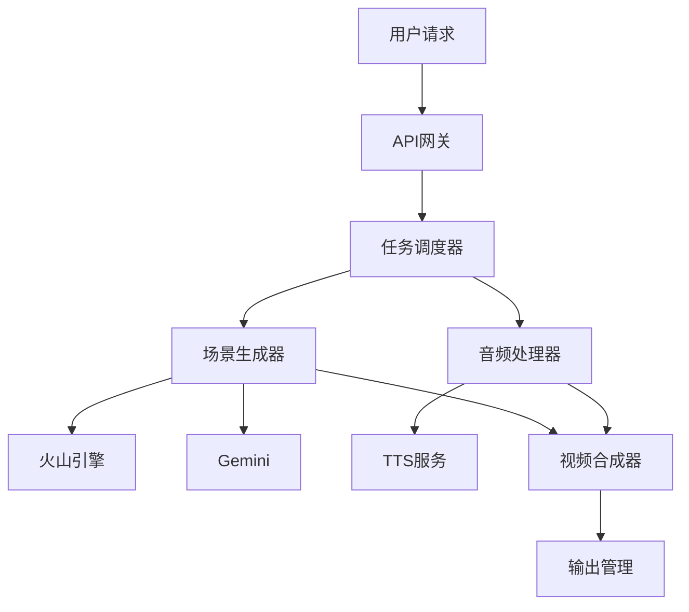

# /plan 命令 - 技术实施规划

基于项目规格创建详细的技术实施计划：

## 前置条件

- 已运行 `/specify` 创建项目规格
- 规格文件位于 `specs/[###-project-name]/spec.md`

## 执行流程

1. **加载项目规格**
   ```bash
   运行 {SCRIPT} 验证规格文件
   解析场景需求和验收标准
   ```

2. **技术栈选择**
   ```yaml
   视频生成: 火山引擎即梦AI
   场景图片: Google Gemini 2.5 Flash
   语音合成: 选定的TTS服务
   视频合成: FFmpeg
   任务管理: 异步队列系统
   ```

3. **Constitution合规检查**
   - [ ] 场景驱动开发原则
   - [ ] 6×10秒分段策略
   - [ ] API优先设计
   - [ ] 成本控制要求

4. **生成技术文档**
   - `research.md` - 技术研究和决策
   - `data-model.md` - 数据模型设计
   - `contracts/api-spec.json` - API合约
   - `quickstart.md` - 快速验证指南

5. **任务分解策略**
   ```markdown
   Phase 1: 基础设施
   - API客户端初始化
   - 任务队列配置

   Phase 2: 场景生成
   - 6个场景并行处理（2批×3个）
   - 每批最多3个并发任务

   Phase 3: 合成输出
   - FFmpeg视频拼接
   - 添加转场和音频
   ```

## 技术决策模板

### API选型决策

```yaml
文本生成视频:
  选择: jimeng_t2v_v30_1080p
  原因:
    - 支持10秒生成
    - 质量稳定
    - 成本可控
  备选: jimeng_t2v_v20_720p

图片生成:
  选择: Gemini 2.5 Flash Image
  原因:
    - 风格一致性好
    - 生成速度快
    - $0.039/图片
  备选: DALL-E 3, Midjourney
```

### 性能优化策略

```yaml
并发控制:
  最大并发: 3
  队列长度: 100
  超时设置: 5分钟

缓存策略:
  场景提示词: 7天
  生成结果: 30天
  临时文件: 24小时

重试机制:
  最大重试: 3次
  退避因子: 2
  初始延迟: 1秒
```

## 架构设计

### 系统组件



### 数据流设计

```yaml
输入:
  - 项目规格
  - 场景脚本
  - 配置参数

处理:
  - 提示词生成
  - API调用
  - 状态管理

输出:
  - 视频片段
  - 合成视频
  - 元数据
```

## 成本预估

```markdown
单个60秒视频成本分析：
- 火山引擎（6个片段）: ¥X.XX
- Gemini图片（6张）: $0.234
- TTS语音合成: ¥X.XX
- 总计: ¥X.XX (约$X.XX)

月度预算（1000个视频）：
- API成本：¥XXXX
- 存储成本：¥XXX
- 带宽成本：¥XXX
```

## 风险识别与缓解

| 风险 | 影响 | 缓解措施 |
|-----|------|---------|
| API限流 | 高 | 实施队列和退避重试 |
| 内容违规 | 高 | 预审核和敏感词过滤 |
| 生成质量差 | 中 | 质量评分和自动重试 |
| 成本超支 | 中 | 实时监控和配额管理 |

## 验证计划

### 技术验证

```bash
# 单元测试
- API客户端测试
- 提示词生成测试
- 任务状态机测试

# 集成测试
- 端到端生成流程
- 并发处理测试
- 错误恢复测试

# 性能测试
- 负载测试（100并发）
- 压力测试（找到极限）
- 稳定性测试（24小时）
```

### 业务验证

- 场景时长准确性
- 视觉风格一致性
- 音视频同步性
- 平台兼容性

## 输出文件

执行完成后生成：

```
specs/[###-project-name]/
├── plan.md              # 本计划文档
├── research.md          # 技术研究
├── data-model.md        # 数据模型
├── quickstart.md        # 快速开始
└── contracts/           # API合约
    ├── volcano-api.json
    ├── gemini-api.json
    └── internal-api.json
```

## 下一步

完成规划后，运行 `/tasks` 命令生成具体任务列表。

---

**重要**：本命令止于规划阶段，不执行实际任务。任务执行请使用 `/implement` 命令。