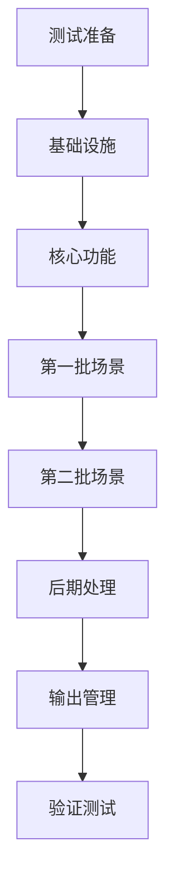

# /tasks 命令 - 任务分解

基于技术计划生成有序的可执行任务列表：

## 前置条件

- 已运行 `/plan` 生成技术计划
- 计划文件位于 `specs/[###-project-name]/plan.md`

## 执行流程

1. **加载技术计划**
   ```bash
   运行 {SCRIPT} 加载计划文档
   解析 data-model.md 和 contracts/
   ```

2. **生成任务列表**
   - 从合约生成测试任务
   - 从数据模型生成实体任务
   - 从场景生成实现任务
   - 标记可并行任务 [P]

3. **任务排序优化**
   - TDD顺序：测试先于实现
   - 依赖顺序：基础先于应用
   - 并行标记：独立任务并发

## 任务模板

### Phase 1: 测试准备 (TDD)

```markdown
1. [P] 创建火山引擎API合约测试
2. [P] 创建Gemini API合约测试
3. [P] 创建内部API合约测试
4. 创建场景生成集成测试
5. 创建视频合成集成测试
6. 创建端到端测试框架
```

### Phase 2: 基础设施

```markdown
7. [P] 实现火山引擎客户端
8. [P] 实现Gemini客户端
9. [P] 实现TTS服务客户端
10. 实现任务队列管理器
11. 实现状态机管理
12. [P] 实现错误处理和重试机制
```

### Phase 3: 核心功能

```markdown
13. 实现场景脚本解析器
14. 实现提示词生成器
15. [P] 实现场景1生成 (0-10秒)
16. [P] 实现场景2生成 (10-20秒)
17. [P] 实现场景3生成 (20-30秒)
18. 等待第一批完成
19. [P] 实现场景4生成 (30-40秒)
20. [P] 实现场景5生成 (40-50秒)
21. [P] 实现场景6生成 (50-60秒)
22. 等待第二批完成
```

### Phase 4: 后期处理

```markdown
23. 实现FFmpeg视频合成
24. [P] 实现转场效果添加
25. [P] 实现音频轨道合并
26. [P] 实现字幕叠加
27. 实现分辨率适配（1088×1920）
28. 实现质量检查验证
```

### Phase 5: 输出管理

```markdown
29. 实现视频文件存储
30. [P] 实现元数据记录
31. [P] 实现成本统计
32. 实现缓存管理
33. 实现清理策略
```

### Phase 6: 验证测试

```markdown
34. 运行单元测试套件
35. 运行集成测试套件
36. 执行quickstart.md验证
37. [P] 测试抖音平台适配
38. [P] 测试视频号平台适配
39. [P] 测试快手平台适配
40. 生成测试报告
```

## 并行执行策略

### 批次1：可并行任务组

```yaml
Group A (API测试):
  - Task 1, 2, 3
  最大并发: 3

Group B (客户端实现):
  - Task 7, 8, 9
  最大并发: 3

Group C (场景生成第一批):
  - Task 15, 16, 17
  最大并发: 3

Group D (场景生成第二批):
  - Task 19, 20, 21
  最大并发: 3
  前置: Group C完成
```

### 依赖关系图



## 任务估时

```markdown
预计总时长: 4-6小时

Phase 1 (测试): 30分钟
Phase 2 (基础): 60分钟
Phase 3 (核心): 90分钟
Phase 4 (后期): 45分钟
Phase 5 (输出): 30分钟
Phase 6 (验证): 45分钟
```

## 任务标记说明

- `[P]` - 可并行执行
- `[B]` - 阻塞任务，必须等待
- `[C]` - 关键路径任务
- `[R]` - 可重试任务
- `[M]` - 人工确认任务

## 失败处理

```yaml
自动重试任务:
  - API调用类 (最多3次)
  - 生成类任务 (最多2次)

需人工介入:
  - 测试失败
  - 质量检查未通过
  - 成本超限

回滚策略:
  - 保存检查点
  - 支持断点续做
```

## 输出格式

生成 `specs/[###-project-name]/tasks.md`:

```markdown
# Implementation Tasks

## Summary
Total tasks: 40
Parallel groups: 6
Estimated time: 4-6 hours

## Task List
[编号有序的任务列表]

## Execution Order
[依赖关系和执行顺序]

## Success Criteria
[每个阶段的验收标准]
```

## 质量门控

每个Phase完成需满足：

- Phase 1: 所有测试用例创建完成
- Phase 2: 基础设施测试通过
- Phase 3: 场景生成成功率>95%
- Phase 4: 视频合成无错误
- Phase 5: 存储和记录完整
- Phase 6: 全部测试通过

## 下一步

任务列表生成后，运行 `/implement` 开始执行。

---

**提示**：可使用 `--parallel` 参数启用最大并行度执行。